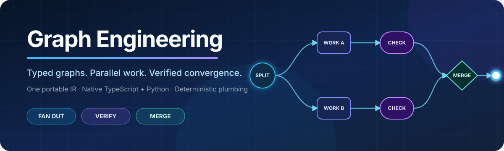
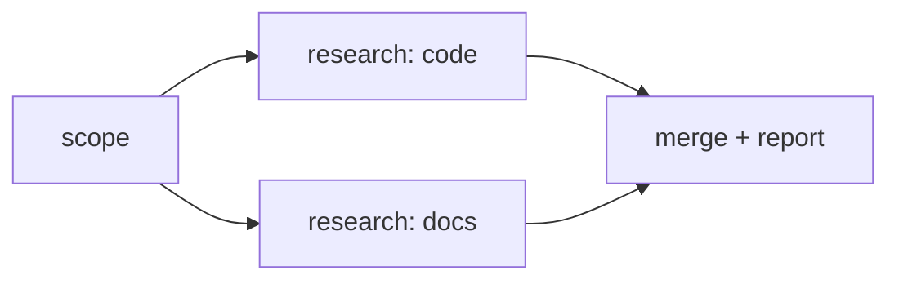

<p align="center">
  
</p>

<p align="center">
  <a href="https://github.com/reacher-z/GraphEngineering/actions/workflows/ci.yml"></a>
  <a href="https://github.com/reacher-z/GraphEngineering/actions/workflows/codeql.yml"></a>
  <a href="LICENSE"></a>
  
  
  <a href="https://github.com/reacher-z/GraphEngineering/stargazers"></a>
</p>

> Prompts describe work. Loops repeat work. Graphs define how work branches,
> verifies, remembers, and converges.

Graph Engineering is a vendor-neutral graph orchestration platform for agentic
systems. Native TypeScript and Python runtimes execute one versioned Graph IR
and are checked against a shared conformance corpus.

Instead of paying model tokens to coordinate a linear conversation, describe
work as typed nodes and data-carrying edges. The runtime fans independent jobs
out, contains failures, and converges named outputs without placing the whole job
in one model context. Pure barrier and router evaluators provide deterministic
decisions while scheduler-level conditional routing remains an explicit v1 goal.

The project is an early alpha. The DAG compiler, ready-queue schedulers, safe project
initializer, machine-readable CLI, structured failure handling, retries,
timeouts, bounded concurrency and attempt budgets, settled barrier/router
decisions, standalone bounded pipelines with backpressure, safe Mermaid/DOT
rendering, pattern constructors, local event/checkpoint stores, a read-only MCP
server, and a development progress scanner are executable today. Both native
runtimes also provide event-sourced durable start/resume: committed successes
are reused after process loss and unsafe ambiguous effects fail closed.
Checkpoint acceleration, replay/fork, distributed leases, Graph IR stream
execution, and the broader v1 surface remain under active development; the
repository does not silently mock unfinished capabilities.

Strict JSON and safe YAML authoring, declaration-ordered builders, opt-in typed
ports, and revision-1 compiled component identities are implemented in both
languages. Equivalent JSON, YAML, and builder inputs are checked against shared
golden graph/schema/component hashes rather than language-local snapshots.

> **Source-only alpha:** npm and PyPI packages are not published yet. Clone this
> repository to try the current release candidate; registry publication remains
> gated on trusted publishing and package-specific security review.

## Quickstart

Validate and inspect a research diamond without an API key:

```bash
git clone https://github.com/reacher-z/GraphEngineering.git
cd GraphEngineering
corepack pnpm install --frozen-lockfile
corepack pnpm build
node packages/cli/dist/src/cli.js validate examples/quickstart/research-diamond.graph.json
node packages/cli/dist/src/cli.js plan examples/quickstart/research-diamond.graph.json
node packages/cli/dist/src/cli.js visualize examples/quickstart/research-diamond.graph.json
node packages/cli/dist/src/cli.js init /tmp/my-first-graph --dry-run
```

The plan exposes two independent research nodes in the same parallel layer. See
the [five-minute Quickstart](docs/QUICKSTART.md) for expected output and failure
diagnostics.

The same Graph IR becomes this execution shape:



Run that graph through the native scheduler with deterministic local handlers:

```bash
node examples/quickstart/run.mjs
uv run --project python python examples/quickstart/run.py
```

Python is a native runtime, not a client for the TypeScript executor:

```bash
uv sync --project python --extra dev
uv run --project python pytest python/tests
```

## What works now

| Capability | TypeScript | Python |
| --- | --- | --- |
| Strict Graph IR models | Yes | Yes, with Pydantic v2 |
| Canonical SHA-256 | Yes | Yes |
| Stable compiler diagnostics | Yes | Yes |
| Strict JSON and safe YAML source decoder | Yes | Yes |
| Declaration-ordered graph builder | Yes | Yes |
| Strict typed-port contract checks | Yes | Yes |
| Revision-1 compiled component identity | Yes | Yes |
| Native `graph`/`grapheng` CLI | Yes | Yes |
| Ready-queue DAG scheduler | Yes | Yes |
| Bounded concurrency | Yes | Yes |
| Standalone bounded pipeline and backpressure | Yes | Yes |
| Retry, timeout, attempt budget | Yes | Yes |
| Failure isolation and named ports | Yes | Yes |
| Shared compiler/runtime conformance | Yes | Yes |
| Settled barrier and route selection | Pure deterministic evaluators | Pure deterministic evaluators |
| Diamond/verifier pattern constructors | Yes | Consumes the portable Graph IR |
| Safe Mermaid/DOT visualization | Yes, through the CLI | Same portable Graph IR |
| Local event/checkpoint stores | Yes | Yes |
| Event-sourced scheduler start/resume | Yes | Yes |
| Scheduler checkpoint acceleration | Not yet | Not yet |
| Read-only validation/planning MCP | Yes | Uses the same portable IR |
| Graph IR streaming and scheduler-applied routers/verifier panels/loops | Target v1 | Target v1 |

## Design commitments

- Explicit node and edge data contracts.
- Parallel, pipeline, barrier, router, verifier, and bounded-loop topologies.
- Durable event-sourced start/resume today; rebuildable checkpoint acceleration,
  replay, and fork as explicit follow-up protocols.
- Deterministic plumbing; models are reserved for judgment.
- Provider-neutral adapters and deny-by-default capabilities.
- Observable runs with portable events and traces.
- TypeScript/Python semantic parity through shared conformance fixtures.

## Verify the repository

```bash
node scripts/validate-fixtures.mjs
node scripts/check-doc-links.mjs
corepack pnpm check:release-map
corepack pnpm check:evidence-closure
corepack pnpm build
corepack pnpm typecheck
corepack pnpm lint
corepack pnpm test
corepack pnpm test:conformance
corepack pnpm check:packages
corepack pnpm check:packed-install
corepack pnpm audit:prod
uv run --project python ruff check python/src python/tests
uv run --project python mypy --config-file python/pyproject.toml python/src
uv build --project python
python3 scripts/check-python-artifacts.py
```

## Documentation

- [Concepts](docs/CONCEPTS.md)
- [CLI contract](docs/CLI.md)
- [Failure modes](docs/FAILURE_MODES.md)
- [Security policy](SECURITY.md)
- [Architecture](ARCHITECTURE.md)
- [Roadmap](ROADMAP.md)
- [Changelog](CHANGELOG.md)
- [Support](SUPPORT.md)
- [Runtime semantics](spec/runtime-semantics.md)
- [Persistence semantics](spec/persistence-semantics.md)
- [Durable recovery semantics](spec/durable-recovery-semantics.md)
- [Bounded pipeline semantics](spec/pipeline-semantics.md)
- [Primitive semantics](spec/primitives-semantics.md)
- [Authoring and identity semantics](spec/authoring-semantics.md)
- [21-day delivery plan](codex_plans/Graph-Engineering-21-Day-Master-Plan.md)

## Status

Alpha. APIs and serialized protocols may change before the first stable
release. Released protocol versions will receive explicit compatibility and
migration policies.

## License

MIT
