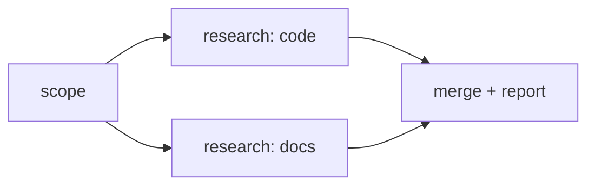

<p align="center">
  
</p>

<p align="center">
  <a href="https://github.com/reacher-z/GraphEngineering/actions/workflows/ci.yml"></a>
  <a href="https://github.com/reacher-z/GraphEngineering/actions/workflows/codeql.yml"></a>
  <a href="LICENSE"></a>
  
  
  <a href="https://github.com/reacher-z/GraphEngineering/stargazers"></a>
</p>

> Prompts describe work. Loops repeat work. Graphs define how work branches,
> verifies, remembers, and converges.

Graph Engineering is a vendor-neutral graph orchestration contract with native
TypeScript and Python runtimes. Both execute one versioned Graph IR and are
checked against a shared conformance corpus.

Instead of paying model tokens to coordinate a linear conversation, describe work
as typed nodes and data-carrying edges. The runtime fans independent jobs out,
contains failures, and converges named outputs without placing the whole job in
one model context.

**This is an early alpha.** The tables below separate what executes today from
what does not exist yet. The repository does not mock unfinished capabilities:
Graph IR vocabulary without a runtime is refused before dispatch rather than
silently degraded.

> **Source-only:** nothing is published to npm or PyPI. There is no
> `npm install @graph-engineering/...` and no `pip install graph-engineering`.
> Clone this repository to try it. Registry publication remains gated on trusted
> publishing and package-specific security review.

## Quickstart

Three commands to a real run — no API key, no network access, no credential:

```bash
git clone https://github.com/reacher-z/GraphEngineering.git && cd GraphEngineering
corepack pnpm install --frozen-lockfile
corepack pnpm build
node examples/quickstart/run.mjs
```

The Python lane is one command, and is a native runtime rather than a client for
the TypeScript executor:

```bash
uv run --project python python examples/quickstart/run.py
```

Both scripts execute this shape:



They run the two research nodes concurrently through the deterministic mock
adapter, refuse an undeclared adapter capability before dispatch, persist the
same run to a **protected** durable journal, prove that no plaintext payload
reaches disk, and resume the terminal run without calling an executor. Every line
they print is also an assertion. See the
[Quickstart](docs/QUICKSTART.md) for the actual output and a walkthrough.

Inspect a graph without executing it:

```bash
node packages/cli/dist/src/cli.js plan examples/quickstart/research-diamond.graph.json
```

## What executes today

Every row below was verified against the source file named in the last column.

| Capability | TypeScript | Python | Verified in |
| --- | --- | --- | --- |
| Graph IR models and canonical SHA-256 | Yes | Yes, with Pydantic v2 | `packages/core/src/canonical.ts`, `python/src/graph_engineering/canonical.py` |
| Compiler with stable diagnostics | Yes | Yes | `packages/core/src/compiler.ts`, `python/src/graph_engineering/compiler.py` |
| Strict JSON and safe-YAML source decoding | Yes | Yes | `packages/core/src/source.ts`, `python/src/graph_engineering/source.py` |
| Declaration-ordered graph builder | Yes | Yes | `packages/core/src/builder.ts`, `python/src/graph_engineering/builder.py` |
| Opt-in strict typed-port contract checks | Yes | Yes | `packages/core/src/typed-ports.ts`, `python/src/graph_engineering/typed_ports.py` |
| Revision-1 compiled component identity | Yes | Yes | `packages/core/src/component-identity.ts`, `python/src/graph_engineering/component_identity.py` |
| Ready-queue DAG scheduler, bounded concurrency | Yes | Yes | `packages/runtime/src/scheduler.ts`, `python/src/graph_engineering/scheduler.py` |
| Retry, timeout, attempt budget, failure isolation | Yes | Yes | same schedulers |
| Standalone bounded pipeline with backpressure | Yes | Yes | `packages/runtime/src/pipeline.ts`, `python/src/graph_engineering/pipeline.py` |
| Bounded-cycle controller with append-only GraphPatch, replay, fork | Yes | Yes | `packages/runtime/src/cycle-controller.ts`, `python/src/graph_engineering/cycle_controller.py` |
| Integrated router: scheduler-applied `RouteEquals` | Yes | Yes | `packages/runtime/src/router-runtime.ts`, `python/src/graph_engineering/scheduler.py` |
| Zero-rejudge decision adoption (policy hash + decision identity) | Yes, caller-seeded | **No** | `packages/runtime/src/decision-replay.ts`; no Python peer |
| Integrated barriers executed by the scheduler | Ordinary scheduler only | **No** — see below | `packages/runtime/src/barrier-runtime.ts` |
| Event-sourced durable start/resume | Yes | Yes | `packages/runtime/src/durable.ts`, `python/src/graph_engineering/durable.py` |
| Durable payloads protected, failing closed without a key provider | Yes | Yes | `packages/runtime/src/durable-protection.ts`, `python/src/graph_engineering/durable_protection.py` |
| Sink-before-write redaction guard | Yes | Yes | `packages/persistence/src/redaction/guard.ts`, `python/src/graph_engineering/redaction/guard.py` |
| Deterministic mock adapter | Yes | Yes | `packages/adapters/src/mock-adapter.ts`, `python/src/graph_engineering/adapters/mock_adapter.py` |
| Generic HTTP tool adapter, transport injected | Yes | Yes | `packages/adapters/src/http-adapter.ts`, `python/src/graph_engineering/adapters/http_adapter.py` |
| Shell adapter that refuses to execute, deliberately | Yes | Yes | `packages/adapters/src/shell-adapter.ts`, `python/src/graph_engineering/adapters/shell_adapter.py` |
| Local event and checkpoint stores | Yes | Yes | `packages/persistence/src/`, `python/src/graph_engineering/persistence/` |
| Same-host durable SQLite CycleStore | Node.js ≥22.16.0 | Python ≥3.11 | `packages/sqlite/src/sqlite-cycle-store.ts`, `python/src/graph_engineering/sqlite_cycle_store.py` |
| CLI: `init`, `validate`, `plan`, `compile`, `visualize`, `doctor` | Yes | Yes | `packages/cli/src/cli.ts`, `python/src/graph_engineering/cli.py` |
| CLI read-only run commands: `status`, `inspect`, `logs` | Yes, legacy journals only | Yes, legacy journals only | `packages/cli/src/operations.ts`, `python/src/graph_engineering/cli_operations.py` |
| Read-only validation/planning MCP server | Yes | Not applicable | `packages/mcp-server/src/server.ts` |
| Pattern constructors | 5 | 1 | `packages/patterns/src/index.ts`, `python/src/graph_engineering/patterns/` |
| Model-free barrier/router evaluators (settled inputs) | Yes | Yes | `packages/primitives/src/`, `python/src/graph_engineering/primitives/` |
| Shared cross-language conformance corpus | Yes | Yes | `spec/conformance/`, `tools/conformance/` |

Three rows need their exact boundary stated, because the short answer would
mislead:

- **Integrated barriers.** The *ordinary* TypeScript scheduler genuinely executes
  them: arming, arrival census, deadline elapse, the closed non-pass resolution
  set, a `BarrierSatisfied` decision document. The TypeScript *durable*
  scheduler still refuses them, because it does not journal that decision yet —
  integrated barriers and durable start/resume cannot be combined today. Python
  executes them nowhere: `python/src/graph_engineering/integrated_barrier_runtime.py`
  is a complete, conformance-tested evaluator that nothing in `python/src`
  imports, and the Python scheduler refuses a policy-bearing `barrier` node as
  the unsupported capability `node-config:barrier` rather than passing it
  silently. The portable contract in `spec/integrated-barrier-semantics.md` is
  still a revision-2 candidate.
- **Durable protection.** A durable start or resume with no protected payload
  store and no key provider fails with `PAYLOAD_PROTECTION_REQUIRED` before the
  first event, checkpoint, log, error payload, temporary file, or executor call.
  There is no fallback to an inline plaintext writer. Protection is not a KMS:
  key derivation, hardware boundary, escrow, and rotation are the operator's, and
  a decrypted value is in process memory for the executor that needs it.
- **CLI run commands.** `status`, `inspect`, and `logs` project one durable run
  journal from `<store>/events-v1alpha2/` (the `events/v1alpha2` records the
  protected durable scheduler writes today) or `<store>/events/` (a legacy
  `events/v1alpha1` history), and report which contract they found. They read the
  envelope only: no key provider is accepted and no protected reference is
  resolved, so a run's inputs, outputs, and results stay unreadable to the CLI by
  construction.
- **Adapters.** `mock`, `http`, and `shell` ship. The HTTP adapter has no default
  transport — the caller injects one, and there is no fallback to
  `globalThis.fetch` or `node:http`. The shell adapter always refuses to launch a
  process: no isolation provider exists, so a launch would run with the ambient
  authority of the host process. That refusal is the feature.

## What is not in this repository

Named plainly, because absence is easier to plan around than a hedge.

| Not present | What exists instead |
| --- | --- |
| Isolation runtime — worktree, process, or container provider | Nothing. Node executors have the ambient authority of the host process. `isolation` is an opaque IR field, and a node that declares one is refused before dispatch. See `spec/isolation-semantics.md` §0. |
| Capability policy engine, merge gate, approval runtime | Schemas and descriptor shapes only. `enforced` is pinned to `false`. |
| Verification, judge panel, or citation runtime | `validator` is an IR node kind that fails closed. Verdicts are read from node output; nothing evaluates a rubric or checks a citation. |
| Budget and cost runtime | No ledger, no pricing snapshot resolution, no spend accounting. Graph-level `maxCostUsd` is refused as the unimplemented capability `cost-budget`. The bounded-cycle controller enforces a stop against *declared* per-attempt ceilings only. |
| Any real provider client (OpenAI, Anthropic, Gemini) | Closed enum names in the adapter contract. No request has ever been sent to any of them by this code; the Python adapter package imports no `socket`, `subprocess`, `http.client`, `urllib.request`, `requests`, or `httpx`, and a test proves it statically and at runtime. |
| React Explorer or any web UI | Nothing. No `.tsx`, no React/Next/Vite dependency, no explorer package. |
| Nine of the ten planned pattern bundles | One bundle: `examples/patterns/research-diamond/`. |
| A fourteen-step course or tutorial series | `docs/` and `examples/` as listed here. |
| PostgreSQL or S3 stores | SQLite (same host) and JSONL/file stores. |
| Distributed workers, leases, or fencing | Single-process async concurrency. SQLite leases are same-host rows with fencing tokens; `spec/worktree-lease.schema.json` has no code consumer. Compare-and-swap rejects stale appends but is not a lease: stop the old coordinator before resuming a run. |
| Scheduler checkpoint acceleration | Recovery folds the complete event history. Checkpoint stores exist but do not authorize continuation. |
| Durable decision-event journaling, scheduler replay/fork | The bounded-cycle controller has replay and fork; the durable *scheduler* does not, and does not journal `RouteSelected` or `BarrierSatisfied`. |
| A `graph run` CLI command | Execution is a library API. `examples/quickstart/run.mjs` and `run.py` call it directly. |
| Working `cancel`, `resume`, `replay`, `fork`, `retry` CLI operations | Both CLIs parse them and refuse with a named missing capability, before reading or writing anything. |
| Graph IR streaming, subgraphs, `human` nodes, state reduction | Recognized vocabulary, refused before dispatch by the `runtime-capability/v1alpha1` preflight. |

## Design commitments

- Explicit node and edge data contracts.
- Parallel, pipeline, barrier, router, verifier, and bounded-loop topologies.
- Deterministic plumbing; models are reserved for judgment.
- Provider-neutral adapters and deny-by-default capabilities.
- Durable history as the source of truth, with payloads protected before they
  reach any sink.
- Observable runs with portable events and traces.
- TypeScript/Python semantic parity through shared conformance fixtures, not
  language-local snapshots.

Equivalent JSON, YAML, and builder inputs are checked against shared golden
graph/schema/component hashes. GraphPatch conformance retains 54 hostile shape
attacks, 24 schema-valid semantic/idempotency cases, and 34 durable
replay/restore cases independently executed by both runtimes. A separate 20-case
lineage campaign covers grandchild/sibling/prefix behavior plus 16 rehashed
corruption, missing-ancestor, duplicate, cycle, binding, and bound attacks.

## Runtime requirements

The core TypeScript workspace supports Node.js 20 or newer. The optional
`@graph-engineering/sqlite` package requires Node.js 22.16.0 or newer because it
uses the built-in, active-development `node:sqlite` backup API. The native Python
runtime requires Python 3.11 or newer and the standard-library `sqlite3` module.

## Verify the repository

```bash
node scripts/validate-fixtures.mjs
node scripts/check-doc-links.mjs
corepack pnpm check:release-map
corepack pnpm check:evidence-closure
corepack pnpm build
corepack pnpm typecheck
corepack pnpm lint
corepack pnpm test
corepack pnpm test:conformance
corepack pnpm check:sqlite-migrations
corepack pnpm test:sqlite-campaign
corepack pnpm test:sqlite-interop
corepack pnpm test:sqlite-docs
corepack pnpm test:sqlite-benchmark
corepack pnpm test:sqlite-python-benchmark
corepack pnpm test:sqlite-ledger-contract
corepack pnpm check:packages
corepack pnpm check:packed-install
corepack pnpm check:sqlite-artifacts
corepack pnpm audit:prod
uv sync --project python --extra dev
uv run --project python pytest python/tests
uv run --project python ruff check python/src python/tests
uv run --project python mypy --config-file python/pyproject.toml python/src
uv build --project python
python3 scripts/check-python-artifacts.py
```

## Documentation

- [Quickstart](docs/QUICKSTART.md)
- [Concepts](docs/CONCEPTS.md)
- [CLI contract](docs/CLI.md)
- [Failure modes](docs/FAILURE_MODES.md)
- [Security policy](SECURITY.md)
- [Architecture](ARCHITECTURE.md)
- [Roadmap](ROADMAP.md)
- [Changelog](CHANGELOG.md)
- [Support](SUPPORT.md)
- [Runtime semantics](spec/runtime-semantics.md)
- [Persistence semantics](spec/persistence-semantics.md)
- [Redaction semantics](spec/redaction-semantics.md)
- [Adapter semantics](spec/adapter-semantics.md)
- [Isolation semantics](spec/isolation-semantics.md)
- [CycleStore provider semantics](spec/cycle-store-provider-semantics.md)
- [SQLite CycleStore operator runbook](docs/SQLITE.md)
- [Durable recovery semantics](spec/durable-recovery-semantics.md)
- [Bounded pipeline semantics](spec/pipeline-semantics.md)
- [Primitive semantics](spec/primitives-semantics.md)
- [Authoring and identity semantics](spec/authoring-semantics.md)
- [Integrated barrier semantics](spec/integrated-barrier-semantics.md)
- [21-day delivery plan](codex_plans/Graph-Engineering-21-Day-Master-Plan.md)

## Status

Alpha. APIs and serialized protocols may change before the first stable release.
Released protocol versions will receive explicit compatibility and migration
policies.

## License

MIT
