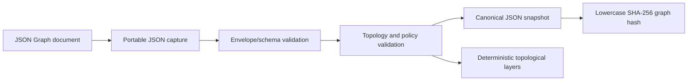

# Graph IR and schema architecture

Status: implementation-aligned Day 2 freeze ledger, 2026-07-26

The canonical persistent contract is
[`spec/graph.schema.json`](../../spec/graph.schema.json). This document explains
that contract, the compiler behavior implemented around it, and the work still
required before the complete Day 2 promise can be called frozen. It does not
add fields, reinterpret existing fields, or grant runtime behavior merely
because a word appears in the schema.

Normative serialization rules and stable compiler codes live in the
[protocol README](../../spec/README.md). Entrypoint/output rationale and the
controlled namespace are recorded in
[ADR-0001](./ADR-0001-explicit-entrypoints.md) and
[ADR-0002](./ADR-0002-protocol-namespace.md). Runtime execution is a separate
contract described by [runtime semantics](./runtime-semantics.md).

The [21-day master plan](../Graph-Engineering-21-Day-Master-Plan.md) is the
delivery source. Its current evidence ledger correctly marks Day 2 and the full
Graph IR/compiler capability as **Partial** in the
[coverage matrix](../delivery/master-plan-coverage-matrix.md).

## 1. What the IR is

Graph IR v1alpha1 is a language-neutral JSON document that describes graph
identity, external contracts, explicit roots and outputs, node declarations,
data-dependency edges, and optional graph policies. TypeScript and Python have
native projections of the same document; neither language model is normative.

Today, that pipeline supports an immutable static DAG subset. The document can
*name* node kinds, edge modes, state schema, policy objects, and condition/map
annotations that have no complete compiler or scheduler implementation. The
schema is therefore a serialization vocabulary, not a capability-negotiation
result.

### Current capability labels

| Label | Meaning in this document |
| --- | --- |
| **Validated** | Both native compilers accept/reject the stated document shape and shared fixtures cover the portable observation. |
| **Has local runtime meaning** | The current DAG runtime consumes the field for the narrowly described behavior. |
| **Opaque/declarative** | The field is retained and hashed, but its inner semantics are not validated or executed by core. |
| **Vocabulary only** | A literal is allowed so the IR can evolve, but no generic execution contract exists for it. |
| **Not implemented** | No supported authoring, compilation, migration, or runtime surface currently provides the promised feature. |

## 2. Protocol identity, namespace, and versions

Several strings that look like “version” have distinct jobs and must never be
collapsed:

| Field | Current value/example | Meaning |
| --- | --- | --- |
| JSON Schema dialect | `https://json-schema.org/draft/2020-12/schema` | How tooling interprets the schema document itself. |
| Schema `$id` | `https://reacher-z.github.io/GraphEngineering/schemas/v1alpha1/graph.schema.json` | Stable identity/location for this schema resource. |
| Graph `apiVersion` | `graphengineering.reacher-z.github.io/v1alpha1` | Protocol discriminator used by readers and compilers. |
| Graph `kind` | `Graph` | Resource type within the protocol family. |
| `metadata.version` | Caller-owned non-empty string such as `1.0.0` | Application graph version; currently not required to be SemVer and not used for protocol dispatch. |
| `graphHash` | SHA-256 of the complete canonical document | Exact content identity of one Graph IR snapshot. |
| Event `graphRevision` | Positive safe integer; current durable DAG uses revision `1` | Revision identity in run history, not a field in GraphSpec and not evidence that GraphPatch exists. |

The namespace uses `reacher-z.github.io` because it is controlled by the
project. It must not be shortened to an unowned vanity domain. Released
`apiVersion` strings are immutable identifiers even if a future custom domain
becomes available; redirects may improve discovery but must not rewrite stored
documents.

The canonical schema is under `spec/`. The CLI and MCP currently carry
byte-identical bundled copies at
[`packages/cli/assets/spec/graph.schema.json`](../../packages/cli/assets/spec/graph.schema.json)
and
[`packages/mcp-server/schemas/v1alpha1/graph.schema.json`](../../packages/mcp-server/schemas/v1alpha1/graph.schema.json).
Those are distribution artifacts, not independent sources. A Day 2 freeze must
make drift detection an explicit test rather than relying on manual copying.

## 3. Canonical JSON and graph identity

The TypeScript implementation lives in
[`canonical.ts`](../../packages/core/src/canonical.ts); Python exposes the same
surface through
[`canonical.py`](../../python/src/graph_engineering/canonical.py). Compilation
binds canonical text and its hash to one detached snapshot so later caller
mutation cannot change execution while leaving the reported hash unchanged.

### Frozen v1alpha1 algorithm

For the currently supported numeric corpus:

1. capture one portable JSON snapshot without invoking caller-owned accessors;
2. preserve array order exactly;
3. recursively sort object property names by Unicode code point;
4. serialize compact JSON with no insignificant whitespace;
5. encode the result as UTF-8; and
6. compute SHA-256 and render lowercase hexadecimal.

The shared [diamond fixture](../../spec/conformance/diamond.graph.json) hashes
to the value recorded in
[`expected.json`](../../spec/conformance/expected.json). Both native compilers
also agree on its declaration-sensitive topological layers.

### What changes the hash

The hash covers the complete accepted document, not only executable topology.
The following changes therefore produce a different graph identity:

- metadata, labels, descriptions, or caller graph version;
- node or edge array order, even if reachability is unchanged;
- any JSON Schema, config, policy, resource, cache, or isolation value;
- endpoint ports, edge annotations, and edge modes;
- adding or removing an optional field;
- legal JSON `null` versus field absence (the schema separately decides where
  `null` is valid); and
- any spelling, Unicode scalar, number representation after normalization, or
  value change that alters canonical bytes.

Object insertion order does not affect the hash because keys are sorted.
Repeated host-language aliases are snapshotted by value. Negative zero is
serialized as JSON zero. These are canonicalization properties, not semantic
equivalence rules: the project has no graph-normalization pass that sorts node
or edge arrays for arbitrary callers.

### Numeric profile

Graph canonicalization accepts finite JSON numbers and rejects integer-valued
numbers outside JavaScript's interoperable safe-integer range. Every accepted
finite binary64 is serialized with ECMAScript's shortest-round-trip number
algorithm, including closest-value selection, round-to-even ties, `-0` to `0`,
fixed notation for `1e-6 <= abs(x) < 1e21`, and lowercase scientific notation
otherwise. No implementation may round values preemptively or stringify them
as application data.

[`canonical-number.case.json`](../../spec/conformance/canonical-number.case.json)
freezes the RFC 8785 Appendix B finite tokens, non-finite rejection, 10,000
fixed-seed random finite bit patterns against Node `JSON.stringify`, and one
fractional whole graph through JSON/YAML decoding, direct canonicalization,
both compilers, both builders, component/revision identity, and SHA-256. Public
canonicalization separately rejects unsafe integer-valued and non-finite
binary64 values. This adopts RFC 8785 Section 3.2.2.3 only. The project
sorts keys by Unicode code point rather than RFC 8785's UTF-16 code units and
therefore does not claim full JCS conformance.

## 4. Portable JSON boundary

Graph IR is JSON, not an arbitrary TypeScript or Python object graph. Before a
hash or compilation result is trusted, values must be finite, detached, and
representable consistently in both languages.

The current boundary rejects, as applicable to the host language:

- `undefined`, functions, symbols, bigint, NaN, and infinities;
- integers outside `-(2^53-1)` through `2^53-1`;
- cyclic containers and sparse arrays;
- accessor-backed, hidden, symbolic, or extra array properties;
- hostile proxies and custom-prototype/class instances; and
- object-key collisions created by Unicode surrogate normalization.

Valid JSON `null` is data, never a silent failure placeholder. Repeated object
references are copied rather than retained as shared mutable aliases. Unicode
surrogate pairs are normalized consistently, lone surrogates are escaped into
UTF-8-safe JSON, and object keys are compared by code point rather than
JavaScript UTF-16 code unit ordering.

The compiler reports unsafe graph input as `GE1007_INVALID_GRAPH` and does not
leak an accessor/proxy exception cause. Authors should still pass parsed JSON or
plain data rather than rely on implementation-specific rejection behavior for
exotic host objects.

This portable boundary validates representation. It does **not** prove that an
embedded object is a valid JSON Schema, mapping language, condition language,
provider configuration, resource policy, or isolation policy.

## 5. Root envelope

The root object rejects unknown fields and requires:

- `apiVersion` and `kind`;
- `metadata`;
- `inputSchema` and `outputSchema`;
- non-empty `entrypoints` and non-empty named `outputs`;
- `nodes`; and
- `edges`.

`stateSchema` and `policies` are optional. `nodes` and `edges` are structurally
allowed to be empty arrays, but a valid non-empty entrypoint and output
reference cannot resolve against an empty node set, so semantic compilation
will fail.

In JSON Schema, “optional” means the property may be absent; it does not make
the property nullable. The current optional metadata, endpoint, node, edge,
retry, and known-policy fields do not include `null` in their declared types.
`config` may legally be null because it deliberately accepts any portable JSON
value, and null can also appear inside an otherwise valid schema/config object.

The earlier Python nullability divergence is closed. Both compilers distinguish
absence from a present null for every known optional non-null field. Four shared
JSON fixtures and four equivalent YAML fixtures lock `metadata.description`,
`stateSchema`, endpoint `port`, and node `retry` to
`GE1007_INVALID_GRAPH`; Python also enumerates all known optional model fields.
Required `config: null` and null inside an unknown policy extension remain valid
and hash-identical across languages.

### Metadata

Metadata is closed to unknown properties. `name` must match
`^[a-z][a-z0-9-]{0,62}$`; `version` is any non-empty string. Description is
optional text and labels are an optional string-to-string map.

Metadata participates in the graph hash. Labels can advertise a versioned
required capability to external tooling, as the TypeScript pattern package
does, but core does not negotiate or enforce such a label. An annotation is not
a substitute for an implementation check.

### Graph input, output, and state schemas

Each root schema-valued field is structurally a JSON object. Ordinary graphs
retain and hash these declarations without claiming runtime value validation.
When the exact versioned strict-typed-port policy is enabled, both compilers
meta-validate every participating schema as Draft 2020-12, reject all `$ref`
and `$dynamicRef`, reject regex-bearing keywords and empty `enum` arrays, and
prove only canonical-exact endpoint compatibility. This does not validate
runtime values or claim general schema assignability.

`stateSchema` is especially easy to overclaim. Its presence does not create a
shared state store, state transaction, reducer, conflict detector, checkpoint
scope, or concurrent-write semantics. It is **opaque/declarative** today.

## 6. Entrypoints and outputs

Entrypoints and outputs are explicit by accepted architectural decision:

- `entrypoints` is a non-empty unique list of node IDs;
- each entrypoint must resolve to a declared node;
- an entrypoint cannot have an incoming edge;
- reachability starts only from those listed roots;
- independent zero-indegree roots are legal only when each is listed; and
- every declared node must be reachable from at least one entrypoint.

The runtime gives raw graph input to entrypoint nodes. It does not infer roots
from array position or indegree.

`outputs` is a non-empty mapping from public result names to `{ node, port? }`
endpoints. Each referenced node must exist. At runtime, the optional port names
a property on that node's result; missing data becomes a structured output
binding failure. The compiler does not currently prove that the port exists in
the node's declared output schema or that the assembled result conforms to the
graph output schema.

Public output names themselves have no additional naming grammar in the
current JSON Schema. Code that handles them must use safe map/object practices
rather than assuming identifier syntax.

## 7. Nodes

Every node object is closed to unknown fields and requires `id`, `kind`,
`inputSchema`, `outputSchema`, and `config`.

### Node identity and order

Node IDs match `^[A-Za-z][A-Za-z0-9_.-]{0,127}$` and must be unique. Declaration
order is semantically observable: it is the deterministic tie-break for peers
that become ready together, it contributes to topological layer order, and it
changes canonical bytes. Builders must never depend on incidental map or set
iteration to choose it.

### Node kind vocabulary

The allowed literals are `agent`, `model`, `tool`, `transform`, `subgraph`,
`router`, `barrier`, `validator`, and `human`.

Acceptance of a literal proves only that the node can be represented. The
current scheduler dispatches caller-supplied executors and does not provide a
generic model, tool, nested subgraph, router, durable barrier, validator, or
human-approval implementation based on `kind`. Transform and barrier have
TypeScript identity defaults, but those defaults do not implement the semantic
feature suggested by the name.

### Node contracts and policy-shaped fields

- `inputSchema` and `outputSchema` are required opaque JSON objects today.
- `config` accepts any portable JSON value and is interpreted only by the
  selected executor/pattern.
- `retry` has bounded attempts, delays, multiplier, and jitter vocabulary.
- `timeoutMs` has a positive timer-safe integer bound.
- `cache`, `resources`, and `isolation` are optional opaque JSON objects.
- `sideEffects` is `none`, `idempotent`, or `non-idempotent`.

Current local scheduling uses retry and timeout fields. Durable recovery uses
`sideEffects` to decide whether an interrupted activity can safely retry.
Cache/resource/isolation objects are retained but not enforced. A declaration
cannot restrict filesystem, network, tool, process, or secret access without a
future capability/isolation provider.

## 8. Edges and ports

Every edge object is closed to unknown fields and requires a unique valid `id`,
`from`, and `to`. Each endpoint requires a non-empty node name and may include a
non-empty port name. Source and target nodes must exist.

For the current DAG runtime, an edge is a required dependency. A source port
selects a property from the producer result. A target port chooses the key in
the consumer input map; without one, the source node ID is the key. Duplicate
target binding keys are detected during runtime binding as structured failure.

Legacy graphs use named-port binding without a static type claim. Graphs that
opt into `graphengineering.reacher-z.github.io/typed-ports/v1alpha1` receive a
strict-exact compile-time proof: required source and target properties must
exist, source/edge/target schemas must be canonical-identical, duplicate target
bindings fail, public outputs and entrypoints match graph schemas, and non-value
modes fail closed. All reference keywords are rejected to prevent identical
local reference tokens in different roots from producing a false proof.

### Edge vocabulary versus execution

| Field/value | Schema/compiler treatment | Current DAG runtime treatment |
| --- | --- | --- |
| `from` / `to` node | Existence and DAG topology validated | Required dependency and value binding |
| endpoint `port` | Non-empty string only | Property selection / input-key binding |
| `mode: value` | Accepted and hashed | One terminal value per producer |
| `mode: stream` | Accepted and hashed | No stream lowering, item identity, queue, offset, ack, or backpressure semantics |
| `mode: artifact-ref` | Accepted and hashed | No ArtifactStore contract or reference validation |
| `map` | Must be an object if present | Not lowered or evaluated |
| `condition` | Must be an object if present | Not lowered; all statically reachable branches still run |
| `schema` | Object in Graph IR; Draft 2020-12 meta-validated in strict-exact mode | Compared statically in strict mode; transferred runtime values are not yet schema-validated |

An omitted edge mode is accepted, but authors should not use omission as a
portable promise for future mode negotiation until the default is explicitly
frozen in the normative contract.

Ordinary cycles are rejected. The existence of condition annotations or a
statically unrolled TypeScript `loopUntilDry` pattern does not enable an
executable conditional cycle or early stop.

## 9. Graph policies

Unlike the closed root/node/edge objects, `policies` intentionally permits
extension keys. Known v1alpha1 properties are:

| Policy | Structural validation | Current enforcement |
| --- | --- | --- |
| `maxConcurrency` | Positive safe integer | Bounds local/durable active node attempts |
| `maxDynamicNodes` | Non-negative safe integer | No effect because dynamic graph expansion is absent |
| `maxDepth` | Positive safe integer | Compiler rejects excess static topological layers |
| `maxFanOut` | Positive safe integer | Compiler rejects excess static outgoing edge count |
| `maxTotalAttempts` | Positive safe integer | Bounds local/durable node attempts and retry reservations |
| `maxDurationMs` | Positive timer-safe integer | Value/timer ceiling validated; no complete graph-duration stop contract is implemented |
| `maxCostUsd` | Non-negative finite number | Retained only; no provider usage accounting or cost reservation exists |

Unknown policy fields being accepted means they can be preserved and hashed; it
does not mean either runtime enforces them. A feature that requires an unknown
policy must use a versioned capability contract and fail closed when the runtime
cannot honor it. Silent “best effort” would make safety budgets fictional.

## 10. Compiler stages and implemented diagnostics

TypeScript compilation is implemented by
[`compiler.ts`](../../packages/core/src/compiler.ts) with closed-envelope checks in
[`schema-validation.ts`](../../packages/core/src/schema-validation.ts). Python
implements the corresponding behavior in
[`compiler.py`](../../python/src/graph_engineering/compiler.py) and strict
[Pydantic models](../../python/src/graph_engineering/models.py).

The observable compile pipeline is:

1. safely snapshot portable JSON;
2. validate closed envelopes, required fields, literals, shapes, and numeric
   bounds;
3. compute canonical graph text/hash for a structurally valid snapshot;
4. index node and edge identities;
5. resolve edge endpoints, entrypoints, and output nodes;
6. build adjacency and deterministic topological layers;
7. reject cycles, incoming edges to entrypoints, and unreachable nodes;
8. enforce static max-fan-out and max-depth policies; and
9. when explicitly enabled, meta-validate and prove strict-exact typed ports.

Identity/reference failures stop topology analysis so the compiler does not
manufacture cascaded cycle/reachability diagnoses from an ambiguous index.
Messages and host exception classes may differ; stable codes and associated
portable identifiers are the compatibility surface.

| Code | Implemented trigger |
| --- | --- |
| `GE1001_DUPLICATE_NODE` | More than one node declares the same ID. |
| `GE1002_DUPLICATE_EDGE` | More than one edge declares the same ID. |
| `GE1003_MISSING_SOURCE` | An edge source node does not exist. |
| `GE1004_MISSING_TARGET` | An edge target node does not exist. |
| `GE1005_CYCLE` | Static adjacency contains a cycle. |
| `GE1006_UNREACHABLE_NODE` | A declared node is not reachable from an explicit entrypoint. |
| `GE1007_INVALID_GRAPH` | Portable JSON, envelope, literal, shape, identifier, or numeric validation fails. |
| `GE1008_MISSING_ENTRYPOINT` | An entrypoint string does not name a node. |
| `GE1009_MISSING_OUTPUT` | A public output endpoint does not name a node. |
| `GE1010_ENTRYPOINT_HAS_INCOMING` | A declared entrypoint has an incoming edge. |
| `GE1101_MAX_FAN_OUT` | A node's static outgoing edge count exceeds policy. |
| `GE1102_MAX_DEPTH` | Static topological layer count exceeds policy. |
| `GE1201_MISSING_SOURCE_PORT` | A strict source/public-output port is absent or not required. |
| `GE1202_MISSING_TARGET_PORT` | A strict target binding is absent or not required. |
| `GE1203_PORT_SCHEMA_MISMATCH` | Strict source, edge, and target schemas differ canonically. |
| `GE1204_DUPLICATE_TARGET_BINDING` | Two strict edges bind one target input key. |
| `GE1205_INVALID_PORT_SCHEMA` | Strict policy/schema is invalid or contains a reference. |
| `GE1206_OUTPUT_SCHEMA_MISMATCH` | A public output differs from graph output schema. |
| `GE1207_ENTRYPOINT_SCHEMA_MISMATCH` | An entrypoint differs from graph input schema. |
| `GE1208_UNSUPPORTED_TYPED_EDGE_MODE` | Strict mode sees stream or artifact-ref. |
| `GE1301_UNSUPPORTED_GRAPH_REVISION` | Initial identity revision is not the safe integer 1. |
| `GE1302_GRAPH_IDENTITY_MISMATCH` | Identity graph hash differs from the compiled graph. |
| `GE1303_COMPONENT_IDENTITY_MISMATCH` | Component/schema/order/revision identity differs. |

The shared negative corpus currently covers duplicate node, missing endpoint,
cycle, unreachable node, incoming-entrypoint, unsafe budget, and oversized
timer cases. It does not yet provide one shared fixture for every code or every
invalid field/path combination.

### Validation explicitly absent

Current compilation does not establish:

- full JSON Schema validity or runtime input/output conformance;
- general schema assignability or reference resolution beyond opt-in
  strict-exact typed-port identity;
- router exhaustiveness, defaults, or condition-language validity;
- concurrent state-write conflicts or reducer correctness;
- capability authorization or resource/isolation feasibility;
- `maxCostUsd` or provider/model budget enforceability;
- dynamic fan-out/GraphPatch cardinality and permission limits;
- explicit loop-node boundedness or convergence; or
- nested subgraph namespace/checkpoint correctness.

Those are master-plan requirements, not hidden behavior behind
`GE1007_INVALID_GRAPH`.

## 11. Cross-language evidence

The shared coordinator
[`tools/conformance/run.mjs`](../../tools/conformance/run.mjs) compares native
TypeScript and Python compilation results. The current canonical/compile
evidence includes:

- the exact diamond SHA-256 and its three topological layers;
- invalid graph verdicts and ordered stable diagnostic codes for the fixtures
  listed in [`expected.json`](../../spec/conformance/expected.json);
- declaration-order tie breaking for topological peers;
- explicit root/reachability behavior;
- finite timer and safe-integer budget ceilings;
- safe handling of mutation, aliases, hostile accessors/proxies, cycles,
  sparse arrays, Unicode edge cases, and non-portable numbers in package tests;
  and
- preservation of required `config: null`, rejection of known optional-field
  null, and lossless unknown policy-extension values.

The D2 authoring candidate adds a three-way golden coordinator for strict JSON,
safe YAML, both general builders, declaration order, YAML lexical traps and
limits, `GE1201`-`GE1208`, domain-separated component identities, and
`GE1301`-`GE1303` mutation cases. Its v1alpha1 profile rejects regex-bearing
keywords rather than inheriting incompatible host regex grammars. It still does
not prove every Draft 2020-12 keyword, general schema assignability, full
node-kind behavior, or future migrations.

## 12. Authoring and advanced IR gaps

The following distinctions are mandatory in README tables, release notes,
examples, and launch content.

| Promised surface | Evidence that exists | Missing work / honest current label |
| --- | --- | --- |
| General TypeScript builder | Detached arbitrary GraphSpec builder, duplicate/seal checks, compiler/hash/identity result | **Implemented for immutable v1alpha1 revision 1**; no GraphPatch inference |
| General Python builder | Same operation model with detached-on-access nested graph snapshot | **Implemented for immutable v1alpha1 revision 1**; no Python pattern-set claim |
| YAML authoring | Bounded strict YAML 1.2 JSON-compatible decoder plus CLI file/stdin selection | **Implemented safe subset**; anchors/tags/merge/directives/multi-doc and non-JSON values fail closed |
| Typed ports | Versioned strict-exact policy and `GE1201`-`GE1208` | **Implemented opt-in canonical-exact proof**; no runtime value validation, `$ref`, widening, stream, or artifact proof |
| Runtime schema contracts | Schema objects are required and hashed; the opt-in strict typed-port profile meta-validates participating Draft 2020-12 schemas | No node/edge/graph runtime instance validation or general schema execution; **not implemented** |
| Shared graph state | `stateSchema` is accepted | No state instance, transaction, reducer, conflict check, or persistence semantics; **vocabulary only** |
| Nested subgraphs | `kind: subgraph` is accepted | No embedded/reference form, namespace expansion, input/output mapping, policy inheritance, checkpoint scope, or trace lineage; **vocabulary only** |
| Stream/artifact edges | Edge mode literals are accepted | No Graph IR stream scheduler or ArtifactStore lowering; **vocabulary only** |
| Conditions and mappings | Opaque objects are accepted and hashed | No portable expression language, compiler, sandbox, or scheduler application; **declarative only** |
| Dynamic `GraphPatch` | `GraphPatched` exists in the event-type enum | No patch document schema, compiler API, revision transition, authorization/budget check, dry run, durable fold, or runtime execution; **not implemented** |
| Node/edge/schema content hashes | Domain-separated component/schema hashes and revision-1 manifest | **Implemented for initial revision 1**; no patch lineage, signing, or durable manifest store |

The `GraphPatched` event name is reserved vocabulary. The current durable
contract intentionally runs one immutable compiled DAG at graph revision `1`.
Emitting an arbitrary event with that type cannot create a valid patch or
change the compiled graph.

Likewise, pattern constructors that emit condition annotations clearly state
that the current scheduler runs every statically reachable branch. Their
existence is authoring evidence, not routing or early-stop execution evidence.

## 13. Compatibility and migration policy

v1alpha1 is pre-stable, but compatibility still requires deliberate versioning.
The following rules protect fixtures, durable histories, and users while the
contract evolves.

### Reader behavior

- Unsupported `apiVersion` fails; it is never guessed from `$id`, metadata, or
  filename.
- Root, metadata, node, edge, endpoint, and retry objects reject unknown fields.
- Unknown graph policy fields are preserved/hashed but have no implied support.
- Required capabilities must be negotiated explicitly and fail closed when
  absent; an ignored safety field is worse than a clear incompatibility.
- A reader must not silently upgrade, delete, default, reorder, or coerce data
  before reporting the original document's hash.

Because most envelopes reject unknown properties, adding even an optional root,
node, or edge field breaks older strict readers. Such a change is not safely
backward compatible merely because a new reader considers the field optional.
It requires either a new protocol version or a previously defined, versioned
extension container with clear ignore/fail behavior.

### Writer behavior

- Writers emit exactly one supported `apiVersion`/`kind` pair.
- Deterministic builders define node/edge declaration order instead of relying
  on hash-map iteration.
- Defaults that affect identity are materialized or omitted consistently across
  languages; a schema-legal explicit null must not be collapsed into absence,
  while null must still be rejected where the schema does not allow it.
- Opaque configs and annotations carry their own controlled version identity.
- Writers must never claim a required runtime capability only because the
  schema accepts the associated field.

### Migration shape

No general migration tool exists today. Before the first incompatible change,
the project needs a deterministic migration contract that:

1. selects the source schema from the original `apiVersion`;
2. validates and records the original canonical bytes and hash;
3. applies one named, versioned, pure transformation;
4. emits a new document with a new protocol identity when required;
5. compiles it through the target compiler;
6. reports source/target hashes and a semantic/topology diff;
7. never mutates or overwrites the source document by default; and
8. has byte-identical TypeScript/Python/YAML-to-JSON fixtures.

Durable resume must continue to require the graph hash bound by `RunCreated`.
A changed graph, including metadata-only changes, cannot be substituted into an
existing immutable run. Future GraphPatch revisions require their own protocol
and lineage; migration is not a back door for patching live history.

### Compatibility test matrix

Before stable release, CI must cover:

- current reader/current writer in both languages;
- every supported old reader/new writer and new reader/old writer combination;
- canonical bytes/hash before and after migrations;
- unknown field/version/capability failures;
- absence versus explicit null, including deterministic rejection wherever the
  field does not admit null;
- node/edge order and Unicode-key determinism;
- safe-integer boundaries and the adopted fractional-number profile; and
- durable history rejection when graph identity or revision mismatches.

## 14. Day 2 freeze exit gate

The calendar's Day 2 headline gate is “byte-equivalent canonical IR.” The
master plan's detailed Day 2 promise also includes builders/schema types,
JSON Schema and negative fixtures, stable component hashes, and the authoring
path from TypeScript, Python, YAML, and JSON. The gate must be assessed against
the complete promise, not only one green diamond hash.

### Current gate status

| Exit criterion | State on 2026-07-26 | Evidence or blocker |
| --- | --- | --- |
| Canonical Graph v1alpha1 schema under controlled namespace | Green for current document | Canonical schema plus accepted namespace ADR |
| Native strict TS/Python GraphSpec projections | Green for current envelope | Core types/validator and Pydantic models |
| Byte-identical canonical JSON/hash | Green for the current Graph IR number domain | Shared diamond plus RFC/seeded fractional manifest and compiler/builder whole-graph identity |
| Shared positive/negative compiler corpus | Partial | Core DAG cases exist; not every stable diagnostic or advanced validation has a fixture |
| Optional-field nullability parity | Green | Shared JSON/YAML negatives plus exhaustive Python optional-field matrix |
| General TypeScript builder | Candidate green | General detached builder; package/full gates still bind final evidence |
| General Python builder | Candidate green | General detached builder; package/full gates still bind final evidence |
| Safe deterministic YAML loader | Candidate green | Bounded shared safety corpus and CLI JSON/YAML/stdin behavior |
| Graph/node/edge/schema content hashes | Candidate green for revision 1 | Golden domain-separated identities and fail-closed verifier |
| Typed ports and schema compatibility | Candidate green for strict-exact v1alpha1 | Opt-in exact proof only; general assignability remains out of scope |
| State/reducer conflict validation | Open | `stateSchema` has no execution model |
| Subgraph namespace/checkpoint contract | Open | Node kind literal only |
| Dynamic revision/GraphPatch schema | Open | Event name only; durable graph remains immutable revision 1 |
| Policy/budget/capability/loop validation promised by plan | Partial/Open | Static fan-out/depth and numeric shapes exist; broader semantics do not |
| Schema bundle drift detection | Green locally / published URL open | CLI package tests and MCP stdio tests byte-compare bundled copies to `spec/graph.schema.json`; published schema URL byte-equality remains a release gate |
| Compatibility/migration ADR and fixtures | Open | No migration surface exists |

The bounded D2 authoring/identity task can close only after clean package,
full-suite, three-way conformance, and independent-review evidence is bound to a
candidate commit. The broader Day 2 semantic surface remains **Partial** because
runtime schemas, state, subgraphs, GraphPatch, and wider policy validation are
explicit later work.

### Required evidence to close the gate

The integration owner may mark Day 2 complete only after all of the following
are present:

1. **Protocol freeze record:** approved schema/namespace/version ADR, complete
   field-presence rules, default rules, and an explicit numeric canonicalization
   decision.
2. **Source-of-truth enforcement:** CI proves every bundled schema equals the
   canonical `spec/` file and published schema URLs resolve to the same bytes.
3. **Four authoring paths:** arbitrary equivalent graphs built through JSON,
   safe YAML, TypeScript builder, and Python builder compile to byte-identical
   canonical JSON and the same hash.
4. **Builder safety:** deterministic declaration ordering, collision handling,
   immutable snapshots, explicit-null preservation, no implicit roots/outputs,
   and no capability claim beyond the emitted IR.
5. **Canonical corpus:** arrays, nested Unicode keys, lone surrogates, empty
   values, explicit null, safe-integer edges, negative zero, and the chosen
   fractional-number policy have shared golden bytes and hashes.
6. **Component identity:** graph, node, edge, and schema content/revision hash
   rules are either implemented with cross-language vectors or explicitly
   removed/deferred by an approved plan amendment.
7. **Compiler completeness:** port/schema compatibility, schema meta-validation,
   state/reducer conflicts, router exhaustiveness, policy/budget/capability
   requirements, and loop/dynamic limits have stable diagnostics and negative
   fixtures—or each is explicitly moved to a later version without misleading
   Day 2 completion language.
8. **Advanced vocabulary contracts:** subgraph, state, stream/artifact, and
   GraphPatch shapes either receive normative contracts or remain explicitly
   rejected/declarative at compile/runtime boundaries.
9. **Migration tests:** unsupported versions fail predictably and every
   supported migration is pure, non-destructive, traceable, and hash-audited.
10. **Parity evidence:** TypeScript and Python package tests, fixture validation,
    and the full cross-language coordinator pass from a clean checkout with no
    skipped case.

The freeze is a protocol commitment, not a prohibition on later features.
Later work can add a new version or a previously designed extension, but it
cannot retroactively reinterpret a v1alpha1 hash or turn declarative vocabulary
into execution without an explicit contract, conformance corpus, and migration
story.

## 15. Review checklist for every IR change

Before merging any change that touches graph structure or canonicalization,
reviewers must answer:

- Is `spec/graph.schema.json` still the only semantic source?
- Does the change require a new `apiVersion`, schema `$id`, or extension
  namespace?
- Will old strict readers reject it, ignore it, or mis-execute it?
- Does it change canonical bytes for an existing valid document?
- Are array order, explicit null, Unicode, and numeric behavior deterministic?
- Are all new limits finite and safe in JavaScript and Python?
- Are TS and Python models, compilers, builders, bundled schemas, and public docs
  aligned?
- Is there a shared positive vector and a negative/adversarial vector?
- Does a diagnostic need a new stable code rather than an overloaded message?
- Is any schema field being mistaken for runtime implementation?
- Does durable history bind or reject the new graph identity correctly?
- Is a deterministic migration available when existing documents are affected?

If any answer is unknown, the capability remains Partial/Open and the current
version must fail clearly rather than infer behavior. That discipline is what
makes Graph IR a cross-language protocol instead of two similarly named object
models.
