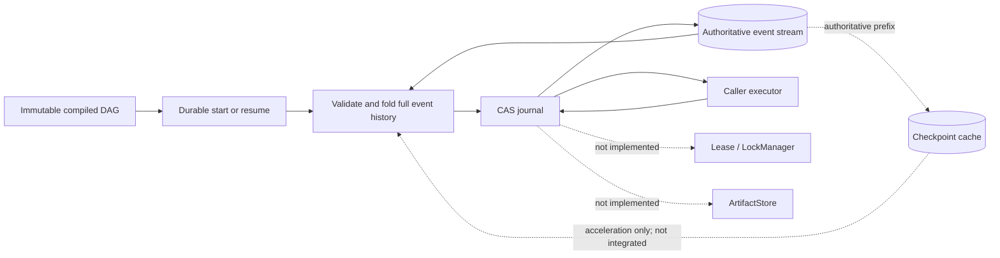

# Persistence and recovery architecture

Status: implementation-aligned Day 9 freeze ledger, 2026-07-26

This document explains the persistence and recovery slice that exists today,
the authority boundaries it relies on, and the work still required before the
complete Day 9 durable-execution promise can be called delivered. It does not
replace the normative [persistence semantics](../../spec/persistence-semantics.md),
[durable recovery semantics](../../spec/durable-recovery-semantics.md),
[event schema](../../spec/event.schema.json),
[checkpoint schema](../../spec/checkpoint.schema.json), or
[Durable JSON schema](../../spec/durable-json.schema.json). If this document and
a versioned specification disagree, the specification wins.

The current implementation is a strong local slice: TypeScript and Python can
persist and resume one immutable revision-1 DAG, reuse committed successes,
recover bounded safe attempts, and fail closed on an in-doubt external effect.
It is not a distributed coordinator, a production storage system, or an
exactly-once activity engine.

## 1. Current boundary at a glance



| Surface | TypeScript | Python | Current claim |
| --- | --- | --- | --- |
| Event envelope | [`events.ts`](../../packages/persistence/src/events.ts) | [`events.py`](../../python/src/graph_engineering/events.py) | Strict v1alpha1 envelope and portable structured validation |
| Event store | [`EventStore`](../../packages/persistence/src/event-store.ts), memory and JSONL adapters | [`EventStore`](../../python/src/graph_engineering/persistence/event_store.py), memory and JSONL adapters | Last-sequence CAS and inclusive reads within one coordinating process |
| Checkpoint store | [`CheckpointStore`](../../packages/persistence/src/checkpoints.ts) and atomic file adapter | [`CheckpointStore`](../../python/src/graph_engineering/persistence/checkpoint_store.py) and atomic file adapter | Standalone content-hashed local snapshots; not used by durable scheduling |
| Durable value codec | [`durable-json.ts`](../../packages/runtime/src/durable-json.ts) | [`durable_json.py`](../../python/src/graph_engineering/durable_json.py) | Exact cross-language finite binary64 transport through tagged JSON |
| Durable scheduler | [`durable.ts`](../../packages/runtime/src/durable.ts) | [`durable.py`](../../python/src/graph_engineering/durable.py) | Event-sourced start/resume for one static local DAG revision |

“Local” is a correctness qualifier. The TypeScript serial queue and Python
per-event-loop process locks coordinate store instances inside one process.
They are implementation plumbing, not a public `LockManager`, lease, fencing
token, heartbeat, or cross-process ownership protocol.

## 2. Event authority

The append-only event stream is the sole durable authority for scheduler work.
An in-memory result, an executor return value, a checkpoint, a log message, or a
caller assertion cannot authorize a dependent or prove that an attempt
completed. Recovery derives its state by validating and folding the committed
event prefix.

This yields five rules:

1. A node attempt is claimed only by a committed `NodeStarted`.
2. An executor result is reusable only after its outcome event is committed.
3. A dependent can observe a success only after `NodeSucceeded` and all ordered
   `EdgeEmitted` events commit.
4. A terminal result is trusted only when it is consistent with every explicit
   folded node outcome.
5. A checkpoint can accelerate reconstruction but can never create, erase, or
   supersede an event fact.

### Authoritative commit batches

| Commit | Meaning after successful append | What remains forbidden before success |
| --- | --- | --- |
| `RunCreated` + `RunStarted` | The run identity, original input, graph hash, implementation hash, and attempt budget exist | Starting executor work or silently treating the stream as another run |
| `NodeScheduled` + `NodeStarted` | One attempt and its global budget slot are claimed, with bound input and recovery identity | Calling the executor |
| `NodeSucceeded` + ordered `EdgeEmitted` | The detached output and every outgoing value fact are reusable | Releasing a dependent or reporting durable success |
| `NodeAttemptFailed` + optional `NodeRetried` | The attempt outcome is known; a retry reservation is durable when present | Inventing an unrecorded retry or resetting backoff/budgets |
| `NodeSettledWithoutAttempt` | A deterministic failed/skipped result exists without a new attempt | Releasing dependants based only on an in-memory failure |
| `RunSucceeded`, `RunFailed`, or `RunCancelled` | The tagged terminal snapshot is final | Appending another event or rerunning an executor on terminal resume |

The writer computes `payloadHash` over canonical JSON for every event `data`
object. The recovery fold also validates event IDs, timestamps, run and graph
identity, sequence, payload hashes, node/edge identity, attempt progression,
retry reservations, budgets, output hashes, activity keys, edge batches, and
terminal projection consistency.

These hashes provide integrity checks, not origin authentication. There is no
signature, MAC, trusted timestamp authority, or append authorization layer. A
hostile actor who can rewrite the complete private store can construct new
bytes and hashes; protecting the directory and storage credentials remains an
operator responsibility.

## 3. Event versions and compare-and-swap

An event stream belongs to one safe `runId`. Its version is its last sequence,
not its length:

- a missing stream has version `-1`;
- the first event has sequence `0`;
- append at version `V` must contain contiguous sequences beginning at `V + 1`;
- a successful append returns the new last sequence; and
- an empty append is a CAS-checked no-op.

`read(runId, fromSequence)` is inclusive and sequence ordered. Readers reject a
truncated, blank, non-UTF-8, malformed, wrong-run, invalid, or non-contiguous
record. They never skip a bad line and continue with an apparently healthy
history.

Error precedence is intentional. Implementations validate request identity,
version shape, and container shape and detach caller input first. Inside the
per-run critical section they then validate existing storage, compare CAS, and
only after a match validate the new event envelopes. Therefore existing
corruption wins over a stale write, and `VERSION_CONFLICT` wins over defects in
a stale append payload.

The durable journal serializes its own append calls and uses the last successful
sequence as the next expectation. It maps a resume CAS loss to
`RESUME_CONFLICT`, latches the first durability failure, and stops intentional
new scheduling. A losing resume invokes no executor because `RunResumed` must
commit before continuation begins.

CAS is necessary but insufficient for distributed ownership. Two coordinators
can both execute application code before one loses a later append race. CAS
detects a stale durable write; it does not fence a stale worker, revoke
credentials, stop an external request, or establish a lease.

### Local JSONL durability

Both local JSONL adapters append canonical UTF-8 JSON records, flush and
`fsync` successful writes, and validate the complete stream on the next
operation. A newly created stream directory entry is also synchronized within
the documented local-filesystem assumptions.

A process or disk failure during append can leave an uncertain tail. A
truncated tail is detected as `CORRUPT_EVENT_LOG`; automatic truncation, repair,
salvage, replication, compaction, and retention are out of scope. Callers must
not infer success from an append that did not return successfully.

## 4. Checkpoints are caches, not authority

The file checkpoint stores are implemented in both languages. A checkpoint
contains `runId`, `checkpointId`, last applied `sequence`, `createdAt`, `state`,
and `contentHash`. Saving performs the following local atomic-replacement
sequence:

1. validate safe identifiers, timestamp, sequence, and state;
2. detach the state and calculate its canonical content hash;
3. write a private temporary file in the destination directory;
4. flush and `fsync` the temporary file;
5. atomically rename/replace it; and
6. `fsync` the containing directory.

Loading validates UTF-8/JSON, the closed envelope, safe identifiers, directory
and filename identity, safe-integer-only state, and `contentHash`. Listing
returns summaries without state, ordered by sequence and then checkpoint ID by
Unicode code point.

Checkpoint v1alpha1 state deliberately excludes floating-point numbers. It
accepts null, booleans, strings, arrays, objects, and integers in the JavaScript
safe range. Runtime values containing finite decimals can still be embedded by
first encoding them as Tagged Durable JSON, whose representation contains only
strings, arrays, booleans, null, and safe integers.

### Scheduler integration status

The durable start/resume options do not accept a `CheckpointStore`, and the
scheduler does not save, load, list, or trust checkpoints. Every resume folds
the complete event history. Thus checkpoint files currently provide a tested
storage primitive but no recovery acceleration.

Future acceleration must preserve this order:

```text
load and validate authoritative event stream
  -> consider a checkpoint whose sequence is within that stream
  -> verify graph/input/implementation and history-prefix identity
  -> rebuild any missing suffix from events
  -> continue only from the event-derived projection
```

A scheduler checkpoint will need at least the last applied sequence,
graph/input/implementation hashes, a history-prefix hash, total attempts, and
node projections in graph declaration order. Missing, stale, corrupt,
ahead-of-tail, or projection-inconsistent checkpoints must be ignored with a
structured recovery warning and rebuilt from events. They must never hide event
corruption. None of this scheduler integration or warning behavior is
implemented yet.

## 5. Tagged Durable JSON and identity hashes

The ordinary runtime accepts portable finite JSON, including non-integer
binary64 values, and Graph IR now has a frozen cross-language decimal
serialization for them. Checkpoint v1alpha1 nevertheless remains deliberately
stricter and accepts only safe integers in its canonical state envelope.
Tagged Durable JSON transports non-integer binary64 values by exact bits for
durable runtime histories without weakening that checkpoint profile.

| Runtime value | Tagged form |
| --- | --- |
| null | `["n"]` |
| boolean | `["b", true]` |
| string | `["s", "text"]` |
| safe integer | `["i", 42]` |
| finite non-integer binary64 | `["f", "3ff8000000000000"]` |
| array | `["a", [encoded items...]]` |
| object | `["o", [["key", encoded value]...]]` |

The float payload is the exact sixteen-character lowercase big-endian IEEE-754
bit pattern. Negative zero and integer-valued doubles normalize to the integer
form. Object keys are strictly increasing by Unicode code point, making
duplicates and noncanonical order invalid. Decoders reject unknown tags, wrong
arity, unsafe integers, non-finite floats, integer-valued float tags, and
unsorted or duplicate keys.

Inputs, outputs, implementation IDs, activity identities, and terminal result
snapshots are hashed as lowercase SHA-256 over canonical UTF-8 JSON for their
tagged representation. Hash equality is therefore a cross-language byte-level
claim for the shared domain, not a comparison of host-language float text.

## 6. Stable activity keys and the side-effect boundary

Every scheduled node records its detached input, `inputHash`, declared
`sideEffects`, and logical activity key. The key is:

```text
durableJsonHash([
  "activity/v1alpha1", runId, graphRevision, nodeId, inputHash
])
```

Attempt is deliberately absent. A retry of the same logical activity receives
the same `activityKey` and `idempotencyKey`; `attemptId` remains distinct and
includes the attempt number. The runtime can preserve and pass the stable key,
but the executor must actually forward it to an external system that provides
idempotent semantics.

| Declaration on an interrupted attempt | Recovery behavior | Caller obligation |
| --- | --- | --- |
| `none` | May retry automatically within node/global budgets | The executor must truly have no external effect requiring reconciliation |
| `idempotent` | May retry with the same activity key | Forward the key to, and rely on, an external idempotency boundary |
| `non-idempotent` | Do not reinvoke; fail with `IN_DOUBT_SIDE_EFFECT` | Reconcile outside this API |
| omitted | Same fail-closed behavior as non-idempotent | Add an honest declaration or reconcile outside this API |

External effects are at-least-once. The irreducible ambiguity is a crash after
the external system commits but before `NodeSucceeded` commits. The event log
correctly says only that the attempt was open; it cannot inspect or roll back
the outside system. Stable keys, remote idempotency, reconciliation,
compensation, and human approval are application responsibilities.

There is no independent durable activity ledger and no approval callback or
approval event flow in the current durable scheduler. Event-schema literals
such as `HumanInputRequested` and `HumanInputReceived` are vocabulary only for
this slice; the durable history fold does not implement an approval protocol.

## 7. Start and resume lifecycle

Start and resume are deliberately separate APIs. Start never silently resumes,
and resume never silently creates a run or accepts replacement input.

### Start

1. Snapshot and compile the graph; enforce the durable timer bounds.
2. Snapshot portable graph input and hash the caller-supplied non-empty
   `implementationId`.
3. Read the stream and reject a non-empty history as `RUN_ALREADY_EXISTS`.
4. CAS-append `RunCreated` and `RunStarted` from version `-1`. A racing start is
   rejected as `RUN_ALREADY_EXISTS`.
5. Commit each attempt claim before executor dispatch.
6. Commit each outcome before releasing dependent work.
7. Commit one terminal event containing the exact tagged graph result.

`RunCreated` binds revision `1`, canonical graph hash, original detached input
and its hash, implementation hash, and effective total-attempt budget. The
`implementationId` is an assertion, not code attestation: a caller can
dishonestly reuse a label for changed code.

### Resume

1. Snapshot and compile the supplied graph and read the complete stream.
2. Reject an empty stream as `RUN_NOT_FOUND`.
3. Validate every event envelope and fold every semantic transition.
4. Verify graph, original input, implementation, attempts, retry reservations,
   outputs, activity identities, and any terminal projection.
5. If history is terminal, return the recorded result with zero new events,
   zero checkpoint writes, and zero executor calls.
6. Otherwise CAS-append `RunResumed` before invoking an executor. A losing CAS
   returns `RESUME_CONFLICT` and invokes no executor.
7. Reuse committed successes, preserve pending retry availability, and convert
   each open attempt to canonical `NODE_EXECUTION_INTERRUPTED` history.
8. Retry only a safe activity with remaining node and global budget; otherwise
   settle or fail closed according to the side-effect rule.

Cancellation signals are process-local and do not survive a crash. A committed
`RunCancelled` is terminal. If the process exits before that event commits,
resume reasons from the durable node history rather than assuming that a prior
in-memory cancellation completed.

## 8. Crash-window ledger

The table distinguishes what is durable from what was merely observed by one
process. “Resume action” always assumes the old coordinator has stopped; the
current local store cannot enforce that precondition.

| Crash or loss window | Authoritative history | Resume action | Remaining risk |
| --- | --- | --- | --- |
| Before `RunCreated` + `RunStarted` commits | Missing stream | A new start may create the run; resume returns `RUN_NOT_FOUND` | An append with uncertain return must be inspected, not guessed |
| After run creation, before any attempt claim | Run identity only | Append `RunResumed`, then schedule ready roots | No executor output exists to recover |
| After `NodeScheduled`, before `NodeStarted` | A reservation without a claim, if such a valid prefix exists | Preserve the schedule identity and append the matching start without duplicating `NodeScheduled` | Local torn-write/corruption rules still apply |
| After `NodeStarted`, before executor entry | Open attempt | Record interruption; retry only under safe side-effect and budget rules | Conservatively treated the same as unknown execution |
| While executor is running | Open attempt | Same interruption path | Synchronous or remote work may have continued after process loss |
| External system committed, before success append | Open attempt | Reuse the activity key only for an idempotent retry; otherwise stop in doubt | No universal exactly-once answer exists |
| Output returned/validated, before `NodeSucceeded` batch commits | Open attempt | Do not reuse the in-memory output; recover as interrupted | Pure computation may be repeated |
| Success batch committed, before dependent release | Committed success and emitted edges | Reuse output; release dependent from folded state; never rerun producer | This is the central successful-node invariant |
| Failed attempt committed without a retry reservation | Known terminal attempt failure | Reuse the failure and settle descendants as required | No hidden retry may be invented |
| `NodeAttemptFailed` + `NodeRetried` committed, before delay or next start | Known failure plus exclusive next-attempt reservation | Wait only the remaining absolute delay and consume the reserved attempt once | Clock representation and budgets remain validated |
| `NodeSettledWithoutAttempt` committed, before dependent release | Explicit failed/skipped node outcome | Reuse the result and release dependants from the fold | No attempt is retroactively charged |
| Terminal event committed, before API return | Complete terminal result | Return it byte-semantically unchanged; append and execute nothing | Caller may have missed the original response but not the result |
| Event append fails or returns an impossible version | Last successful prefix only | Latch `DURABILITY_STORE_FAILED`; stop new scheduling and recover from the store later | In-flight external effects may still need reconciliation |
| Checkpoint write fails | Event stream remains authoritative | Current scheduler is unaffected because it does not use checkpoints | Future acceleration must warn/fallback without changing facts |

## 9. Threat and failure matrix

| Threat or failure | Present control and observable outcome | Boundary / operator action |
| --- | --- | --- |
| Path traversal through IDs | Strict 1–128 character identifier grammar; `.`/`..` forbidden; filenames use SHA-256 identifiers; `UNSAFE_IDENTIFIER` | Symlink and hostile shared-directory hardening are outside the alpha model; use a private directory |
| Caller mutates append/checkpoint input | Inputs are snapshotted before asynchronous persistence | Do not pass exotic host objects; only portable JSON is supported |
| Stale append | Expected-version mismatch causes `VERSION_CONFLICT` and writes nothing | Retry only after intentionally rereading and reconciling state |
| Racing start or resume | Start maps the creation CAS loss to `RUN_ALREADY_EXISTS`; resume maps its claim loss to `RESUME_CONFLICT` and invokes no executor | CAS does not fence work already launched by another coordinator |
| Two live coordinators | A later stale append is rejected | Unsupported and unsafe for external effects; stop the old process before resume |
| Torn or malformed JSONL | Complete-stream validation returns `CORRUPT_EVENT_LOG`; no record is skipped | Repair/salvage is manual and unspecified; preserve evidence before intervention |
| Checkpoint truncation, tampering, wrong identity, or unsafe number | Load/list returns `CORRUPT_CHECKPOINT` | Scheduler acceleration is absent; future integration must ignore with warning and rebuild from events |
| Stale or ahead checkpoint | Normatively cannot authorize work | No scheduler check exists yet because checkpoints are not integrated |
| Graph, input, or implementation mismatch | `GRAPH_HASH_MISMATCH`, `INPUT_HASH_MISMATCH`, or `IMPLEMENTATION_MISMATCH` before executor invocation | `implementationId` is caller attestation, not a signed build identity |
| Semantically contradictory history | Complete fold returns `INVALID_RUN_HISTORY` | Do not skip or synthesize around the contradiction |
| Duplicate/invalid generated event ID or clock | Writer latches `DURABILITY_STORE_FAILED`; history rejects duplicate IDs and invalid timestamps | Inject deterministic valid factories in tests; fix the producer before retrying |
| Store I/O or impossible returned version | First failure is latched as `DURABILITY_STORE_FAILED`; successful in-memory outcome is not reported as durable | Inspect authoritative storage and reconcile possible external effects |
| Attempt/retry/budget forgery | Fold validates contiguous attempts, exclusive retry reservations, per-node/global budgets, and concurrency | A consistent malicious full-history rewrite is not prevented cryptographically |
| Process loss during executor | Open attempt becomes `NODE_EXECUTION_INTERRUPTED` | Retry only `none`/`idempotent`; otherwise reconcile out of band |
| Effect committed outside, success not committed inside | Stable activity key and fail-closed side-effect policy | External idempotency, compensation, or human decision is required |
| Sensitive input/output persisted | Event envelopes default `redacted: true`; telemetry and prompt/response capture remain off by default | Tagged values still contain application data; encryption-at-rest and field-level redaction are not implemented |
| Hostile local user rewrites all bytes | Envelope, content, and semantic hashes detect accidental or inconsistent mutation | No signature/MAC/ACL layer; filesystem and credential security are operator-owned |
| Unbounded history growth | Correctness comes from a complete fold | No compaction, retention, or checkpoint acceleration; long-run latency/storage limits remain open |
| Network filesystem or disk semantics differ | Only documented local-filesystem assumptions are claimed | Use neither JSONL nor file checkpoints as a production distributed store |

## 10. Cross-language evidence

The language-neutral coordinator
[`tools/conformance/run.mjs`](../../tools/conformance/run.mjs) executes native
TypeScript and Python implementations and compares portable machine output. The
shared evidence currently includes:

- [`run-created.event.json`](../../spec/conformance/run-created.event.json) for
  the common event envelope;
- [`checkpoint-basic.json`](../../spec/conformance/checkpoint-basic.json) for
  canonical checkpoint bytes, content hash, restart load, and summary shape;
- [`durable-json.case.json`](../../spec/conformance/durable-json.case.json) for
  every tagged value kind, exact float bits, Unicode code-point ordering, and
  malformed/noncanonical negatives;
- [`durable-resume.case.json`](../../spec/conformance/durable-resume.case.json)
  for committed-success reuse, interrupted-attempt advancement, stable activity
  identity, dependent input reconstruction, and terminal idempotence; and
- [`strict-rfc3339.case.json`](../../spec/conformance/strict-rfc3339.case.json)
  for strict shared timestamp acceptance.

The coordinator compares memory and JSONL CAS versions, empty CAS, inclusive
reads, restart persistence, checkpoint hashes, unsafe-ID codes, durable executor
calls and attempts, reused/interrupted node lists, activity-key stability, and
terminal resume. It also exchanges terminal histories in both directions so
each runtime consumes histories produced by the other.

Package-local suites provide deeper fault evidence:

- TypeScript persistence corruption and atomicity tests live under
  [`packages/persistence/test`](../../packages/persistence/test), with durable
  crash and semantic-forgery tests in
  [`durable.test.ts`](../../packages/runtime/test/durable.test.ts).
- Python persistence tests live in
  [`test_event_store.py`](../../python/tests/test_event_store.py) and
  [`test_checkpoint_store.py`](../../python/tests/test_checkpoint_store.py),
  with durable crash and history tests in
  [`test_durable_scheduler.py`](../../python/tests/test_durable_scheduler.py).

This evidence proves parity only for the named local observations. It does not
exercise two OS processes, lease expiry, fencing, SQLite, PostgreSQL, S3,
artifact loss, approval races, replay/fork lineage, distributed workers, or a
hostile storage administrator.

## 11. Explicitly unimplemented capabilities

The following boundaries are release-protective. Schema vocabulary, roadmap
text, an internal mutex, or a standalone storage interface is not evidence that
the operational capability exists.

| Capability | Current reality | Required before claiming it |
| --- | --- | --- |
| Leases | Not implemented | Versioned ownership, expiry/renewal, monotonic fencing token, stale-owner tests, and defined clock/partition behavior |
| Public `LockManager` | Not implemented | Cross-process provider contract, lease/fencing integration, structured failures, and both-language adapters |
| `ArtifactStore` | Not implemented | Content/identity schema, atomic publication, authorization, garbage collection, corruption handling, and recovery fixtures |
| SQLite store | Not implemented | Transactional EventStore/checkpoint/artifact design, migrations, concurrent-process CAS, crash tests, and parity |
| PostgreSQL store | Not implemented; planned production adapter | Transaction/isolation contract, migrations, connection failure handling, lease/fencing integration, and multi-host tests |
| S3 artifact/checkpoint store | Not implemented; planned production adapter | Object consistency/version contract, integrity metadata, atomic publish protocol, retry policy, and fault tests |
| Scheduler checkpoint acceleration | Specified but not integrated | Prefix/projection validation, stale/ahead/corrupt fallback warnings, suffix fold, and equivalence tests against full replay |
| Replay | Explicitly outside durable v1alpha1 | Recorded-activity policy, deterministic decision reuse, lineage, new-run identity, and conformance corpus |
| Fork | Explicitly outside durable v1alpha1 | Parent/history reference, fork point rules, mutable inputs/implementation policy, lineage events, and parity tests |
| Approval/reconciliation workflow | Not implemented | Durable request/decision events, authorization, stale-decision handling, timeout/escalation, CLI/API callback, and audit tests |
| Non-idempotent confirmation | Not implemented | The approval protocol above; current behavior always fails closed with `IN_DOUBT_SIDE_EFFECT` |
| Distributed workers | Not implemented | Worker protocol, queue/claim semantics, leases, heartbeats, fencing, ownership transfer, cancellation, and chaos suite |

There is likewise no universal exactly-once effect guarantee, repair service,
compaction/retention engine, at-rest encryption layer, or cryptographic history
signature. PostgreSQL, S3, and distributed-worker completion belongs primarily
to the later production-storage milestone; their absence must not be hidden by
calling the Day 9 local slice “production durable.”

## 12. Day 9 exit gates

The master plan's literal Day 9 outcome—“successful nodes never rerun”—is green
for a valid, authoritative local immutable-DAG history. The broader Day 9
deliverable remains **Partial, strong local-DAG slice**, matching the
[coverage matrix](../delivery/master-plan-coverage-matrix.md), because storage,
checkpoint, coordination, artifact, and intervention extensions remain open.

### Frozen local-slice gate

| Gate | State | Evidence required to preserve the state |
| --- | --- | --- |
| Event stream is the only recovery authority | Green | Normative specs, full semantic fold, corruption tests |
| Last-sequence CAS and strict read contract match across languages | Green locally | Shared persistence report plus memory/JSONL package tests |
| Attempt claim commits before executor invocation | Green | Start/crash tests must observe `NodeStarted` before handler entry |
| Success and edge emissions commit before dependent release | Green | Blocking-store tests and durable history validation |
| A committed successful node is never rerun on resume | Green | Shared durable-resume fixture and terminal/interrupted crash tests |
| Terminal resume is read-only and idempotent | Green | Zero new events, checkpoint writes, and executor calls |
| Exact finite JSON identity is portable | Green for Tagged Durable JSON v1alpha1 | Shared valid/invalid codec corpus and bidirectional history exchange |
| Open effects fail safely | Green for declared local policy | Stable key reuse for idempotent work; `IN_DOUBT_SIDE_EFFECT` otherwise |
| Standalone file checkpoint integrity is portable | Green as a storage primitive | Shared content hash, restart, atomic replace, corruption, and order tests |

Any change to event ordering, event data shape, activity-key composition,
attempt accounting, terminal projections, checkpoint hashing, or error
precedence must update the canonical specification and shared fixtures before
either language implementation diverges.

### Gates still required for complete Day 9 delivery

Day 9 cannot be marked fully Green until all of the following have durable
evidence:

1. A versioned extension specification defines lease/fencing ownership,
   `LockManager`, `ArtifactStore`, checkpoint acceleration, replay/fork lineage,
   and approval/reconciliation semantics without weakening event authority.
2. Native TypeScript and Python implementations expose equivalent SQLite,
   locking, artifact, checkpoint-accelerated recovery, replay/fork, and approval
   behavior with stable structured failures.
3. Checkpoint fault injection proves missing, stale, corrupt, ahead-of-tail, and
   inconsistent caches always fall back to the same event-derived result.
4. Crash injection covers every authoritative batch boundary, retry
   reservation, terminal commit, artifact publication, approval decision, and
   external-effect ambiguity.
5. A real dual-coordinator suite proves one owner through lease expiry,
   renewal, fencing, takeover, stale-worker writes, and process death; CAS-only
   tests do not satisfy this gate.
6. Replay and fork fixtures prove lineage, recorded-versus-reexecuted activity
   behavior, deterministic results under fakes, and terminal/history parity.
7. Non-idempotent recovery has an auditable authorized decision path instead of
   either silent reinvocation or an unrecorded manual workaround.
8. The cross-language coordinator and package-local suites are green for every
   new provider, with docs and capability matrices naming both guarantees and
   non-guarantees.

PostgreSQL, S3, and distributed workers retain their later production-storage
exit gates even after local Day 9 is complete. Until those gates pass, operators
must run one coordinator against private local storage, stop it before resume,
and treat every external activity as at-least-once.
