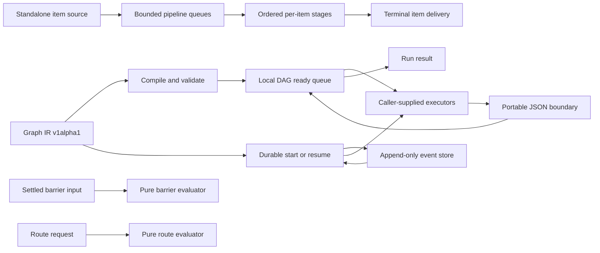
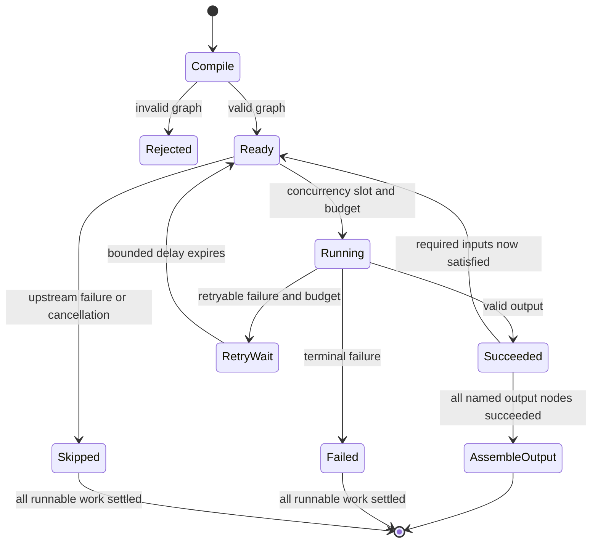
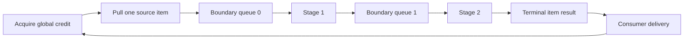
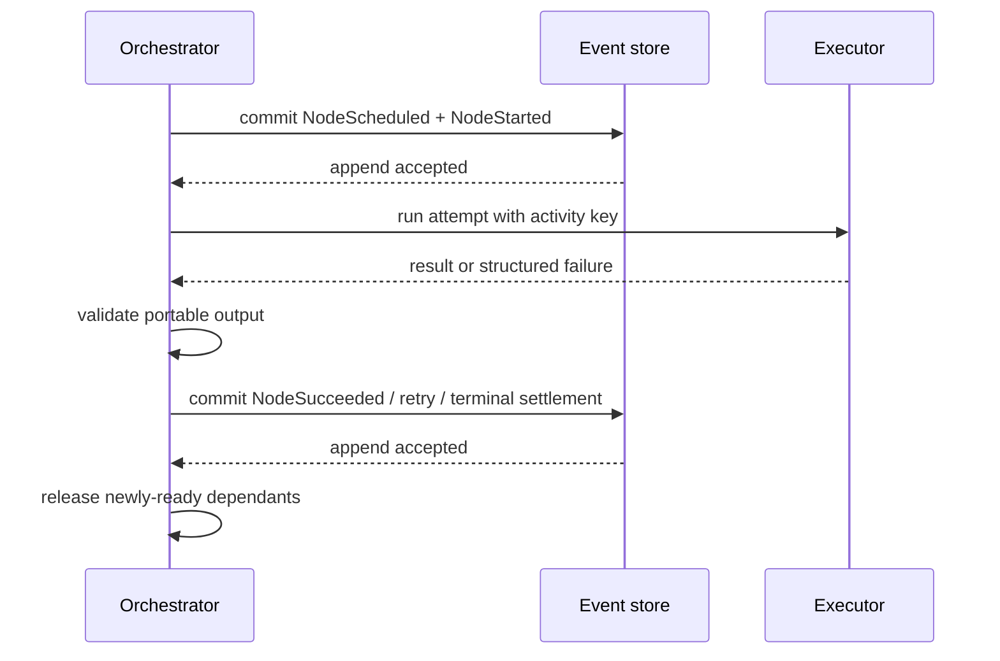

# Runtime architecture and implementation boundary

Status: implementation-aligned planning baseline, 2026-07-26

This document explains how the runtime pieces that exist today fit together and
where their boundaries are. It is not a replacement for the protocol. The
normative contracts remain [runtime semantics](../../spec/runtime-semantics.md),
[pipeline semantics](../../spec/pipeline-semantics.md),
[primitive semantics](../../spec/primitives-semantics.md),
[persistence semantics](../../spec/persistence-semantics.md), and
[durable recovery semantics](../../spec/durable-recovery-semantics.md). If this
architecture note and a versioned specification disagree, the specification
wins and this note must be corrected.

The purpose of this boundary document is to prevent three dangerous capability
inflations:

1. a deterministic evaluator must not be advertised as scheduler integration;
2. an in-memory item pipeline must not be advertised as Graph IR streaming;
3. local event-sourced continuation must not be advertised as distributed or
   exactly-once execution.

The delivery schedule is owned by the
[21-day master plan](../Graph-Engineering-21-Day-Master-Plan.md), while its
evidence status is tracked in the
[master-plan coverage matrix](../delivery/master-plan-coverage-matrix.md).

## Capability labels used here

| Label | Meaning |
| --- | --- |
| **Implemented local slice** | Public TypeScript and Python code exists, is bounded, and participates in shared conformance for the stated slice. |
| **Pure evaluator** | Deterministic library logic exists, but it neither waits for work nor changes graph scheduling. |
| **Specified, not integrated** | A normative contract exists, but the main graph scheduler does not expose the complete behavior. |
| **Planned** | The roadmap describes the capability, but current users must not rely on it. |
| **Explicitly excluded** | The current contract deliberately declines the guarantee, usually because a later protocol/storage revision is required. |

“Implemented” in this document never means production-hard distributed
operation. It means the exact local, in-memory or local-filesystem boundary
named in the row.

## Runtime topology at a glance

These are four related surfaces, not one hidden mega-runtime:

- `runGraph` / `run_graph` is the local, non-persistent DAG scheduler.
- `runPipeline` / `run_pipeline` is a standalone bounded item-flow engine.
- settled barrier and route selection APIs are pure evaluators.
- durable start/resume is a separate event-sourced continuation path for one
  immutable compiled DAG.

There are no implicit calls from the local DAG scheduler into pipeline,
primitive, durable, provider, or distributed-worker subsystems.

## 1. Local DAG scheduler

### Implemented execution shape

The TypeScript implementation is rooted in
[scheduler.ts](../../packages/runtime/src/scheduler.ts); the Python equivalent
is [scheduler.py](../../python/src/graph_engineering/scheduler.py). Both compile
before executing, reject invalid graphs, copy values across a portable JSON
boundary, and return structured run and node results.

This diagram shows the scheduler mechanism, not a new protocol state machine.
The conceptual state vocabulary remains in the normative runtime specification.
The current public result projection intentionally exposes only terminal node
statuses `succeeded`, `failed`, and `skipped`. Internal ready, running, and
retry-wait phases are not a stable public introspection API.

The current run result exposes `succeeded`, `failed`, or `cancelled`. Although
the protocol state model reserves `paused`, the public local scheduler has no
operational pause API. Durable `resume` means continuing a persisted history
after interruption; it is not an implementation of interactive pause/unpause.

### Readiness and determinism invariants

- Every declared entrypoint is an independent root and receives the graph
  input. An entrypoint with an incoming edge is rejected during compilation.
- Every node must be reachable from an explicit entrypoint. The scheduler does
  not infer accidental roots.
- A node becomes ready only after all required incoming producers have
  succeeded. There are no implicit topological-layer barriers.
- Simultaneously ready nodes are considered in `GraphSpec.nodes` declaration
  order. Concurrency can change completion order, but not the tie-break rule.
- `maxConcurrency` bounds active node attempts. Retry delays and settled nodes
  do not consume an active attempt slot.
- A producer result is copied and validated before it can be bound downstream.
  A sibling cannot mutate another sibling's view of the same result.
- A failed producer causes its dependent, not-yet-started descendants to settle
  as structured `UPSTREAM_FAILED` skips. Independent branches may continue.
- The scheduler never replaces a failed branch with `null`. JSON `null` remains
  valid data and is distinguishable from a missing binding.
- Graph output is assembled solely from named endpoint bindings. An endpoint
  port selects a property; absence becomes a structured output-binding failure.

For a non-entry node, incoming values form a mapping. A target port is the key
when present; otherwise the source node ID is the key. A source port selects a
property before binding. Colliding input keys fail rather than silently
overwrite one another.

### Attempt, retry, and timeout bounds

Retries are finite and remain part of one logical node. A retry is possible
only while the node policy allows another attempt and the graph-wide total
attempt budget has capacity. Backoff and per-attempt timeouts use bounded
values validated by the compiler/runtime boundary. Exhaustion produces a
structured terminal failure rather than a hidden extra attempt.

The stable failure surface currently includes executor lookup, executor
failure, timeout, cancellation, invalid portable output, upstream failure,
input binding, output binding, total-attempt exhaustion, and interrupted
durable attempts. Exact codes and field-presence rules belong to the normative
specifications and conformance fixtures; this architecture note deliberately
does not duplicate their schema.

### Cancellation boundary

Cancellation is cooperative:

1. once caller cancellation is observed, the scheduler stops intentionally
   dispatching new attempts;
2. active handlers receive the language-native cancellation signal;
3. active nodes that do not complete successfully settle with structured
   cancellation failure information;
4. nodes that never start settle as structured skips; and
5. caller cancellation has run-status precedence over ordinary branch failure.

An asynchronous handler can observe cancellation promptly. Arbitrary
synchronous user code cannot be forcibly preempted by either runtime. Its
external side effects may continue even after the orchestrator has stopped
waiting, so application code must use cooperative asynchronous boundaries and
idempotency where effects are involved.

### Executor and validation boundary

Executors are capabilities supplied by the caller. The local runtimes do not
ship a model-provider registry, invoke an LLM by node kind, or infer tool access.
TypeScript provides deterministic identity defaults for transform and barrier
node kinds; this convenience does not turn a barrier node into a quorum-aware
wait primitive.

Values crossing graph input, bound node input, retry attempt input, executor
output, edge binding, and public graph output are finite detached JSON. This
rejects language-only values, aliases, cycles, non-finite numbers, unsafe
integers, and mutation leaks. It is structural portable-JSON validation, not
runtime enforcement of arbitrary node `inputSchema` / `outputSchema` JSON
Schema declarations.

### Scheduler backpressure boundary

For the DAG scheduler, backpressure means only bounded active attempts through
`maxConcurrency` and bounded total attempts. Each node produces one terminal
result. The ready queue is in memory, and there is no byte-based queue limit,
item credit, stream offset, acknowledgement, or durable queue spill. Those
concepts belong to future Graph IR stream execution, not this scheduler.

## 2. Standalone bounded pipeline

The current pipeline implementation is
[pipeline.ts](../../packages/runtime/src/pipeline.ts) and
[pipeline.py](../../python/src/graph_engineering/pipeline.py). Its complete
contract is frozen in [pipeline semantics](../../spec/pipeline-semantics.md).

The factory is synchronous and lazy: it validates and snapshots stage/options
configuration without advancing the source. A run is single-pass and has one
consumer. Once consumption begins, items can overlap across stages while every
individual item still visits its stages in declaration order.

### Pipeline invariants

- `accepted - emitted` never exceeds `maxInFlight`; credit is obtained before
  pulling the next source item.
- Every inter-stage queue is bounded by `bufferCapacity`; a running handler is
  not counted as queued.
- `maxItems` is a hard intake budget. At the limit the engine does not perform
  a speculative extra source read.
- Total handler attempts are bounded by `maxItems` multiplied by the sum of
  each stage's configured maximum attempts.
- A fast later item can enter a downstream stage while a slow earlier item is
  still upstream. There is no whole-stage barrier.
- Ordered delivery changes terminal emission order only; it does not serialize
  internal execution.
- Every accepted item becomes `succeeded`, `failed`, `dropped`, or `cancelled`.
  Structured failure data is preserved, and `inputBound` distinguishes valid
  JSON `null` from absence.
- Only execution failure and timeout are retry candidates. Retry delay is
  bounded, cancellable, and consumes no stage concurrency slot.
- `dead-letter`, `drop`, and `stop` are explicit terminal policies. `stop`
  prevents further intentional intake while already accepted work drains.
- Consumer delivery releases global credit; an open consumer that stops
  reading without closing can intentionally keep completion pending.

### Pipeline cancellation and cleanup

Caller cancellation or explicit consumer close stops source intake, wakes
queue and retry waiters, signals active handlers, and accounts for every
accepted unfinished item. No new handler attempt starts after cancellation is
observed. Source and iterator cleanup is explicit and errors during cleanup do
not erase the first run-level failure.

As with the graph scheduler, synchronous source iteration and synchronous
handler code cannot be preempted. Non-cooperative asynchronous outcomes are
detached and observed so late rejection does not become an unhandled failure,
but cancellation cannot roll back an external action already committed.

### Pipeline summary precedence

The completion summary is cancelled when caller cancellation or consumer close
wins. Otherwise a run-level failure or failed item makes it failed, then a
dropped item makes it failed, and only a fully successful drain is succeeded.
Counts reconcile accepted items with terminal statuses after a normal drain or
cancelled cleanup.

### Deliberate separation from Graph IR

The pipeline is **not** a lowering of `edge.mode: "stream"`. If a caller invokes
it inside a graph executor, the entire pipeline is one graph-node attempt. A
process crash can therefore replay that whole attempt, and inner stage attempts
do not consume `runGraph`'s graph-wide attempt budget. The current pipeline has
no persisted item identities, offsets, acknowledgements, queue recovery,
windows, joins, materializing barrier, replay, or fork.

External effects executed by a stage are at-least-once under retry. The engine
does not promise exactly-once delivery or exactly-once side effects.

## 3. Barrier and router evaluators

TypeScript exposes the pure implementations in
[barrier.ts](../../packages/primitives/src/barrier.ts) and
[router.ts](../../packages/primitives/src/router.ts); Python exposes
[barrier.py](../../python/src/graph_engineering/primitives/barrier.py) and
[router.py](../../python/src/graph_engineering/primitives/router.py).

### Settled barrier

The evaluator consumes an already-settled collection and a deterministic
`all`, `minimum`, or `percentage` policy. It returns whether the threshold is
satisfied plus accepted/rejected/missing evidence and a stable reason. It does
not wait for unfinished work, create a timer, cancel laggards, schedule nodes,
or mutate item status.

Consequently, current support is a **pure evaluator**, not scheduler-integrated
barrier execution. A full runtime barrier still needs arrival accounting,
quorum/deadline behavior, missing-item policy, cancellation behavior, durable
decision events, and recovery rules.

### Route selection

The route evaluator validates an already-produced classifier request against a
declared allowlist/policy and deterministically returns selected route keys. It
does not invoke a classifier, execute an edge, or schedule a destination.

The local ready-queue scheduler currently does not lower `edge.condition`, does
not apply the evaluator result to graph topology, and does not record/replay a
route-selection event. Routing therefore remains evaluator-complete but
scheduler-incomplete.

Both evaluators are model-free, tool-free, clock-free, storage-free, and
network-free. They return detached immutable/immutable-style portable results;
judgment belongs in a caller-provided model node upstream of the evaluator.

## 4. Durable continuation and recovery

The durable entrypoints are separate from `runGraph`: TypeScript uses
[durable.ts](../../packages/runtime/src/durable.ts), while Python uses
[durable.py](../../python/src/graph_engineering/durable.py). Start and resume are
distinct operations. A missing history is never silently treated as start, and
an existing history is never silently restarted.

The current recovery unit is one immutable, compiled DAG revision. `RunCreated`
binds graph hash, input, implementation identity, and execution budgets. Tagged
Durable JSON preserves finite portable JSON, including exact binary64 values,
without weakening checkpoint-safe numeric rules.

### Event-sourced state machine

The event stream is the source of truth. The central invariant is
**commit-before-release**: a successful result cannot make dependants ready
until its success and emitted values are durably appended. A deterministic
settlement without an executor attempt is likewise appended before downstream
readiness changes.

An append failure latches a durability failure; the in-memory outcome is not
reported as durable success. A compare-and-swap loss becomes
`RESUME_CONFLICT` and is never blindly retried. The process that loses the race
must stop coordinating the run, although already-dispatched external work may
still require idempotency protection.

### Resume boundary

Resume reads, validates, and folds the complete history before it calls an
executor. It appends a resume record before continuing. Previously successful
nodes are reused and never re-executed. A valid terminal history is returned
exactly as recorded, without a new event, checkpoint write, or executor call.

An open attempt found after process loss has an unknown external outcome:

- `sideEffects: "none"` may retry within its original budgets;
- `sideEffects: "idempotent"` may retry with the same stable activity key; and
- `sideEffects: "non-idempotent"` or an omitted declaration fails closed as an
  in-doubt side effect.

This is at-least-once activity execution, not universal exactly-once effects.
A crash after an external system commits but before `NodeSucceeded` is appended
is inherently ambiguous unless that system honors the activity key or an
application-specific approval/reconciliation flow resolves it.

### Storage and checkpoint boundary

Memory and local JSONL event stores implement contiguous per-run sequences,
compare-and-swap append, strict corruption detection, and private local storage
assumptions. File checkpoints are atomic and content-hashed caches. Scheduler
correctness currently comes from full event-history folding; checkpoint-based
recovery acceleration is not integrated.

Local serialization is within one process. CAS is not a distributed lease, and
the old coordinator must be stopped before another resumes a run. Multi-process
or multi-host workers require leases, fencing tokens, heartbeats, ownership
transfer, and a production database/object-store contract that do not exist in
this slice.

## 5. Cross-language evidence

The language-neutral coordinator is
[tools/conformance/run.mjs](../../tools/conformance/run.mjs). It launches native
TypeScript and Python reporters and compares portable observations, not stack
traces, class names, or uncontrolled wall-clock order.

| Implemented slice | Shared evidence |
| --- | --- |
| Compile/canonical DAG | [diamond graph](../../spec/conformance/diamond.graph.json) and negative graph fixtures under `spec/conformance/` |
| Ready queue without layer barrier | [runtime ready-queue case](../../spec/conformance/runtime-ready-queue.case.json) |
| Invalid output and cancellation | [invalid-output case](../../spec/conformance/runtime-invalid-output.case.json) and [cancellation case](../../spec/conformance/runtime-cancellation.case.json) |
| Settled barrier and route selection | [barrier case](../../spec/conformance/settled-barrier.case.json) and [route case](../../spec/conformance/route-selection.case.json) |
| Local persistence | [checkpoint vector](../../spec/conformance/checkpoint-basic.json), [event vector](../../spec/conformance/run-created.event.json), and strict timestamp cases |
| Durable recovery/interchange | [durable resume case](../../spec/conformance/durable-resume.case.json) and [Durable JSON case](../../spec/conformance/durable-json.case.json) |
| Standalone bounded pipeline | [pipeline case](../../spec/conformance/pipeline.case.json) |

Current conformance joins exercise canonical compile output, ready-queue
ordering, invalid output, cancellation, pure primitives, persistence, durable
continuation, terminal-history interchange, and bounded pipeline observations.
Package-local tests add fault injection and language-specific API checks.

Passing these fixtures proves parity only for the named observations. It does
not prove production reliability, exhaustive schedules, provider correctness,
distributed safety, future feature support, performance, or popularity.

## 6. Failure and recovery boundaries

| Boundary | Current guarantee | Outside the guarantee |
| --- | --- | --- |
| Executor failure | Structured terminal/retry outcome within bounded policy | Rollback of already committed external effects |
| Invalid value | Rejected at portable JSON/binding boundary | Full runtime JSON Schema enforcement |
| Cancellation | No intentional new attempt after observation; cooperative signal and complete accounting | Force-stopping synchronous code or undoing side effects |
| DAG overload | Active attempts and total attempts are bounded | Stream/byte queue pressure and durable spill |
| Pipeline overload | Global item credit and every boundary queue are bounded | Durable queues or cross-process consumers |
| Local crash in `runGraph` | No recovery promise | Any implicit conversion to durable mode |
| Crash in durable run | Full event fold, committed success reuse, side-effect safety gate | Exactly-once effects, replay/fork, distributed takeover |
| Event/checkpoint corruption | Strict failure; never skip corrupt records silently | Automatic repair of torn/corrupt local state |
| Concurrent resume | CAS conflict fails closed | Lease-based coordination or fencing of stale workers |

Failures remain values or events at every boundary. Missing work, rejected work,
timeout, cancellation, and in-doubt side effects must never be collapsed into an
unexplained `null` or an apparently successful empty result.

## 7. Explicitly not implemented

The following table is release-protective. Documentation, examples, CLI output,
and marketing must not imply these capabilities until their freeze gate is
green in both languages.

| Capability | Current status | Required completion evidence |
| --- | --- | --- |
| Graph IR stream-edge lowering | Not implemented | Versioned item identity, offsets/acks, bounded durable queues, recovery and cross-language fixtures |
| Stream joins, windows, materializing barriers | Not implemented | Explicit ordering/watermark/failure semantics plus crash matrix |
| Runtime `edge.map` and `edge.condition` | Not implemented | Deterministic lowering, validation, events, resume/replay parity |
| Scheduler barrier quorum/deadline | Pure evaluator only | Arrival state machine, missing/timeout policy, event history and fixtures |
| Scheduler route application | Pure evaluator only | Route event, selected-edge scheduling, unselected-branch settlement and recovery |
| Explicit cycles and `untilDry` | Protocol frozen; runtime rejected/not implemented | Native TS/Python standalone controllers, budget/lease/store integration, crash recovery, and executable cross-language transition evidence |
| Dynamic graph patches/fan-out | Protocol frozen; runtime not implemented | Native patch compilers/appliers, authority/budget enforcement, scheduler exposure, replay, and executable cross-language evidence |
| Verifiers, judge panels, reflection, citation gates | Not implemented runtime primitives | Typed policies, evidence lineage, deterministic aggregation and adversarial fixtures |
| Unknown/abstain and human approval gates | Not implemented | Durable decision state, callbacks/CLI/API, timeout/escalation and audit trail |
| Worktree/process/container isolation | Not implemented | Capability policy, filesystem ownership, cleanup, merge conflict and threat model tests |
| Provider/model/tool adapters | Not implemented | Explicit capability injection, error taxonomy, record/replay and secret-redaction tests |
| Per-node model routing and token/money budgets | Not implemented | Provider-neutral accounting, hard enforcement, overflow/failure semantics and fixtures |
| Runtime JSON Schema node I/O validation | Not implemented | Shared validator profile and error-path parity; portable JSON checks remain active |
| Operational pause/unpause | Not implemented | Public state/API, safe-point definition, durable event semantics and cancellation interaction |
| Scheduler checkpoint acceleration | Specified, not integrated | Checkpoint validation/fallback fault matrix proving event stream remains authoritative |
| Replay and fork | Explicitly excluded from current durable revision | Lineage schema, recorded-activity behavior and deterministic comparison suite |
| Distributed workers | Not implemented | Worker protocol, leases, heartbeats, fencing, ownership transfer and chaos tests |
| PostgreSQL/S3 production stores | Not implemented | Adapter contract, migration, cross-process races, corruption and availability tests |
| OpenTelemetry/live Explorer/time travel | Not implemented | Opt-in privacy policy, stable event projection, redaction and bounded retention |

Telemetry and prompt/response capture remain off by default even after
observability surfaces arrive. External side effects remain at-least-once and
must be idempotent or explicitly approved; no topology can waive that rule.

## 8. Freeze points and change control

The master plan names five architectural freeze points:

| Day | Freeze point | Interpretation for the current repository |
| --- | --- | --- |
| 2 | Canonical IR | Graph v1alpha1 schema, canonical form, entrypoint/output decisions, and diagnostics are the baseline for implemented DAG work. |
| 6 | State machines | Current local scheduler and pure primitive behavior must remain cross-language aligned; unintegrated future states are not claimed. |
| 9 | Event/checkpoint semantics | Local persistence and durable continuation use the event stream as authority; checkpoint acceleration and distributed locks remain outside the gate. |
| 14 | Public alpha API | Names, exports, documentation, examples, and structured failure shapes require compatibility review before promotion. |
| 19 | Complete feature freeze | Applies only when all planned capability/evidence rows are green; this repository has not reached that full-product gate merely because the current slices pass. |

The standalone pipeline has its own active v1alpha1 contract and conformance
slice. That freezes the bounded in-memory API behavior; it does not pre-approve
Graph IR streaming or durable item-flow design.

Any observable runtime change must be reviewed in this order:

1. decide whether the existing specification already defines the behavior;
2. update the canonical `spec/` contract first when protocol behavior changes;
3. add or update a shared fixture that isolates the observation;
4. implement matching TypeScript and Python behavior;
5. run focused package tests and the full cross-language coordinator;
6. update user documentation and the capability/coverage matrices; and
7. record an ADR when the change affects an established architectural boundary.

A one-language implementation, a unit test without a shared fixture, or a
roadmap checkbox is insufficient to advance a capability label. Until every
required layer is present, documentation must use “planned,” “pure evaluator,”
or “specified, not integrated” with the missing boundary named explicitly.

## 9. Acceptance checklist for future runtime work

A runtime feature is ready to move from planned to implemented only when all of
the following are true:

- its input, output, failure, cancellation, retry, and recovery state machines
  are bounded and versioned;
- deterministic plumbing stays in code while model judgment remains an
  explicit executor capability;
- no failure or missing branch is silently converted to `null`;
- concurrency, fan-out, retry, item/byte buffering, time, and cost limits are
  explicit where relevant;
- side-effect replay behavior and idempotency/approval requirements are stated;
- crash windows are enumerated and tested at every authoritative commit point;
- TypeScript and Python expose equivalent portable observations;
- shared conformance fixtures and package-local negative tests are green;
- public documentation states both the guarantee and its non-guarantees; and
- telemetry, prompts, responses, secrets, and artifacts remain private by
  default unless the caller opts in.

This checklist is intentionally stricter than “the happy path runs.” The
project's runtime architecture is credible only when users can see exactly
which graph shape is executable, what survives a crash, and where responsibility
returns to the caller.
