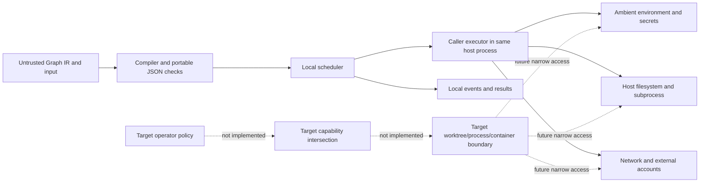

# Security and isolation architecture

Status: current-alpha boundary and target-v1 gate plan, 2026-07-26

Graph Engineering coordinates code that may read files, call networks, spend
provider budget, mutate external systems, and persist sensitive results. The
orchestrator is therefore part of the security boundary, but the current alpha
is **not** a sandbox and is **not production hardened**.

The public [security policy](../../SECURITY.md) governs vulnerability reporting
and supported versions. The detailed [security guide](../../docs/SECURITY.md)
defines operator guidance and target-v1 principles. This planning document maps
those principles to current code, attack cases, review controls, and the Day 12,
Day 16, and Day 20 exit gates. It does not turn a target into an implemented
feature.

Delivery authority remains the
[21-day master plan](../Graph-Engineering-21-Day-Master-Plan.md), the
[coverage matrix](../delivery/master-plan-coverage-matrix.md), the
[ownership/review map](../delivery/agent-ownership-map.md), and the
[stable-v1 release checklist](../delivery/release-checklist.md). The coverage
matrix correctly marks security/isolation **Open** and the security preflight
**Partial**.

## 1. Claim vocabulary

| Label | Meaning |
| --- | --- |
| **Implemented control** | Code and tests provide the narrowly stated behavior in the current alpha. |
| **Risk reduction** | Useful validation or bounding exists, but it is not an authorization or containment boundary. |
| **Deployment responsibility** | The caller/operator must enforce the control outside Graph Engineering today. |
| **Target v1** | Required design or release gate with no complete accepted implementation yet. |
| **Release blocker** | Stable v1 is prohibited until candidate-bound evidence satisfies the named acceptance test. |

The phrases “declared,” “hashed,” “bounded,” “read-only,” and “redacted” do not
automatically mean “authorized,” “authenticated,” “isolated,” or “secret-safe.”
Each guarantee below names the exact layer that enforces it.

## 2. Current ambient-authority boundary

The most important current fact is simple:

> A node executor has the ambient authority of the host process that runs it.

TypeScript `NodeExecutor` functions run in the orchestrator's Node.js process.
Python handlers run in the orchestrator's Python process. Unless the application
adds an external sandbox, executor code can read the process environment, use
the host filesystem, open network connections, launch subprocesses, access
locally available credentials, and interfere with other in-process work.

Graph IR fields named `resources` and `isolation` are opaque declarations.
`sideEffects` is a caller-supplied assertion used for one durable recovery
decision; the runtime does not verify that a supposedly idempotent remote action
really is idempotent. A metadata label advertising a runtime capability is not a
grant and is not enforced by the scheduler.

Timeout and cancellation are cooperative. They bound how long the orchestrator
intentionally waits or schedules, but cannot forcibly stop arbitrary synchronous
code or undo an external mutation. A timed-out executor may keep running and may
commit an effect after the run has already reported a timeout.

There is no current built-in provider, shell, filesystem, tool, or mutating MCP
adapter. That keeps the package-owned attack surface smaller, but it does not
restrict custom executor code. Applications must run only reviewed executors
under an operating-system identity whose existing permissions are acceptable.

### Current-versus-target authority flow



The dotted target path is required work. It must not be inferred from the
current `resources`, `isolation`, `sideEffects`, node kind, or metadata labels.

## 3. Security objectives and non-goals

Target v1 needs the following properties:

1. least authority per node and per external account;
2. policy decisions outside model/tool output;
3. hard, compositional execution/resource limits;
4. isolation between parallel writers and untrusted processes;
5. durable, attributable approval and effect evidence;
6. data minimization and redaction before any sink;
7. honest at-least-once external-effect semantics; and
8. recovery that cannot change graph, capability, or approval identity.

Even a completed v1 must not claim that arbitrary generated code, third-party
plugins, MCP servers, provider SDKs, containers, or external services are
trustworthy. Container isolation is not a complete boundary when privileged
flags, host sockets, broad mounts, credentials, or a vulnerable kernel are
exposed.

## 4. Assets

Security review protects confidentiality, integrity, and availability across
these asset classes:

| Asset | Confidentiality concern | Integrity/availability concern |
| --- | --- | --- |
| Source repositories and worktrees | Private code, unreleased changes, embedded credentials | Unauthorized edits, destructive cleanup, false merge, lost work |
| Environment and secret material | Provider/API tokens, cloud credentials, signing keys, SSH agents | Credential replacement, scope expansion, accidental rotation/revocation |
| User/graph data | Prompts, inputs, outputs, retrieved content, customer/PII data | Tampered inputs, forged evidence, cross-tenant disclosure |
| External accounts and services | Account/tenant identifiers and request content | Duplicate mutation, wrong target, irreversible action, rate-limit/ban |
| Provider and compute budgets | Usage and pricing data may be sensitive | Cost exhaustion, unbounded attempts, denial of service |
| Durable histories/checkpoints | Inputs and outputs may be embedded in records | Forged history, rollback, truncation, divergent resume |
| Future artifacts | Reports, patches, binaries, model evidence | Poisoning, substitution, oversized storage, cross-run access |
| Findings and verification evidence | Sensitive vulnerability detail | False approval, omitted rejection, source/citation tampering |
| Release artifacts and package identity | Publishing tokens and private provenance metadata | Dependency/package substitution, unsigned artifact, tag/digest mismatch |
| Operational availability | Runtime topology and failures | Deadlock, process exhaustion, queue growth, stale coordinator activity |

No graph hash, checkpoint content hash, or event payload hash authenticates an
author. Current SHA-256 values establish content identity/corruption signals,
not permission, provenance, non-repudiation, or resistance to an attacker who
can rewrite the file and recompute the hash.

## 5. Threat actors and untrusted principals

The design assumes the following may be malicious, compromised, or simply
wrong:

- a graph author, graph input producer, or dynamic-planning result;
- prompt content, a model response, retrieved text, webpage, issue, repository
  file, generated patch, embedding, or citation;
- an MCP server, tool description, tool response, provider response, or SDK
  error payload;
- a custom executor, plugin, dependency, repository hook, build script, or
  package lifecycle script;
- another run/node that produces an artifact or shared-state value;
- a stale orchestrator or competing process attempting to resume the same run;
- a local user/process with access to event/checkpoint directories;
- an external service that commits an action before its reply is lost;
- a contributor or compromised CI/dependency/publishing account; and
- a hurried operator or approver who misunderstands the target, diff, or scope.

The operator policy and reviewed runtime implementation are intended trusted
computing inputs, but they remain fallible and require independent review. Human
approval text copied from an untrusted source is data; only an authenticated,
bound decision from the approval system can authorize an action.

## 6. Trust boundaries

### B1 — untrusted document to compiler

Graph IR, configs, schemas, and inputs cross from caller data into core. Current
portable JSON capture and structural/topology validation reduce parser,
mutation, and unbounded-topology risk. They do not authorize executor actions or
validate every declared JSON Schema.

### B2 — scheduler to executor

This is the largest current gap. Scheduling, input snapshotting, attempt bounds,
and cancellation exist, but there is no process/capability boundary. The
executor receives in-process code authority and can bypass Graph IR declarations.

### B3 — executor to tools, files, network, and secrets

Graph Engineering currently has no enforcement point here. The host OS,
container, service account, firewall, secret manager, and application wrappers
are deployment controls. Target v1 must mediate access rather than trust an
executor's self-description.

### B4 — orchestrator to durable storage

Current local stores validate records, IDs, sequence, and hashes, but use a
private-local-directory threat model. There is no tenant authorization,
encryption, keyed authenticity, cross-process lease, or stale-worker fencing.

### B5 — MCP host to local read-only server

The MCP server is a separate local stdio process. It deliberately exposes only
validation, planning, and a package-owned schema. Stdio provides no identity or
authentication; the spawning host decides which model/user can call it.

### B6 — source to CI, package, and registry

Actions, dependencies, build tools, package contents, release identities, and
registries cross a supply-chain boundary. Current CI hardening is useful, while
trusted publishing, SBOMs, checksums, attestations, secret/license scans, and
candidate provenance remain open.

### B7 — proposal to human approval

No runtime approval system exists. Target v1 must show the exact action and bind
the decision to graph/revision/node/input/capability/diff identity. A prompt
asking “is this okay?” is not an approval boundary.

## 7. Controls implemented in the current alpha

### 7.1 Graph structure and portable data

The canonical compiler in
[`packages/core`](../../packages/core/src/compiler.ts) and the native
[Python compiler](../../python/src/graph_engineering/compiler.py) provide these
risk reductions:

- reject malformed/unknown closed-envelope fields;
- reject unsafe host values, cycles, sparse arrays, non-finite numbers, and
  unsafe integers at portable boundaries;
- reject duplicate node/edge IDs and missing endpoints;
- require explicit roots/outputs and reject unreachable nodes;
- reject implicit graph cycles;
- enforce static max fan-out and max depth; and
- bind accepted content to a canonical graph hash.

These checks prevent several accidental or malicious malformed graphs from
reaching executors. They do not validate typed ports, arbitrary embedded JSON
Schema, capability declarations, edge maps/conditions, router exhaustiveness,
dynamic patches, state reducers, or executor code.

### 7.2 Scheduler and pipeline bounds

The [TypeScript scheduler](../../packages/runtime/src/scheduler.ts) and
[Python scheduler](../../python/src/graph_engineering/scheduler.py) bound active
node attempts with concurrency policy, bound the total attempt count, implement
bounded per-node retry/timeout, preserve structured failures, and propagate
cooperative cancellation.

The standalone pipelines add finite item intake, global in-flight credit,
bounded boundary queues, per-stage concurrency, bounded retries, and explicit
stop/drop/dead-letter outcomes. Those controls constrain the current local
algorithm; they do not isolate stage handlers or make Graph IR streaming safe.

Unimplemented resource dimensions include a complete graph-duration hard stop,
dynamic node cardinality, token/money accounting, CPU, memory, process count,
file descriptors, disk bytes, network bytes, and external provider quota.

### 7.3 Structured failure containment

Invalid input/output, missing executors, upstream failure, timeout,
cancellation, binding error, attempt exhaustion, and persistence/recovery
failures remain explicit results or events. The runtime never treats a missing
or failed branch as a successful `null` value.

This protects control-flow integrity and auditability. It does not contain a
malicious process, reverse an effect, or guarantee that an application does not
discard/log the structured detail incorrectly.

### 7.4 Read-only MCP surface

The current MCP package is intentionally narrow. Its
[server registration](../../packages/mcp-server/src/server.ts) exposes exactly:

- `graph_validate`;
- `graph_plan`; and
- `graph_get_schema` plus one fixed schema resource.

There is no graph execution, runtime state, persistence, arbitrary file path,
network, provider, shell, subprocess, MCP proxy, or mutation tool. The handlers,
not the client-facing annotations, are the safety property. `readOnlyHint` and
`destructiveHint: false` are informative metadata only.

The [bounded compiler worker](../../packages/mcp-server/src/limits.ts) limits a
submitted graph to 524,288 serialized UTF-8 bytes, 2,048 nodes, 8,192 edges, and
a 2,000 ms compiler deadline. Cancellation/timeout terminates the worker thread.
The fixed schema path performs no network lookup.

Remaining MCP boundaries are explicit:

- stdio is not authenticated;
- the host must decide who can launch/call the server;
- the SDK parses JSON-RPC before the application measures graph bytes, so the
  bound is not a transport-frame or process-memory limit;
- a worker thread is not an OS sandbox;
- returned identifiers/diagnostics remain untrusted display data; and
- future mutation/runtime tools require a new capability/approval threat review.

### 7.5 Local persistence integrity and path controls

The current
[JSONL event store](../../packages/persistence/src/jsonl-event-store.ts) and
[file checkpoint store](../../packages/persistence/src/file-checkpoint-store.ts)
implement:

- a restrictive run/checkpoint identifier grammar;
- filename derivation from SHA-256 so caller text is not a path segment;
- strict envelopes, UTF-8/JSON parsing, contiguous sequence, and wrong-run
  detection;
- expected-version compare-and-swap within documented local assumptions;
- event append fsync and directory sync for newly created streams;
- checkpoint private temporary creation, fsync, atomic rename, directory sync,
  and content-hash verification; and
- corruption failure instead of silently skipping a bad record.

These are durability and accidental-corruption/path-injection controls. They do
not protect a shared directory from a hostile local user, symlink attack,
tampering with recomputed unkeyed hashes, data disclosure, tenant confusion, or
cross-process coordination. Local queues serialize only within one process.

Operators must place stores in a private directory owned by a least-privileged
runtime account. The file checkpoint store is not currently part of scheduler
recovery, so its hash cannot be presented as an authorization or resume claim.

### 7.6 Durable recovery and external effects

The [TypeScript durable runtime](../../packages/runtime/src/durable.ts) and
[Python durable runtime](../../python/src/graph_engineering/durable.py) bind one
immutable graph, original input, implementation identity, and attempt budget to
the event history. They commit an attempt claim before dispatch, commit success
before releasing dependants, fold complete history on resume, and use stable
activity keys.

After process loss, an open effect-free or declared-idempotent activity may
retry under the original budgets. An omitted or non-idempotent side-effect class
fails closed as `IN_DOUBT_SIDE_EFFECT`. Terminal resume calls no executor.

This is valuable replay-risk containment, but:

- initial non-idempotent execution does not pass an approval gate;
- idempotency is trusted metadata and the application must send the activity key
  to the external service;
- there is no durable activity ledger, reconciliation, compensation, or approval
  callback;
- a crash after remote commit but before `NodeSucceeded` is ambiguous;
- CAS cannot fence a stale coordinator before external work; and
- external effects remain at least once, never universal exactly once.

### 7.7 Current CI and supply-chain controls

Repository workflows currently provide:

- read-only default workflow permissions, with only CodeQL receiving the
  required `security-events: write` grant;
- commit-SHA-pinned GitHub Actions and checkout with credential persistence off;
- frozen pnpm/uv lockfile installation in normal CI;
- TypeScript/Python build, type, lint, tests, artifact-content checks, and
  cross-language conformance;
- production npm audit at moderate severity;
- pull-request dependency review failing at moderate severity;
- scheduled/pull-request CodeQL for JavaScript/TypeScript and Python; and
- Dependabot for npm, Python, and GitHub Actions.

These controls are source/CI evidence, not a completed release provenance
chain. No accepted candidate-bound secret scan, Python/system dependency scan,
license inventory, SBOM, checksum manifest, build attestation, trusted npm/PyPI
publishing rehearsal, or independent provenance verification exists yet.

## 8. Privacy and redaction release blocker

There is no runtime redaction engine. No built-in telemetry exporter currently
ships, so product telemetry and provider prompt capture are absent by default;
however, node inputs/outputs exist in memory and calling applications can log
them. Durable execution also persists sensitive payloads:

- `RunCreated.data.input` contains the encoded original graph input; and
- `NodeSucceeded.data.output` contains the encoded successful node output.

Both native durable journals currently set the event envelope field
`redacted: true` while writing those full values. That flag is **not evidence of
actual redaction**. The mismatch between the flag and stored bytes is a
**release blocker** because a consumer could reasonably treat it as a safety
claim.

Stable v1 cannot pass `I06`, `T26`, `Q08`, `SC07`, or `SC13` until the semantics
are corrected. The resolution must be explicit: either implement and specify
real pre-sink redaction/capture policy, or change/remove the field/default so it
truthfully describes the payload. Documentation alone is insufficient.

### Canary-secret acceptance criteria

For a clean packaged TypeScript run and a clean packaged Python run:

1. seed unique canary strings separately into graph input, model prompt/mock
   input, executor output, thrown error, tool response, artifact content, and
   support-bundle/log metadata;
2. run success, retry, timeout, cancellation, durable crash/resume, and failure
   paths with capture at its default setting;
3. recursively scan raw event journal bytes, checkpoint bytes, artifact bytes,
   stdout, stderr, application/runtime logs, trace-export bytes, error reports,
   support bundles, and generated diagnostics;
4. assert that no canary byte sequence or obvious encoded form appears in any
   sink that the default policy does not explicitly authorize;
5. where payload capture is explicitly enabled, assert that redaction happens
   before persistence/export, that access is separately authorized, and that
   the event flag accurately describes the stored payload;
6. record scanner version/config, exact candidate digests, fixtures, raw
   machine-readable results, false-positive dispositions, and independent
   security review; and
7. include a negative control proving the scanner detects an intentionally
   seeded unsafe fixture.

The hard acceptance statement is:

> Under default configuration, a canary secret must not occur in journal,
> checkpoint, artifact, log, trace, error-report, or support-bundle bytes.

If a product contract requires durable node values for recovery, it must define
an encrypted/authorized sensitive-payload channel or store only protected
references; setting `redacted: true` over raw payload bytes cannot satisfy this
criterion.

## 9. Target capability and approval model — not implemented

Target v1 requires positive grants with deny as the default. The effective node
authority is the intersection of:

```text
operator maximum
  ∩ graph-requested capabilities
  ∩ executor/provider-supported capabilities
  ∩ run-specific approval
```

Missing information narrows authority. A model, router, planner, tool response,
child graph, or dynamic patch can request a path but cannot enlarge this set.

### Required capability dimensions

- stable tool/MCP operation identities and argument constraints;
- filesystem roots with independent read/write/create permissions;
- allowed executable identities and bounded argument/environment rules;
- network protocol, host, port, method, redirect, and DNS behavior;
- secret reference IDs, account/tenant scope, and injection channel;
- artifact read/write namespace and maximum size;
- external account/resource/action scope;
- CPU, memory, process, descriptor, time, concurrency, and output limits; and
- effect class plus idempotency/reconciliation/approval requirement.

The capability snapshot must bind graph hash/revision, node ID, input hash,
policy version, executor/provider identity, secrets by reference/version, and
approval identity/expiry. Retry and resume reuse that snapshot instead of
silently acquiring newly available ambient credentials.

### Required denial behavior

- denied actions produce structured failures/events;
- tool discovery never implies authorization;
- a model is not asked to invent a policy workaround;
- child/subgraph/dynamic work cannot escape the parent grant;
- safety-critical unknown policy/capability versions fail closed; and
- authorization is rechecked at the effect boundary, not only at graph compile.

No manifest schema, policy engine, enforcement adapter, or shared denial corpus
currently satisfies this model.

### Human approvals

A target approval must show and bind:

- graph revision/hash, run, node, and normalized action;
- target account/resource and proposed effect;
- input, output/effect, and relevant diff/evidence hashes;
- requested capability set and side-effect class;
- approver identity, decision, timestamp, expiry, and policy version; and
- secret-safe context sufficient to understand the action.

Any material graph, input, target, capability, diff, or expiry change invalidates
the approval. Broad approval of future actions is a separate scoped policy
change. Current Graph Engineering has no human-gate runtime, authenticated
approval record, stale-approval rejection, or non-idempotent recovery callback.

## 10. Target filesystem and worktree isolation — not implemented

### Path policy

Every file operation must begin from a fixed resolved root, reject ungranted
absolute/parent paths, resolve symlinks, verify the final target remains inside
the grant, and recheck at the operation boundary. Environment variables, `~`,
globs, command substitution, and model-produced strings cannot be security
selectors for destructive targets.

The store's hashed identifier paths do not implement this general executor file
policy. Custom executors currently remain unrestricted.

### Worktree provider

Parallel writers need one provider-owned resource set per run/node attempt:

- unique git worktree and deterministic branch identity;
- exclusive lease and ownership record;
- allowed/denied path policy;
- unique temp directory, cache, ports, and database namespace;
- bounded artifact/log output;
- no secret copying into tracked content;
- safe handling of repository hooks/config as untrusted inputs;
- cleanup only for a verified resource created by the provider; and
- quarantine/preservation after conflict or security failure.

A worktree separates file history. It does not isolate processes, environment,
network, ports, or the kernel.

### Merge gate

Merge must be a separate authorized node/action, never an implicit consequence
of worker success. Its inputs include immutable worker revision/diff, target
base, tests, policy results, and approval where required. It must require a
clean status, revalidate allowed paths, run deterministic tests/security checks,
reject stale bases, and surface conflicts as structured failures. On failure,
the isolated work remains preserved and the target branch remains unchanged.

No worktree lease, path enforcement, cleanup provider, or tested merge node is
implemented today.

## 11. Target process and container isolation — not implemented

A process provider must launch a node with a minimal environment, restricted
user/group, dedicated working/temp directories, explicit read-only/read-write
mounts, network disabled or allowlisted, and hard CPU/memory/process/file/output
limits. It must capture bounded stdout/stderr and have an independent kill path
for non-cooperative code.

A container provider additionally needs image identity/provenance, no privileged
mode, no host/Docker socket, no broad credential mounts, controlled syscalls and
devices, read-only root where feasible, explicit egress, and cleanup tied to a
verified run/node resource ID.

Isolation failures, kill failures, resource exhaustion, and cleanup failures
must be structured and must not trigger an automatic mutating retry. Neither
provider exists in the current TypeScript or Python runtime.

## 12. Secrets, logging, and observability target — not implemented

Secrets must be references rather than Graph IR, edge payload, prompt,
checkpoint, or artifact values. A secret resolver should inject only the
approved reference at the executor boundary, use short-lived audience-bound
credentials where possible, keep provider and tool credentials separate, and
audit only reference/version/outcome—not secret value.

Redaction must happen before event store, log, trace, error aggregator, artifact,
or support bundle. Target controls include payload capture off by default,
field allowlists, credential/canary scanning, bounded error text, artifact
references for large data, separate privileged access, and retention/deletion
rules.

Literal scanning is defense in depth; transformed secrets can evade it. The
primary control is withholding a secret from model/data paths entirely.

## 13. Attack and abuse matrix

| ID | Attack or failure | Present-alpha mitigation | Residual exposure | Target control and required evidence |
| --- | --- | --- | --- | --- |
| `A01` | Malformed, cyclic, or mutation-hostile Graph IR | Portable capture, closed envelopes, compiler diagnostics | Embedded schemas/config semantics remain opaque | Fuzz parsers/models; shared minimized fixtures; no crash or unsafe coercion |
| `A02` | Static fan-out/depth or retry explosion | Compiler fan-out/depth, concurrency, retry and total-attempt bounds | Cost, CPU/memory, duration, dynamic nodes and nested totals incomplete | Compositional hard budgets; `T18`, `Q04`, 1,000-node/resource reports |
| `A03` | Custom executor reads environment/secrets | Operator warning only | Full host-process authority | Deny-by-default capability intersection and process isolation; `T09`, `T24` |
| `A04` | Custom executor writes/deletes arbitrary paths | Store identifiers are safe, but executor paths are not mediated | Traversal, symlink escape, broad deletion, repository loss | Resolved path policy, destructive-target guards, escape corpus and OS matrix |
| `A05` | Parallel writers collide or overwrite work | Data dependencies and application serialization only | Same filesystem/process; independent graph branches can race | Leased worktrees/namespaces and structured merge gate; `T23-T24` |
| `A06` | Prompt injection requests tool/network/secret authority | No built-in mutating adapter; model text is treated as caller data by convention | Custom executor/application may obey it | Policy outside model, typed tool args, denial events, independent `T28` campaign |
| `A07` | Non-cooperative code runs after timeout/cancel | Cooperative signal and bounded new scheduling | Process/effect can continue after terminal result | Killable process/container and late-effect tests; no automatic mutating retry |
| `A08` | Crash duplicates an external mutation | Commit-before-dispatch claim, stable activity key, in-doubt non-idempotent fail | Idempotency declaration unverified; remote may ignore key | Activity ledger, reconciliation, approval/compensation, crash-after-effect matrix |
| `A09` | Two coordinators resume one run | Event-store CAS detects stale append | No lease/fence before external work; local queue is one-process only | Lease/heartbeat/fencing token, synchronized dual-resume and lease-loss tests |
| `A10` | Local attacker forges event/checkpoint history | Strict schema/sequence/content hashes and corruption failure | Unkeyed hashes can be recomputed; no auth/encryption/tenant ACL | Authenticated production stores, tenant policy, backup/restore and malicious-store suite |
| `A11` | Secret leaks through durable event payload | Private directory guidance only | Full input/output currently stored while `redacted: true` | Resolve release blocker; pre-sink redaction/protected refs and canary byte scan |
| `A12` | Secret leaks through error/log/trace/support bundle | No built-in telemetry exporter; MCP does not log graph content | Caller and future adapters may log payloads | Default-off capture, bounded allowlists, canary tests across every sink; `T26`, `SC13` |
| `A13` | Hostile MCP client submits expensive graph | Byte/node/edge limits, worker deadline/cancel, no mutations | SDK parses frame first; stdio has no authentication; thread not sandbox | Host/OS pipe and process limits, deployment identity policy, transport fuzzing |
| `A14` | Compromised MCP/tool adds or mutates authority | Current server registers a fixed read-only set | Future servers/plugins and custom executors remain untrusted | Pinned tool identities, explicit mutation enablement, capabilities/approval, response redaction |
| `A15` | Malicious GraphPatch expands authority or evades totals | Dynamic patch execution absent | Reserved event name could be misread as support | Versioned patch compiler; parent-grant intersection; malicious dry-run corpus `T15` |
| `A16` | Stale or replayed approval authorizes changed work | Approval runtime absent, so supported flow cannot approve | Applications may invent unsafe ad hoc confirmation | Durable bound approval record, expiry/invalidation and `T22` mismatch fixtures |
| `A17` | Poisoned/cross-tenant artifact consumed | ArtifactStore absent | Custom paths/services have no common integrity/ACL contract | Content address, media/size metadata, namespaces, authorization and corruption suite |
| `A18` | Model/provider cost exhaustion | Attempt/concurrency limits | No token/money reservation, provider rate/circuit policy | Atomic budget reservation, pricing version, hard pre-schedule stop and resume tests |
| `A19` | Dependency/action/plugin supply-chain compromise | Pinned Actions, read permissions, locks, audit, dependency review, CodeQL, Dependabot | No full SBOM/provenance/secret/license/publisher evidence | `SC01-SC14`, independent digest/attestation verification, clean builds |
| `A20` | Malicious repository hook/build script escapes worktree | No worktree/process provider | Runs with host authority if invoked by custom executor | Disable/review hooks, isolate process, minimal env/mounts and escape tests |
| `A21` | Router/planner selects unauthorized path | Pure route evaluator has no authority role; runtime routing absent | Future integration could conflate selection with grant | Selected route intersected with preauthorized edges/capabilities; denial and replay fixtures |
| `A22` | Multi-tenant storage disclosure or namespace confusion | Safe IDs and private-directory guidance | No tenant auth/encryption; one local host trust domain | Production ACL/tenant namespaces, encryption responsibility and cross-tenant tests |
| `A23` | Release artifact differs from reviewed source | Local package content/install rehearsals | No trusted publisher, SBOM, checksums or attestations | Candidate coordinates, source-to-artifact map, two clean builds and provenance verify |
| `A24` | False security claim masks an open control | Alpha warnings and evidence-led checklist | Marketing/release copy can still drift | Candidate-bound claim audit; `I10`; stable forbidden while mandatory row not Green |

Every test must have a safe deterministic fake or disposable environment. Real
provider/service tests remain opt-in and must never print credentials or raw
customer data.

## 14. R1–R3 verification and independent review

`R1`, `R2`, and `R3` are review levels from the ownership map, not vulnerability
severity ratings. Vulnerabilities still need a separate severity/risk
disposition.

### R1 — local, non-security-impacting change

R1 requires the author plus one non-author reviewer. It applies only to a
package-local implementation with no public semantic, persistence, security, or
release impact. A change to parsing, path handling, capability decisions,
redaction, storage, executor launch, MCP exposure, package contents, or release
workflow cannot be classified R1 merely because the diff is small.

Minimum evidence: reviewed revision, focused tests, lint/type checks, changed
surface inventory, and a written reason why no public/security boundary moved.

### R2 — public semantic or boundary change

R2 requires three identities: author, opposite native-runtime semantic reviewer,
and integration reviewer. Platform work substitutes the relevant runtime reviewer
plus integration. It applies to public APIs, cross-language semantics,
cancellation/resource bounds, persistence/recovery, providers, isolation, CLI
envelopes, and packages unless a day gate elevates the work to R3.

Minimum evidence adds a normative contract, negative tests, shared conformance
where behavior is portable, clean package checks, commands actually run, and a
review outcome of `accepted`, `changes-requested`, or `blocked`.

### R3 — security/release/go-no-go

R3 requires integration, an independent security/go-no-go reviewer, and the
responsible implementation lane, plus genuine external evidence wherever the
gate requires it. Day 12 isolation, Day 16 security preflight, and Day 20
provenance/go-no-go are R3 regardless of diff size.

For Day 12, both runtime semantics, the platform adversarial-test owner, an
independent security reviewer, and integration risk disposition are required.
For Day 16, the implementer cannot be the only attacker/fuzzer and raw scan
evidence must be bound to the candidate. For Day 20, trusted registry authority,
artifact provenance, and independent verification cannot be simulated by an
agent or replaced with a local source test.

### R3 evidence packet

An R3 packet contains:

- immutable source revision and canonical spec revision;
- exact package/artifact digests and environment/tool versions;
- threat/attack IDs addressed and residual-risk register;
- exact commands, fixture/corpus versions, seeds, raw machine reports, and
  minimized reproducers;
- both-language results where the surface is shared;
- escape, denial, cleanup, cancellation, and recovery evidence;
- vulnerability findings with severity, owner, disposition, and retest;
- reviewer identities, independence statement, dates, and explicit verdicts;
- external authority/evidence references where required; and
- invalidation rules describing which downstream artifacts reopen after change.

Silence, an agent heartbeat, test count, mock-only screenshot, or unreviewed scan
summary is not R2/R3 evidence.

## 15. Day 12 isolation and policy exit gate

Current state: **Open**. Accurate documentation of ambient authority is useful,
but no enforcement or isolation provider exists. Day 12 also depends on bounded
cancellation and judgment/human-gate semantics; incomplete upstream contracts
prevent a truthful Green state.

### Required implementation

- versioned capability manifest and deny-by-default policy engine;
- stable structured allow/deny decisions in TypeScript and Python;
- graph/parent/provider/approval capability intersection;
- authenticated, bound approval contract for high-impact/non-idempotent work;
- resolved filesystem path policy with symlink/TOCTOU defenses;
- worktree lease/ownership and safe cleanup;
- isolated temp/cache/port/database namespaces;
- killable process provider and container provider with minimal authority;
- explicit merge node with clean-status, diff, test, policy, stale-base, conflict,
  and approval gates; and
- migration demo that preserves conflicted/failed work rather than merging it.

### Required R3 evidence

- `T09` unauthorized transform/capability expansion denials;
- `T23` worktree lease/path/test/merge conflict matrix;
- `T24` concurrent process/container port/temp/cache/database isolation;
- `T28` prompt-injection authority-expansion attempts;
- traversal, symlink, broad deletion, stale lease, orphan cleanup, hook/config,
  environment, network, secret, and kill-failure attacks;
- both native runtimes returning aligned structured policy/isolation outcomes;
- implementer-independent adversarial owner and security review; and
- no write, merge, external call, or secret access after a denied decision.

### Exit statement

Day 12 exits only when parallel writes, ports, temporary directories, caches,
and database namespaces remain isolated under adversarial concurrency; conflicts
and policy denials are structured; cleanup cannot escape provider-owned roots;
and the merge target stays unchanged on every failure path.

Fallback: deny shell/write/network/secret capabilities, serialize trusted work,
disable automated merge, preserve/quarantine conflicted worktrees, and keep the
feature experimental. Documentation or an external user-created container does
not close the product gate.

## 16. Day 16 security preflight exit gate

Current state: **Partial**. Existing CodeQL, dependency review, Dependabot,
private disclosure, npm audit, CI permissions, and package checks are meaningful.
They are not a candidate-bound complete security preflight.

Day 16 cannot begin its final join until Day 12 isolation, Day 13 provider/tool
surface, and Day 15 deployable storage/worker topology are complete enough to
attack. Scanning an architecture that is not yet present cannot prove it safe.

### Required implementation and campaigns

- harden capability, adapter, store, worker, isolation, and redaction boundaries;
- resolve the `redacted: true`/raw-payload blocker;
- candidate-specific threat model and risk register covering providers, shell,
  MCP, patches, stores, artifacts, worktrees, workers, Explorer, and publishing;
- parser/schema/policy/redaction fuzzing with minimized reproducers;
- prompt-injection and capability-escalation campaign;
- non-cooperative timeout/cancellation and container/process escape campaign;
- crash-after-effect, lease-loss, corrupt-store/artifact, and budget-bypass chaos;
- seeded-secret scan across repository/history/packages/source maps and every
  runtime/support sink;
- npm, Python, system/container dependency scans;
- license inventory and complete third-party notices;
- source/package/deployable-artifact SBOMs; and
- proof that telemetry and prompt/response capture are off by default in clean
  npm and wheel/sdist installations.

### Required R3 evidence and threshold

- `T09`, `T15`, `T23-T28`, `T33`, `Q04`, and `Q08` reports;
- `SC07-SC13` evidence tied to the exact candidate;
- scanner/fuzzer versions, configuration, corpora, seeds, duration, raw results,
  and triaged minimized failures;
- no unaccepted high or critical vulnerability;
- all accepted mitigations retested by someone other than the implementer; and
- security and integration reviewers explicitly sign `accepted` or block the
  candidate.

Day 16 exits only when secret, dependency, license, and static-analysis scans
pass, exploit regressions pass, default privacy behavior is observed from clean
artifacts, and the reviewed risk register contains no unaccepted high/critical
item. A finding may be fixed or the feature may be removed/disabled; it cannot
be relabeled Green through documentation.

Fallback: disable/deny the affected feature or adapter, rotate any exposed
credential outside the repository, invalidate derived artifacts, remain
prerelease, and rerun the complete affected campaign after the fix.

## 17. Day 20 provenance and go/no-go exit gate

Current state: **Open/External**. A public source alpha and protected CI checks
do not establish registry authority or release provenance.

Day 20 requires Green Day 16, complete Beta evidence, an immutable RC candidate,
and all evidence collectors. Before any go/no-go review, candidate coordinates
must name source/spec revisions, npm/Python artifact digests, SBOM/checksum
manifest, CI matrix, release manager, independent reviewer, and UTC decision.

### Required provenance evidence

- least-privilege trusted-publishing identities and rehearsals for npm and PyPI,
  with no long-lived release token;
- SPDX or CycloneDX SBOMs for source, every npm package, wheel/sdist, and
  deployable site/application artifact;
- checksum manifest covering every release artifact;
- build/publish attestations binding source revision, workflow identity, and
  artifact digest;
- source/tag, packages, SBOM, checksums, and attestations resolving to one
  candidate with no unexplained drift;
- full secret/dependency/license/static analysis and formal threat review;
- two clean trusted-runner build manifests with reproducible or reviewed
  explained variance;
- independent installation and provenance verification; and
- explicit registry ownership/authority evidence that is not inferred.

### Mandatory go/no-go joins

At minimum, `V1-02` security, `V1-04` provenance, `I05` external effects, `I06`
privacy, `I08` authority, `Q08`, `Q09`, and every `SC01-SC14` row must be Green.
All other mandatory release checklist rows remain conjunctive; security cannot
waive a compatibility, recovery, usability, or package failure.

### R3 decision rule

The release manager, responsible package lanes, independent security reviewer,
and independent go/no-go reviewer sign the exact candidate. External publishing
authority and other required external evidence must be real. Any source, spec,
dependency, package, site, workflow, or release-note change after review
invalidates affected digests and reopens dependent gates.

Day 20 exits only when the leaf-evidence roll-up contains no Open, Partial, or
Blocked mandatory row and all release assets/provenance artifacts are ready.
Otherwise stable packages are not published. The required outcome is an
accurately labeled complete RC with an explicit blocker manifest, not a false
stable claim.

## 18. Security critical-path priority

This order follows exploit impact and dependency criticality, not calendar
optimism:

| Priority | Work package | Why it precedes the next package | Completion signal |
| ---: | --- | --- | --- |
| `P0` | Correct the raw-payload/`redacted: true` contract and quarantine privacy claims | Current wire metadata can misrepresent persisted secret exposure | Spec/implementation decision plus both-language canary negative controls |
| `P0` | Freeze capability/approval policy and deny-by-default semantics | Isolation/adapters cannot safely expose operations without a common authority model | Versioned policy, structured denials, parent intersection, stale approval fixtures |
| `P0` | Implement process kill boundary and filesystem path enforcement | Cooperative cancellation does not contain hostile/non-cooperative executors | Non-cooperative/escape tests prove denied paths/effects and independent kill |
| `P0` | Worktree leases, namespaces, cleanup, and merge gate | Parallel code-writing patterns otherwise risk repository corruption | `T23-T24` conflict/escape/cleanup evidence with target branch unchanged |
| `P1` | Complete durable lease/fencing and effect reconciliation/approval | CAS alone cannot prevent stale external work or safely repeat ambiguous effects | Dual-resume/lease-loss/crash-after-effect suite and activity evidence |
| `P1` | Provider/tool/MCP mutation adapters behind capabilities | Adapter surface must inherit, not invent, authorization and redaction | Shared adapter denial/rate/cancel/fallback suite; read-only remains default |
| `P1` | Pre-sink redaction, secret references, retention and support-bundle policy | Provider/store/Explorer integration creates more payload sinks | Canary scan passes journal/artifact/log/trace/error/support bytes |
| `P1` | Production store/artifact tenant integrity and authorization | Multi-worker/deployable topology cannot use private-directory assumptions | Shared malicious/cross-tenant/storage race suite |
| `P2` | Full Day 16 fuzz/chaos/scanner/SBOM campaign | It must attack the implemented candidate surfaces, not stubs | Candidate-bound reports, zero unaccepted high/critical, R3 sign-off |
| `P2` | Day 20 trusted publishing and provenance | Provenance is meaningful only after the security candidate is frozen | `SC01-SC14`, `Q09`, independent source-to-artifact verification |

The first four P0 packages form the Day 12 security spine. Work on launch copy,
provider breadth, Explorer payload views, or mutating MCP must not outrun them.

### 18.1 Registry dependency audit and executable order

This subsection is a snapshot of `codex_logs/task-registry.json` on
2026-07-26. Registry dependencies, rather than the numeric prefix in a task ID,
define executable order. In particular, `D6-ROUTER-BARRIER-023` follows the
Day 7 pipeline milestone even though its identifier starts with `D6`.

The current executable head of the runtime chain is
`D7-PIPELINE-CONFORMANCE-013`, which is `in_progress`. The security architecture
document is also legitimate parallel work under the unblocked
`CTRL-DOCS-073`, but producing this document does **not** start or complete
`D12-ISOLATION-SPEC-044`. That task additionally requires the canonical policy
schema, public threat model, fixtures, and its declared dependency closure.

| Execution band | Registry work | Snapshot state | Security consequence and required action |
| --- | --- | --- | --- |
| `P0-now` | `D7-PIPELINE-CONFORMANCE-013` | `in_progress` | Finish parity, cancellation/cleanup red-team work, docs, and full gates; it is the only open head that unlocks the serial runtime backbone |
| `P0-now` | `CTRL-DOCS-073` | `in_progress`, no dependency | Complete evidence-based architecture/research documents in parallel, while preserving honest implemented/target labels |
| `P0-contract` | `D9-REDACTION-039` canonical payload/redaction contract | `in_progress`; native dependents remain Open | Freeze closed carriers and hostile corpus first; contract acceptance is only **contract Green**, not native, conformance, candidate, or release Green |
| `P0-native` | `D9-TS-REDACTION-087` and `D9-PY-REDACTION-088` | `planned`, each depends on accepted `039` | Implement guarded writers, protected refs, truthful flags, legacy denial, and focused native suites independently from the frozen contract hash |
| `P0-security join` | `D9-REDACTION-CONFORMANCE-089` | `planned`, depends on both `087` and `088` | Join cross-language semantics, package canaries, hostile sink scans, fault injection, and independent R3; only this can make D9 native/conformance Green |
| `P0-backbone` | `D6-ROUTER-BARRIER-023` -> `D7-CYCLE-SPEC-024` -> native cycles -> `D7-CYCLE-CONFORMANCE-027` -> `D8-CHAOS-OPS-030` | `planned`, transitively blocked by active pipeline task | Preserve bounded routing/cycles and cancellation semantics needed by later durable, budget, verifier, and isolation policy enforcement |
| `P0-durable` | `D9-DURABLE-EXT-SPEC-031` -> native durable extensions -> `D9-DURABLE-EXT-CONFORMANCE-034` | `planned`, depends on chaos | Freeze safe event/checkpoint payload treatment, leases, fencing, stale approvals, and effect reconciliation here; do not carry the false redaction assertion into a larger wire surface |
| `P0-policy prerequisites` | `D10-BUDGET-*` -> `D11-VERIFY-*` | `planned`, depends on durable closure | Prove authority cannot escape through budget contention, retries, verifier fan-out, citations, or stale human gates |
| `P0-isolation` | `D12-ISOLATION-SPEC-044` -> native isolation -> `D12-ISOLATION-REDTEAM-047` | `planned`, depends on verifier conformance | Implement and independently attack capabilities, approvals, process/container boundaries, worktrees, cleanup, and merge gates; documentation alone is not an exit |
| `P1-surface expansion` | `D13-ADAPTER-SPEC-048`/`D13-ADAPTERS-049` and `D14-MCP-PLUGINS-052` | `planned`, depends on isolation red-team or its policy contract | Expose model/HTTP/shell/MCP authority only after deny-by-default semantics; preserve the current read-only MCP default |
| `P1-shared state` | `D15-STORAGE-WORKERS-054` | `planned`, depends on extended durability and adapters | Add tenant authorization, shared leases, migration, artifact integrity, and worker-loss behavior before multi-worker claims |
| `P2-candidate security` | `D16-SECURITY-062` | `planned`, depends on isolation, storage workers, and MCP plugins | Execute candidate-bound redaction, fuzz, static/dependency/license, and SBOM checks; zero unaccepted high/critical findings |
| `P2-release` | `D19-RC-065` -> `D20-PROVENANCE-066` | `planned`; final task has an external authority gate | Freeze exact artifacts, then verify trusted publisher identity, attestations, checksums, and source-to-package provenance without assuming credentials |

### 18.2 Audited security backlog gaps

The following gaps are not interchangeable. “Mapped” means the registry has a
plausible owner and gate; it does not mean the capability exists. “Unmapped”
means integration planning must add an explicit task or amend an existing task
before implementation can be considered scheduled.

| Rank | Gap | Current evidence | Registry disposition | Acceptance boundary |
| ---: | --- | --- | --- | --- |
| `S0` | Durable payloads are labeled `redacted: true` while raw input/output remains | Confirmed in both runtime implementations; release blocker in Section 8 | Mapped exactly to contract `D9-REDACTION-039`, native `087`/`088`, and independent join `089`; `089 + D9-APPROVAL-077` gate `D9-DURABLE-EXT-SPEC-031`, and `D16-SECURITY-062` revalidates the candidate | Contract Green requires closed semantics/corpus; native Green requires both runtimes; D9 conformance Green requires `089`; candidate Green additionally requires Day 16. Canary secret is absent from every named sink under defaults with positive/negative controls |
| `S1` | No executable capability/approval contract or authority intersection | Resource/side-effect metadata is descriptive; custom executors retain ambient authority | Mapped to `D12-ISOLATION-SPEC-044` and native D12 lanes, currently dependency-blocked | Deny-by-default, parent-child non-expansion, bounded grants, stale/replay denial, structured audit events, parity fixtures |
| `S2` | Cooperative cancellation cannot kill hostile or synchronous execution | Scheduler owns in-process tasks only | Mapped to D12 plus `D8-CHAOS-OPS-030` precursor | Independent process kill, deadline containment, descendant cleanup, no post-terminal mutation |
| `S3` | No path-safe workspace/worktree lease or merge gate | Parallel writers share host/repository unless operators isolate them | Mapped to D12 | Traversal/symlink/device escape denied; exclusive namespaces; stale lease cleanup; dirty/conflicting merge denied; target branch unchanged on failure |
| `S4` | CAS checkpoints are not distributed leases; ambiguous effects are unreconciled | Local stores provide integrity/atomicity, not ownership fencing or exactly-once effects | Split across D9 and `D15-STORAGE-WORKERS-054`; task-level responsibility must remain explicit | Dual resume has one winner; stale worker fenced; crash-after-effect does not silently duplicate; approval/reconciliation evidence retained |
| `S5` | MCP validates semantic bounds only after SDK parsing and worker threads are not sandboxes | Current server is useful and read-only, but transport is unauthenticated and parsing can precede app limits | Policy mapped to D12/D14, but pre-parse byte/framing enforcement must be named in the implementation checklist | Oversize/malformed input is rejected before unbounded allocation/work; timeout terminates work; read-only default and structured errors preserved |
| `S6` | Provider, HTTP, shell, and mutating MCP/plugin surfaces do not exist yet | No official provider/tool adapters; arbitrary custom executors remain an embedding boundary | Mapped to D13/D14 after isolation | Capability-denial, rate/deadline/cancel, fallback, secret-ref, injection, and audit suites pass with deterministic fakes by default |
| `S7` | No tenant authorization, encryption/key policy, retention deletion, or shared-worker isolation | Local private-directory assumptions only | Mapped primarily to D15, with policy validation at D16 | Cross-tenant negative suite, artifact ownership/integrity, encryption/key/retention policy, migration and worker-loss chaos |
| `S8` | Sink inventory and default privacy policy are incomplete | Telemetry/prompt capture is intended off, but durable raw payload persistence violates the stronger privacy claim | Partly D9/D12/D16; integration must keep one cross-sink acceptance matrix | One inventory covers journals, checkpoints, artifacts, logs, traces, errors, CLI/MCP output, Explorer, and support bundles; opt-in capture is explicit and bounded |
| `S9` | Supply-chain controls are partial | Pinned CI actions, lockfile installs, audit, dependency review, and CodeQL exist; final license/SBOM/attestation/trusted publishing evidence does not | Mapped to D16 and D20 | Candidate-bound scans/SBOM/checksums/attestations and independent source-to-package verification; no inferred registry authority |
| `S10` | Independent review can be claimed without candidate identity unless evidence is digest-bound | Plans define R1-R3, but future reports do not yet exist | Mapped to D12 red-team, D16, D19, and D20 | Reviewer identity/role, commands, raw outputs, fixture/candidate digests, time, exceptions, and invalidation rules are recorded |

The urgent implementation correction remains `S0`: it is already exploitable
as a truthfulness and secret-persistence defect. It is no longer unmapped. The
live order is `039 -> 087/088 -> 089`, followed by the `089 + 077 -> 031`
durable-extension join. A remediated independent review may make only `039`
contract Green; it cannot make either native runtime, the D9 security join, a
candidate, privacy, RC, or release Green. Day 16 remains the full-candidate
verification gate. This staged distinction prevents documentation from
claiming away the current defect while also avoiding a dependency deadlock.

The next schedule risk is the long serial path from the active pipeline gate to
Day 12. Safe acceleration means parallelizing threat analysis, fixtures,
negative-test design, and provider interfaces that do not freeze premature
authority semantics. It does not mean marking dependency-blocked D12 code as
implemented or allowing adapters, mutating MCP, shared workers, or launch claims
to bypass the isolation red-team gate.

## 19. Current-alpha operator checklist

Until the target controls are implemented:

- use only reviewed Graph IR and trusted executor code;
- run under a disposable least-privileged OS account/environment;
- remove unrelated credentials and agents/sockets from the environment;
- enforce filesystem/network/process limits outside Graph Engineering;
- keep concurrency, fan-out, depth, attempts, retry, item, and timeout limits low;
- serialize executors that might touch shared state/files;
- make external mutation genuinely idempotent and reconcile ambiguous results;
- ensure asynchronous handlers honor cancellation, but assume synchronous code
  cannot be stopped;
- do not put raw secrets, personal data, or credentials in graph input, node
  output, prompts, errors, or application logs;
- keep local event/checkpoint directories private and remember durable journals
  store input/output payloads;
- stop the old coordinator before resume and never treat CAS as a lease;
- do not expose execution directly to untrusted multi-tenant callers; and
- use the read-only MCP only through a reviewed local host configuration with
  external process/pipe limits where the client is hostile.

## 20. Change-control checklist

Every security-relevant change must answer:

- What actor, asset, and trust boundary changes?
- Is enforcement in deterministic code outside model/tool output?
- What is the effective authority intersection and fail-closed behavior?
- Can retry, resume, dynamic work, or a child graph widen authority?
- What happens after cancellation, kill failure, lease loss, or ambiguous effect?
- Are filesystem targets resolved and rechecked against explicit grants?
- Can two nodes collide through worktree, port, temp, cache, database, artifact,
  account, or secret namespaces?
- What exact bytes reach journal, checkpoint, artifact, log, trace, error, and
  support sinks under default and opt-in capture?
- Does any field/annotation claim more redaction, authentication, or isolation
  than the implementation provides?
- Which shared negative, escape, canary, chaos, and recovery fixtures prove it?
- Is the review level R2 or elevated R3, and are reviewers independent?
- Which candidate artifacts and downstream gates must be invalidated on change?

If the evidence is incomplete, the feature stays disabled, deny-by-default, or
prerelease. Stable-v1 eligibility is a conjunction of accepted controls, not a
confidence score or a documentation assertion.
