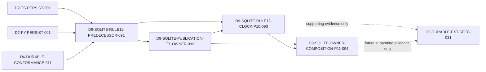

# Graph Engineering 21-Day Task Dependency Graph

- Authority: [Graph Engineering 21-Day Master Plan](../Graph-Engineering-21-Day-Master-Plan.md)
- Evidence sources: [task registry](../../codex_logs/task-registry.json),
  append-only run logs under `codex_logs/`, and CI/release artifacts
- Scope: Day 1 through Day 21, including product, quality, security, release,
  and organic-launch work

## 1. How to read this graph

This document turns the calendar into dependency and gate relationships. It is
not a progress report. A node ID such as `D09` identifies planned scope; it does
not mean that the node is complete. Completion requires evidence in the task
registry, logs, tests, and release artifacts. No checkbox or position in this
document is completion evidence.

The master plan's live checkpoint remains authoritative. In particular, the
checkpoint describes Days 1-4 as partial, Day 5 primitives as partial and the
pipeline slice as in progress, Day 6 as partial, and the Day 9 delivery as
limited to immutable local DAG recovery. The existing Alpha 1 tag does not
waive unfinished Day 7 scope or any later gate.

Dependency terms:

- **Hard dependency**: the predecessor's exit evidence is required before the
  dependent node can pass its own exit gate.
- **Scaffold dependency**: fixtures, interfaces, documentation, or UI shells
  may be prepared early, but cannot be represented as integrated or released.
- **Join gate**: every listed input must be green; one successful lane cannot
  mask a divergent or missing lane.
- **Freeze**: changes after the freeze require an explicit reviewed exception,
  migration/compatibility analysis, and rerunning all affected downstream
  gates.
- **Fallback**: a fail-closed containment path, never an alternate way to call
  the original gate successful.

## 2. Global execution rules

1. `spec/` is the cross-language protocol authority. Shared schemas and
   conformance fixtures are integration-owned and must be reviewed before the
   TypeScript and Python implementations merge.
2. TypeScript and Python work may run in parallel after their input contract is
   frozen. They join at the same fixture and envelope gates; neither runtime is
   a reference implementation that can silently override the other.
3. Platform work may scaffold ahead of a runtime gate, but public CLI, MCP,
   Explorer, examples, and claims must use released behavior rather than mocks
   unless they are explicitly labeled as mock-only.
4. There are at most four active lanes: integration, TypeScript, Python, and
   platform/quality/growth. Each lane owns one active package, and shared-file
   writes are serialized through integration.
5. Integrate twice daily. An implementer cannot be the sole reviewer of their
   own work. Every merge needs focused tests and the relevant shared
   conformance run.
6. A failed hard gate blocks dependent exits. Independent scaffolding may
   continue, but it cannot be marked integrated, release-ready, or complete.
7. Failures remain structured values or events. Null substitution, unbounded
   retry, implicit cycles, unbounded dynamic fan-out, and authority expansion
   are never valid fallbacks.
8. External effects remain at-least-once. Recovery uses idempotency keys,
   approval, or explicit compensation; it must not claim that an irreversible
   external effect was rolled back.

## 3. Dependency spine and parallel waves

The calendar has a sequential release spine with join dependencies. The
current capability-critical segment called out by the master plan is pipeline
semantics, bounded convergence and hard budgets, model/cost routing,
verification, isolation, and provider adapters. Durable, cancellation, and
failure-envelope gates join that segment before API freeze.

```mermaid
flowchart LR
  D01[D01 contracts] --> D02[D02 canonical IR]
  D02 --> D03[D03 compiler]
  D03 --> D04[D04 scheduler]
  D04 --> D05[D05 pipeline and barrier]
  D05 --> D06[D06 router and failure states]
  D06 --> D07[D07 bounded cycles and Alpha 1]
  D07 --> D08[D08 retry cancellation chaos]
  D08 --> D09[D09 durable recovery]
  D07 --> D10[D10 budgets and model routing]
  D09 --> D10
  D06 --> D11[D11 verifier semantics]
  D09 --> D11
  D10 --> D11
  D08 --> D12[D12 isolation]
  D11 --> D12
  D10 --> D13[D13 providers and Alpha 2]
  D12 --> D13
  D09 --> D14[D14 public API freeze]
  D11 --> D14
  D12 --> D14
  D13 --> D14
  D09 --> D15[D15 production stores and Explorer]
  D13 --> D15
  D14 --> D15
  D12 --> D16[D16 security preflight]
  D13 --> D16
  D15 --> D16
  D14 --> D17[D17 Beta]
  D15 --> D17
  D16 --> D17
  D14 --> D18[D18 compatibility audit]
  D17 --> D18
  D16 --> D19[D19 RC freeze]
  D18 --> D19
  D16 --> D20[D20 provenance and go/no-go]
  D17 --> D20
  D19 --> D20
  D20 --> D21[D21 stable release or full RC]
```



| Wave | Days | Parallel work | Required join before advancing |
|---|---:|---|---|
| W0: authority and ownership | 1 | Plans/contracts, both workspaces, CI/governance/registry audit | Contracts, owners, risks, and external-access blockers are explicit |
| W1: contract to compiler | 2-3 | TS builders/compiler, Python models/compiler, schema fixtures, CLI shell, Quickstart | Byte-equivalent IR and shared invalid-graph verdicts |
| W2: graph execution | 4-7 | Both schedulers/primitives, viewer/tests/demos, integration reviews | Deterministic diamond, real streaming, complete terminal states, bounded cycles, honest Alpha 1 |
| W3: control and judgment | 8-11 | Retry/cancel, persistence, budgets/providers, verifier UX and failure injection | Bounded attempts, durable recovery, budget stops, rejected/unknown gating, runtime parity |
| W4: containment and extensibility | 12-14 | Isolation, provider adapters, doctor/score, MCP/plugins, ten pattern skeletons | Escape tests, adapter contract, read-only MCP default, reviewed public API/IR freeze |
| W5: scale and hardening | 15-17 | Production stores/workers, Explorer/site, security/fuzz/SBOM, docs/testers | Performance/usability target, no unaccepted high/critical issue, tester-backed Beta |
| W6: audit and release | 18-21 | Compatibility fixes, package rehearsals, docs/assets/community support | Zero conformance drift, RC freeze, every mandatory gate and provenance artifact green |

The longest release path is the merge spine from `D01` to `D21`. Work outside
that spine shortens elapsed time only when it does not consume a not-yet-frozen
contract. A late failure at `D09`, `D12`, `D16`, `D18`, or `D20` reopens every
downstream artifact that relied on the failed property.

## 4. Day-by-day delivery nodes

### W0-W1: authority, contracts, and compiler

| Node | Hard entry gate | Required deliverables by lane | Exit gate | Failure containment and re-entry |
|---|---|---|---|---|
| `D01` | Repository identity and available owners; no prior day | **Integration:** materialize plans, restore remote, freeze initial IR/events/ADRs. **TS:** workspace/bootstrap. **Python:** workspace/bootstrap. **Platform:** CI, governance, registry-name audit. | Contracts, ownership, risks, and unavailable publishing authority are frozen and recorded. | Keep work local and unpublished; serialize shared-contract edits; record missing remote/registry authority as blocked. Re-enter only after ownership and risk decisions are reviewable. |
| `D02` | `D01`; draft protocol namespace and serialization rules available | **Integration:** review canonical serialization. **TS:** builders and schema types. **Python:** builders and Pydantic models. **Platform:** JSON Schema, negative fixtures, CLI contract. | Both languages produce byte-equivalent canonical IR and stable hashes for the shared corpus. | Freeze compiler integration; reduce to the smallest divergent fixture; change the canonical contract only through reviewed integration ownership; rerun both language suites. |
| `D03` | `D02` byte-equivalence and IR freeze | **Integration:** freeze diagnostics. **TS/Python:** compiler and DAG validation. **Platform:** `init`, `validate`, `plan`, and Quickstart v0. | Shared invalid-graph fixtures produce aligned verdicts, stable error codes, and JSON envelopes. | Do not start scheduler integration on ambiguous graphs; quarantine divergent diagnostics, add a shared negative fixture, and re-enter after both compilers reject/accept identically. |

### W2: deterministic execution and Alpha 1

| Node | Hard entry gate | Required deliverables by lane | Exit gate | Failure containment and re-entry |
|---|---|---|---|---|
| `D04` | `D03` compiler/diagnostic gate; the later subgraph/edge contract additionally consumes frozen D2 builders, both native runtimes, durable namespace semantics, and pipeline conformance | **Integration:** integrate chain and diamond, then freeze subgraph/reducer/artifact-ref/stream-edge semantics. **TS/Python:** deterministic ready-queue scheduler and bounded fan-out/fan-in. **Platform:** trace viewer and concurrency tests. | Deterministic diamond parity: outputs, event constraints, hashes, and terminal envelopes agree; the later edge contract has shared TS/Python fixtures rather than claiming pipeline behavior from the initial scheduler. | Keep only deterministic mock execution enabled; do not publish concurrency/performance claims; fix ordering through shared fixtures before re-entry. |
| `D05` | `D04` scheduler parity and bounded concurrency | **Integration:** review scheduling semantics. **TS/Python:** pipeline, barrier, and backpressure. **Platform:** research demo and benchmarks. | Fast items flow without an accidental whole-stage barrier; buffers, demand, cancellation, retry/drop/stop/dead-letter, and barrier waits remain bounded and observable. | Mark the primitive experimental, stop on buffer/item/attempt limits, and withhold demo/benchmark claims. Re-enter with adversarial slow-consumer, cancellation, timeout, and parity evidence. |
| `D06` | `D05` scheduling contract; structured settled-result base | **Integration:** freeze state and failure envelopes. **TS/Python:** router, failures, quorum. **Platform:** diff-review flow and failure injection. | Every terminal state is defined; router/barrier/quorum semantics and failure envelopes match across languages. | Reject unknown envelope/state variants at the boundary, never coerce to null, and block cycles/verifiers that consume ambiguous outcomes. Add fixtures and refreeze deliberately. |
| `D07` | Cycle/GraphPatch contract consumes the frozen D2 builder/IR contract and both native runtime bases; native execution also consumes `D06`, bounded pipeline, and failure boundaries | **Integration:** Alpha 1 integration. **TS/Python:** bounded cycles with seen-set and hard iteration/duration/cost/node/attempt limits. **Platform:** discovery demo and build-in-public content. | Honest `0.1.0-alpha.1` artifact plus bounded-cycle exit reasons and release evidence; a tag alone does not satisfy missing scope. | Retain the last verified prerelease, label excluded capability explicitly, and do not broaden release claims. Re-enter after cycle-budget and package-install evidence passes. |

### W3: bounded control, recovery, cost, and verification

| Node | Hard entry gate | Required deliverables by lane | Exit gate | Failure containment and re-entry |
|---|---|---|---|---|
| `D08` | `D06` failure state machine and `D07` hard bounds | **Integration:** join independent runtime chaos (`084`) and durable operational controls (`085`). **TS/Python:** retry, timeout, cancellation, propagated abort and exact accounting. **Platform:** commands land only after extended durability. | No unbounded retry/deadlock/leak; cancellation terminates scheduling; operational commands reject stale/racing actions with stable envelopes. | Fail closed on exhausted/unsafe bounds, disable automatic retry for ambiguous effects, and keep operations diagnostic-only until D9 recovery exists. |
| `D09` | `D06` durable envelope; durable-extension spec explicitly consumes canonical redaction and approval contracts; final durable conformance also consumes scheduler-integrated router/barrier behavior for zero-rejudge replay | **Integration:** redaction, approval, durable-extension contracts. **TS/Python:** independent redaction (`087/088`) then leases, stores, resume/replay/fork. **Platform/security:** conformance `089`, canary sinks and crash/race tests. | Persisted flags describe actual bytes; successful internal results never rerun; approvals are authority-bound; dual resume cannot advance twice; replay/fork lineage and replayed route decisions are traceable. | Disable unsupported recovery, never label raw bytes redacted, preserve history and stop before ambiguous non-idempotent replay. |
| `D10` | Budget contract needs `D06` accounting and `D07` cycle bounds; native crash-safe ledgers additionally need extended `D09` conformance; the final join consumes native `D07` cycle conformance | **Integration:** freeze units/reservations early. **TS/Python:** cost, budget and model router after durable accounting. **Platform:** cost UI and pricing snapshots. | Hard iteration, duration, cost, node, fan-out, and attempt bounds each pass boundary and over-limit tests, stop new scheduling, and survive resume. | Use deterministic mock pricing/routing, reject unsafe unknown cost and withhold claims until snapshot/recovery tests pass. |
| `D11` | Verification contract needs `D06` quorum and approval `077`; native execution additionally consumes `D10` budget conformance | **Integration:** verifier-semantics review. **TS/Python:** adversarial refutation, diverse lenses, citations, judges, reflection and abstention/unknown. **Platform:** cited report and verifier tests. | Rejected and unknown results are gated; insufficient quorum never becomes implicit pass; votes, evidence, rubric and tie-break version are retained. | Return unknown or require a human gate, preserve evidence and never substitute maker context for isolated verification. |

### W4: isolation, adapters, and public API freeze

| Node | Hard entry gate | Required deliverables by lane | Exit gate | Failure containment and re-entry |
|---|---|---|---|---|
| `D12` | Threat contract may start after cycle, redaction and approval contracts; implementation/red-team later joins `D11` human-gate conformance | **Integration:** isolation/threat review. **TS/Python:** worktree/process/container isolation, leases, path policy, namespaces, cleanup and merge node. **Platform:** migration demo and escape tests. | Parallel writes, ports, temp files, caches and database namespaces stay isolated; conflicts are structured failures. | Deny shell/write/network/secret capabilities, serialize work, preserve conflicted worktrees and disable merge automation until escape/conflict tests pass. |
| `D13` | `D10` model contract and `D12` capability/isolation policy | **Integration:** Alpha 2 integration. **TS/Python:** deterministic mock, OpenAI, Anthropic, Gemini, OpenAI-compatible/local, HTTP, shell/subprocess, and MCP adapter contracts. **Platform:** doctor, Graph Ready score, badge, visualize. | Honest `0.2.0-alpha.2`; adapters share discovery, structured output, streaming, tools, usage, retry, rate-limit, and cancellation behavior. | Fall back to the deterministic mock and last verified alpha, disable a nonconforming adapter, and make doctor report the blocker. Real-provider flakiness cannot weaken normal CI. |
| `D14` | Full `D09`, `D11`, `D12`, and `D13` gates | **Integration:** public API freeze. **TS:** MCP/runtime extension interfaces. **Python:** plugin extension interfaces. **Platform:** read-only-default MCP and all ten pattern skeletons. | Reviewed alpha API and IR freeze, documented extension contracts, and skeleton coverage for every named pattern. | Delay the freeze, mark unstable surfaces experimental, keep MCP read-only, and reject mutations without policy/approval. Any post-freeze change requires compatibility review and downstream reruns. |

### W5: production scale, security, and Beta

| Node | Hard entry gate | Required deliverables by lane | Exit gate | Failure containment and re-entry |
|---|---|---|---|---|
| `D15` | `D09` storage semantics, `D13` adapters, and `D14` API freeze | **Integration:** performance review. **TS/Python:** PostgreSQL, S3-compatible artifacts, worker mode. **Platform:** Explorer, site, and video. | A clean first run is under five minutes, production stores pass conformance, and worker/resource bounds meet approved baselines. | Retain SQLite/local artifacts and single-worker mode, label production adapters unavailable, and block performance claims after an unapproved regression over 10%. |
| `D16` | `D12` isolation, `D13` providers, complete `D15` storage/Explorer surface and independent redaction join `089` | **Integration:** security preflight. **TS/Python:** independently reverify redaction/policy. **Platform:** privacy, canary, threat, fuzz, license and SBOM evidence. | No unaccepted high/critical blocker; secret, dependency, license and static scans pass with telemetry/capture off by default. | Disable affected surfaces, deny capability, rotate exposed credentials outside the repository and stay prerelease until full reviewed rescan. |
| `D17` | `D14` frozen API, `D15` performance, `D16` security, and the complete doctor/score/badge DX surface | **Integration:** immutable Beta artifact and bug burn-down. **External/PQG:** separate `D17-USABILITY-076` consumes Beta plus privacy policy. | Beta artifact is immutable with zero repository-owned P0/P1; external usability evidence remains an independent roll-up dependency. | Keep the last alpha/beta and continue tester rounds; missing external evidence cannot be replaced with maintainer self-testing. |

### W6: compatibility, RC, provenance, and release

| Node | Hard entry gate | Required deliverables by lane | Exit gate | Failure containment and re-entry |
|---|---|---|---|---|
| `D18` | `D14` frozen contracts, `D17` complete Beta surface, durable operational commands, and the complete DX command surface | **Integration:** compatibility audit. **TS/Python:** parity and compatibility fixes, including full source CLI goldens. **Platform:** reproducible benchmarks, cases, and launch copy. | No cross-language conformance divergence across canonical data, compilation, runtime, persistence, full source CLI JSON/errors/exits, adapters, stores, and all patterns. | Block RC, freeze incompatible feature work, reduce every mismatch to a shared fixture, and rerun all affected matrices before re-entry. |
| `D19` | `D16` security gate, `D18` compatibility gate, and canonical unscoped npm distribution gate `D14-NPM-DIST-078` | **Integration:** release-candidate freeze. **TS/Python:** clean install and upgrade. **Platform:** installed-artifact OS/runtime and complete CLI matrices plus documentation tests. | `1.0.0-rc.1` is reproducibly installable/upgradable; npm tarballs and Python wheel/sdist expose working `graph` and `grapheng`; every installed command has schema-valid JSON/errors/exits; the Linux/macOS/Windows Node/Python matrix passes; complete feature freeze is enforced. | Retain Beta, allow only reviewed release-blocker fixes, invalidate affected RC artifacts, and restart compatibility/install/doc checks. |
| `D20` | `D16`, `D17`, and `D19`; all evidence collectors available | **Integration:** provenance and go/no-go. **TS:** npm rehearsal. **Python:** PyPI rehearsal. **Platform:** site, assets, and community readiness. | Every mandatory gate in Sections 7-9 is green; the Section 10 asset manifest is release-ready; trusted-publishing, SBOM, checksums, attestations, namespace/alias ownership, clean-install default-off privacy, full final-package/support secret scanning, and install rehearsals are verified. | Do not publish stable packages. Rebuild from a clean trusted environment or ship a fully labeled RC with an explicit blocker list. Never infer external publishing authority. |
| `D21` | `D20` go decision | **Integration:** release/support. **TS:** npm release/support. **Python:** PyPI release/support. **Platform:** GitHub, site, content, and community launch/support. | All planned assets and at least a complete Beta/RC exist. Stable v1 ships only when recovery, security, conformance, provenance, and external-usability gates pass; otherwise the release remains a complete RC. | Publish/support only the label justified by evidence, deprecate a broken package version rather than rewriting history, disclose blockers, and continue RC support until re-entry criteria pass. |

## 5. Cross-cutting product closure

Calendar exits must also close the following surfaces. These rows prevent a
day-level demo from being mistaken for the complete product contract.

| Closure node | Builds on | Required closure evidence | Release join |
|---|---|---|---|
| `S01` Graph IR and compiler | `D01-D03` | TS/Python/YAML/JSON compile to one versioned IR; stable hashes; identity, reachability, endpoint, port/schema, router, reducer, budget, capability, and loop validation | `D14`, `D18` |
| `S02` execution primitives | `D04-D08` | DAG, dry-run dynamic checked patches, bounded fan-out/fan-in, deterministic reduce plus semantic synthesis, pipeline, all/minimum/percentage/quorum/deadline barrier, single/multicast router, subgraph, human gate, bounded cycles, structured failures, cancellation | `D14`, `D18` |
| `S03` durable execution | `D06`, `D08-D09`, `D9-REDACTION-039` | Event/Checkpoint/Artifact/Lock interfaces; append-only truth, truthful redaction metadata, snapshot acceleration, lease/CAS, resume, replay, fork, approvals, idempotency guidance | `D15`, `D16`, `D18`, `D20` |
| `S04` providers and tools | `D10`, `D12-D13` | All official adapters meet the shared adapter contract; mock is normal-CI default; real-provider tests are opt-in/nightly | `D18`, `D20` |
| `S05` policy and isolation | `D06`, `D08`, `D9-REDACTION-039`, `D12`, `D16` | Deny-by-default tool/filesystem/network/secret policies, sink-before-write redaction, no authority expansion, worktree/process/container namespace isolation, safe merge | `D16`, `D20` |
| `S06` observability and Explorer | `D04`, `D08-D11`, `D9-REDACTION-039`, `D15` | JSONL and OpenTelemetry model, live topology/state/budget/critical path/retry/verdict views, replay/fork time travel, truthful redaction and opt-in capture | `D16-D20` |
| `S07` CLI and MCP | `D03`, `D08-D09`, `D13-D14` | `init`/`add`; `validate`/`compile`/`plan`/`run`; `status`/`watch`/`inspect`/`logs`; `pause`/`resume`/`cancel`/`retry`; `replay`/`fork`; `cost`; `doctor`/`score`/`badge`/`visualize`; worktree, artifact, plugin, and MCP commands; JSON output, error envelopes, exit codes; MCP read-only default | `D17-D20` |
| `S08` production storage/worker mode | `D09`, `D14-D15` | SQLite/local defaults plus PostgreSQL/S3 and workers under shared storage, race, resource, and chaos conformance | `D18-D20` |
| `S09` education and product parity | `D03-D15` | Fourteen-step executable course, pattern picker, anti-pattern/failure guides, operations/safety docs, authentic success/failure stories, showcase and galleries | `D17-D21` |
| `S10` governance and distribution | `D01`, `D16-D21` | MIT/third-party notices, contributor path, CI matrices, vulnerability response, trusted publishing, provenance, support plan, organic-only growth; legitimate `graph-engineering` npm/PyPI distributions and `graph`/`grapheng` executables without empty squatting packages | `D20-D21` |
| `S11` execution control | `D01-D21` | Planned architecture/delivery/growth documents, append-only decision/daily/incident evidence, 30-minute scanner with fixed-root locking and atomic snapshots, bounded evidence-based nudges, and no fabricated agent control | Every integration window and `D20` |

The executable course must cover real data edges, fake-edge audits, contracts,
diamond topology, pipelines versus barriers, dynamic routing, adversarial
verification, isolation, convergence, model tiering, persistence, cost/latency
topology, safe self-routing, and when not to use a graph.

`doctor` must check schemas, stores, providers, credentials, version drift,
orphan leases/worktrees, and security defaults, then return the top three
corrective actions. Graph Ready scoring is deterministic and follows the same
top-three-remediation rule.

## 6. Ten executable pattern dependencies

`PB` is a hard bundle gate applied independently to every pattern. It requires:

- YAML/JSON, TypeScript, and Python implementations;
- deterministic fixtures, expected events, and mock execution;
- real-provider setup that is opt-in and never required by normal CI;
- an architecture diagram, explicit budgets, and explicit permissions;
- structured failure and durable resume demonstrations;
- unit/integration tests plus the shared pattern end-to-end suite; and
- Claude Code, Codex, MCP, and shell usage guides without unsupported private
  API claims.

Day 14 requires all ten skeletons. A skeleton is not `PB` completion. Pattern
end-to-end evidence joins at `D18`, release-asset closure at `D20`, and public
release at `D21`.

| Pattern node | Earliest demo/skeleton | Hard capability dependencies | Pattern-specific exit and fallback |
|---|---:|---|---|
| `P01` Multi-source research diamond | Demo `D05`; skeleton `D14` | `D04` diamond/fan-in, `D05` streaming, `D09` resume, `D10` budget, `PB` | Deterministic reduction and bounded source fan-out; a failed source is a settled result, never null. |
| `P02` Cited deep research with citation verification | Cited demo `D11`; skeleton `D14` | `P01`, `D11` isolated verifier/evidence, `D13` adapters, `PB` | Unsupported/failed citations reject or become unknown/human-gated; never publish an implicit pass. |
| `P03` Route authentication security sweep | Skeleton `D14` | `D06` exhaustive router, `D08` cancellation, `D12` capability/isolation, `D16` security, `PB` | Missing route/default or denied capability fails closed; no unauthorized scan or write. |
| `P04` Diff risk router with diverse judge panel | Diff demo `D06`; skeleton `D14` | `D06` route/quorum, `D11` diverse panel/abstention, `D12` isolation, `PB` | All votes and evidence retained; insufficient quorum is unknown/human gate. |
| `P05` Loop-until-dry bug discovery | Discovery demo `D07`; skeleton `D14` | `D07` seen-set convergence and hard stops, `D10` cost budget, `D11` verifier, `PB` | Exit reason is explicit; limit exhaustion is not presented as convergence. |
| `P06` File-by-file migration with worktrees and test gates | Migration demo `D12`; skeleton `D14` | `D09` resume, `D12` leases/path policy/merge node, `D16` escape tests, `PB` | Conflict or test failure is structured; preserve isolated work and do not merge. |
| `P07` CI failure sweeper | Skeleton `D14` | `D08` retry/cancel, `D09` recovery, `D12` process isolation, `D13` shell/agent adapters, `PB` | CI mutations require idempotency/approval; exhausted attempts stop and retain diagnostics. |
| `P08` Dependency update sweeper | Skeleton `D14` | `D06` routing, `D09` recovery, `D12` isolation, `D13` HTTP/shell adapters, `D16` dependency/license scans, `PB` | Updates stay isolated until tests and policy pass; unsafe or conflicting updates remain unmerged. |
| `P09` PR babysitter | Skeleton `D14` | `D06` routing/quorum, `D09` durable waiting, `D11` gates, `D13-D14` adapters/MCP, `PB` | External writes are idempotent or explicitly approved; stale approvals are rejected. |
| `P10` Scheduled ecosystem scan | Skeleton `D14` | `D07-D10` fan-out/cycle/budget/recovery, `D13` providers, `D15` worker/storage, `PB` | Schedule, fan-out, cost, and duration are bounded; partial outages yield structured settled results and resume safely. |

## 7. Mandatory semantic and conformance gates

### 7.1 Non-negotiable invariants

| Gate | Required condition | First enforcement | Final evidence |
|---|---|---:|---:|
| `I01` | Canonical `spec/` contract governs both runtimes and shared fixtures | `D01` | `D18-D20` |
| `I02` | Failures are structured values/events and are never silently replaced by null | `D03` | `D18-D20` |
| `I03` | Deterministic transforms do plumbing; model nodes perform judgment | `D02-D03` | `D11`, `D18` |
| `I04` | No implicit cycle, unbounded retry, or unbounded dynamic fan-out | `D03` | `D08`, `D18-D20` |
| `I05` | External effects are at-least-once and require idempotency or approval | `D06` | `D09`, `D16`, `D20` |
| `I06` | Telemetry and prompt/response capture are off by default and redacted when enabled | `D01` | `D16`, `D20` |
| `I07` | Dynamic patches pass the same compiler, policy, permission, and budget gates with capped depth/fan-out/nodes/attempts | `D07-D14` | `D18-D20` |
| `I08` | Planners cannot expand authority; shell, writes, network, secrets, and MCP mutation are deny-by-default | `D12-D14` | `D16`, `D20` |
| `I09` | Insufficient verification quorum is unknown or human-gated, never implicit pass | `D11` | `D18-D20` |
| `I10` | Stable v1 claims are limited to evidence; no unsupported “battle-tested” or “production proven” language | `D17` | `D20-D21` |

### 7.2 Cross-language equality contract

TypeScript and Python must agree on each row using shared fixtures and stable
machine-readable evidence. A mismatch in any row blocks `D18`.

| Gate | Equality requirement | Primary join |
|---|---|---:|
| `X01` | Canonical bytes and hashes | `D02` |
| `X02` | Compilation verdicts and diagnostics/error codes | `D03` |
| `X03` | Route selection and replayed decisions | `D06`, `D09` |
| `X04` | Barrier and quorum settlement | `D05-D06` |
| `X05` | Event-ordering constraints | `D04`, `D09` |
| `X06` | Terminal states and structured failures | `D06`, `D08` |
| `X07` | Retry, timeout, cancellation, and attempt accounting | `D08` |
| `X08` | Resume, replay, and fork results | `D09` |
| `X09` | Stable JSON envelopes and CLI exit behavior | `D03`, `D14`, `D18` |
| `X10` | Adapter and storage conformance | `D13`, `D15`, `D18` |

## 8. Mandatory test scenario ledger

Every scenario below needs deterministic tests, structured expected results,
and the owning platform matrix where applicable. “Covered by nearby behavior”
is not sufficient evidence.

| Gate | Mandatory scenario | Dependency / latest blocking join |
|---|---|---|
| `T01` | Missing node references | Compiler; `D03` |
| `T02` | Duplicate node identities | Compiler; `D03` |
| `T03` | Unreachable nodes | Compiler; `D03` |
| `T04` | Invalid ports | Compiler/schema; `D03` |
| `T05` | Invalid input/output/edge schemas | Compiler/runtime; `D03`, `D06` |
| `T06` | Implicit graph cycles | Compiler; `D03` |
| `T07` | Incomplete router without exhaustive cases/default | Router; `D06` |
| `T08` | Unbounded loops | Cycle compiler/runtime; `D07` |
| `T09` | Unauthorized transforms or capability expansion | Policy; `D12`, `D16` |
| `T10` | 100-way parallel concurrency under configured bounds | Scheduler; `D04`, `D15` |
| `T11` | Every failure policy, including retry/drop/stop/dead-letter/fail-fast/partial/quorum | Runtime; `D05-D08` |
| `T12` | Streaming, bounded buffering, demand, and downstream backpressure | Pipeline; `D05` |
| `T13` | Barrier timeout/deadline with success/failure/missing statistics | Barrier; `D05-D06` |
| `T14` | Router replay without re-judging | Router/persistence; `D06`, `D09` |
| `T15` | Malicious dynamic patches and dry-run rejection | Compiler/policy; `D07`, `D12`, `D16` |
| `T16` | Verifier pass, reject, and abstain/unknown | Verification; `D11` |
| `T17` | Global seen-set convergence | Cycles; `D07` |
| `T18` | Hard iteration, duration, cost, node, fan-out, and attempt stops | Cycles/budgets; `D07-D10` |
| `T19` | Crash recovery at every checkpoint/crash window | Persistence; `D09` |
| `T20` | Dual-resume lease/CAS races | Persistence; `D09`, `D15` |
| `T21` | Replay and fork lineage/results | Persistence; `D09` |
| `T22` | Stale approvals | Human gate/persistence; `D09`, `D11` |
| `T23` | Worktree lease and merge conflicts | Isolation; `D12` |
| `T24` | Process/container port, temp, cache, and database namespace isolation | Isolation; `D12`, `D16` |
| `T25` | Provider fallback and circuit breaking | Adapters; `D13` |
| `T26` | Secret redaction in errors, events, traces, prompts, and tools | Corrective `D9-REDACTION-039`; independent security revalidation in `D16` |
| `T27` | Cancellation before start and while running across runtime/provider/tool boundaries | Runtime/adapters; `D08`, `D13` |
| `T28` | Prompt-injection attempts cannot expand capability or bypass policy | Security; `D12`, `D16` |
| `T29` | Complete CLI init/add, validate/compile/plan/run, status/watch/inspect/logs, pause/resume/cancel/retry, replay/fork, cost/doctor/score/badge/visualize, worktree/artifact/plugin, and MCP flow | CLI; `D14`, `D17-D19` |
| `T30` | Shared Event/Checkpoint/Artifact/Lock and SQLite/PostgreSQL/S3 storage conformance | Persistence/storage; `D09`, `D15`, `D18` |
| `T31` | All ten pattern end-to-end suites in YAML/JSON, TS, and Python | Patterns; `D18-D20` |
| `T32` | 1,000-node graph resource bounds | Compiler/scheduler/worker; `D15`, `D18` |
| `T33` | Kill, network, store, and artifact chaos with no deadlock/budget escape | Runtime/persistence; `D09`, `D15-D18` |

## 9. Quantitative release gates

These are mandatory thresholds, not aspirational dashboards. A waiver is valid
only where the master plan explicitly allows one: a performance regression over
10% needs an approved baseline ADR. Other missed thresholds select RC rather
than stable v1.

| Gate | Required threshold | Evidence due |
|---|---|---:|
| `Q01` | Compiler, scheduler, event store, and policy each have at least 90% statement and 85% branch coverage | `D18-D20` |
| `Q02` | At least 250 unit/integration cases per language | `D18-D20` |
| `Q03` | One shared adapter/storage conformance suite | `D15`, final `D18-D20` |
| `Q04` | 100 randomized failure runs with no deadlock, unbounded spawn, or budget escape | `D16-D20` |
| `Q05` | Linux/macOS/Windows; Node 20/22; Python 3.11/3.12/3.13 matrix | `D18-D20` |
| `Q06` | Deterministic mock providers in normal CI; real providers only opt-in/nightly | `D13-D20` |
| `Q07` | No performance regression above 10% without an approved baseline ADR | `D15-D20` |
| `Q08` | No unaccepted high/critical vulnerability; secret, dependency, license, and static-analysis scans pass | `D9-REDACTION-039`, `D16-D20` |
| `Q09` | Trusted npm/PyPI publishing, SBOM, checksums, and attestations | `D20` |
| `Q10` | Quickstart uses no more than three commands; at least 80% of external testers finish within five minutes | `D17-D20` |
| `Q11` | No P0/P1 defects and at least five external usability reports | `D17-D20` |

Stable v1 is a conjunctive decision:

```text
V1 = recovery
  AND security
  AND cross-language conformance
  AND package provenance
  AND external usability
  AND complete planned-asset manifest
  AND Q01..Q11
  AND T01..T33
```

Day 21 still requires all planned assets and at least a complete Beta/RC. If the
stable expression is false, the required release outcome is an honestly labeled
RC, not a partially evidenced stable release; any missing asset keeps the plan
open rather than being silently dropped.

## 10. Launch and education dependency ledger

The following assets are planned deliverables. They depend on executable,
reproducible product evidence and cannot substitute for it.

| Asset | Build window | Hard dependency / truth condition |
|---|---:|---|
| Sixty-second Quickstart | `D03-D20` | Mock-first clean install; at most three commands; external five-minute completion evidence |
| Ninety-second uncut terminal demo | `D15-D20` | Clean recorded run with no hidden manual repair |
| Interactive linear-versus-graph visualization | `D04-D15` | Real topology/events and accurate limitations |
| Fourteen-step executable roadmap | `D03-D18` | `S01-S09`, runnable examples, and “when not to use a graph” |
| Architecture essay | `D14-D20` | Frozen IR/API plus accurate durability, failure, and at-least-once claims |
| Side-by-side TS/Python examples | `D02-D18` | `X01-X10` parity evidence |
| Reproducible performance and recovery benchmarks | `D05`, `D09`, `D15-D18` | Versioned environment/data/baseline and no hidden provider dependency |
| Four case studies, including one authentic failure | `D11-D20` | Reproducible traces, explicit limits, no unsupported success claims |
| Graph Ready G0-G4 score and badge | `D13-D20` | Deterministic scoring plus top three remediation actions |
| Pattern picker and anti-pattern/failure-mode guides | `D14-D20` | All pattern skeletons and verified failure behavior |
| Operating and safety documentation | `D12-D20` | Threat, isolation, capability, recovery, and incident evidence |
| Interactive showcase | `D15-D21` | Explorer plus deterministic examples |
| Adopter gallery and trace gallery | `D17-D21` | Consent and real external/adopter evidence; never fabricated |
| English and Chinese launch summaries | `D18-D21` | Same verified claims and version across languages |
| GitHub, Hacker News, X, LinkedIn, Reddit, Dev.to, and Chinese-community material | `D18-D21` | Channel-specific copy, organic promotion only, current install links |

Content beats depend on the matching evidence: build-in-public through Day 6,
Alpha 1 on Day 7, crash/resume on Day 9, verifier demo on Day 11, Alpha 2 on
Day 13, benchmarks/Explorer on Day 15, tester-backed Beta on Day 17, RC and
security story on Day 19, and coordinated release/support on Day 21.

Star milestones (300/1,000/2,000/6,000+ on Days 7/13/17/21) are stretch
outcomes, not engineering gates. The controlled leading goals are 2,000 CLI
downloads, 500 successful or self-reported runs, ten public adopters, ten
outside contributors, twenty-five external PRs, response p50 below twelve
hours, and ten personalized trial invitations. They must remain organic. A miss
changes positioning, Quickstart, reliability, or retention work; it never
authorizes paid/fake stars or a false release claim.

The north-star measures are weekly successful graph runs, seven-day retained
repositories, time to first success, external adopters, and non-maintainer
merged PRs. High visits with low stars triggers positioning work; stars without
installs triggers Quickstart work; installs without successful runs pauses
promotion; runs without retention triggers use-case and reliability work.

## 11. Failure fallback and reopening rules

| Failure class | Immediate containment | Re-entry evidence | Downstream impact |
|---|---|---|---|
| Contract or language divergence | Freeze merges; isolate a minimal shared fixture; preserve both outputs | Reviewed canonical decision plus TS/Python conformance | Reopen every consumer since the affected freeze |
| Deadlock, unbounded work, or budget escape | Cancel/halt scheduling; deny new dynamic work; retain trace | Deterministic reproducer plus randomized bounded run | Reopen scheduler, pipeline/cycle, persistence, performance, and security gates |
| Recovery ambiguity or duplicate advance | Stop resume/fork; preserve append-only history; require approval for non-idempotent work | Crash-window and dual-resume evidence | Reopen cost, verification, patterns, storage, Beta, and release |
| Provider or production-store failure | Disable adapter; use labeled mock or SQLite/local fallback | Shared adapter/storage suite and opt-in live evidence where applicable | Feature remains excluded from release claims until restored |
| Isolation or security escape | Deny capability, disable mutation/provider, preserve incident evidence | Threat review, exploit regression, fuzz/scans, independent review | Reopen all packages/assets that exposed the surface |
| Performance regression | Stop merge when over 10% unless a baseline ADR is approved | Reproducible before/after benchmark or approved ADR | Reopen Explorer/demo/case-study claims and release matrix |
| External usability miss | Continue RC/tester iteration; repair install/Quickstart/docs | At least five reports and 80% five-minute completion | Stable v1 remains blocked; technical work may continue |
| Provenance/publishing failure | Do not publish; rebuild in trusted clean environment | Verified rehearsal, identities, SBOM, checksums, attestations | Stable package release remains blocked |
| Post-publish package defect | Stop promotion; deprecate affected version; publish a new fixed version after gates | Repeated install/upgrade/security/conformance evidence | Never rewrite package history or silently replace artifacts |
| Growth milestone miss | Diagnose visits-to-stars, stars-to-installs, installs-to-runs, and runs-to-retention | Honest activation/retention experiment evidence | Does not waive or itself block technical release gates |

## 12. Post-audit task-level closure graph

This table supersedes any broader day-level edge when the two differ. It turns
the full-plan audit's 16 omitted lanes into executable, single-primary controls.

| Control | Hard predecessors | Direct consumers / exit meaning |
|---|---|---|
| `CTRL-RELEASE-MAP-074` | `CTRL-PLAN-COVERAGE-001` | `CTRL-RELEASE-ROLLUP-086`; all 178 release leaves map uniquely with an explicit blocking bit. |
| `CTRL-EVIDENCE-BACKFILL-075` | `CTRL-EVIDENCE-002` | `CTRL-RELEASE-ROLLUP-086`; historical completed status has zero candidate weight without immutable revalidation. |
| `D17-USABILITY-076` | `D17-BETA-063`, `D16-PRIVACY-079` | Acceptance and roll-up; real consenting testers satisfy 5-report/80%-in-300s gates. |
| `D9-APPROVAL-077` | `D6-DURABLE-SPEC-010`, `D9-REDACTION-039` | D9 durable-extension spec/conformance, D11/D12 contracts and approval-dependent patterns; the contract alone does not prove stale-decision runtime behavior or RC fallback. |
| `D14-NPM-DIST-078` | `D14-API-FREEZE-050`, `D3-CLI-002` | `D19-RC-065`; this task proves the npm tarball only, while D19 joins its binaries with the independently installed Python executables. |
| `D16-PRIVACY-079` | redaction contract, independent native redaction conformance and D12 red-team | External usability/growth; default-off collection, retention, withdrawal and gallery consent are accepted. |
| `D18-SUPPORT-READINESS-080` | D16 security and D18 compatibility | RC and final roll-up; support/incident/rollback/yank readiness and irreversible-side-effect idempotency/approval/compensation fallbacks are proved before publish. |
| `D13-TS-ADAPTERS-081` | `D13-ADAPTER-SPEC-048` | Adapter join `049`; TypeScript native suite passes independently. |
| `D13-PY-ADAPTERS-082` | `D13-ADAPTER-SPEC-048` | Adapter join `049`; Python native suite passes independently. |
| `D18-EDUCATION-ASSETS-083` | patterns, Explorer, Beta/API freeze, external usability and D18 compatibility | RC/docs/growth; executable course, authentic cases, demo, TS/Python examples and bilingual claim audit pass. |
| `D8-RUNTIME-CHAOS-084` | cycle and pipeline conformance | D8 join, durable operations and CI pattern; bounded seeded faults have no leak/deadlock. |
| `D9-OPS-CONTROL-085` | D9 extended conformance and runtime chaos | `D8-CHAOS-OPS-030`, D18 source-CLI parity, D19 installed CLI and then `CTRL-ACCEPTANCE-070`; the operational subset alone cannot prove the complete command surface. |
| `CTRL-RELEASE-ROLLUP-086` | provenance, acceptance, patterns, docs, growth, usability, support, mapping and backfill | `D21-RELEASE-067`; one candidate receives stable, complete-RC or no-release decision. |
| `D9-TS-REDACTION-087` | canonical redaction contract | TS durable extension and redaction join; every TS sink is canary-free. |
| `D9-PY-REDACTION-088` | canonical redaction contract | Python durable extension and redaction join; every Python sink is canary-free. |
| `D9-REDACTION-CONFORMANCE-089` | `087`, `088` | D9 extended conformance, Explorer and D16; wire/migration/identity parity plus independent security acceptance. |

The live registry at this checkpoint contains 107 unique tasks, no dangling
dependency and no cycle. `D21-RELEASE-067` consumes the signed `086` decision;
neither provenance nor acceptance can authorize itself. Pattern tasks explicitly
depend on the runtime, durability, budget, verifier, isolation, adapter and
security producers their examples claim to demonstrate.

### 12.1 Release-leaf semantic joins

A release leaf maps to the earliest downstream task whose own evidence contract
proves the entire checklist sentence. Merely being an ancestor or implementing
one named noun is insufficient. The machine map therefore uses these joins:

| Requirement family | Candidate-bound join | Required closure |
|---|---|---|
| Durable stable-v1 recovery | `CTRL-ACCEPTANCE-070` | D9 crash/replay/approval plus D15 production-store races and D19 candidate artifacts. |
| Canonical spec authority, final compiler corpus and source CLI parity | `D18-COMPAT-BENCH-064` | D2/D3 canonical/compiler and native CLIs, every later compiler feature and positive/negative diagnostic fixture, D9 operational commands, D13 DX, full `X01-X10` source parity. |
| No implicit cycles, unbounded retry, or dynamic fan-out | `CTRL-ACCEPTANCE-070` | D2 compiler cycle rejection, D7 cycle/GraphPatch caps, D8 randomized retry/worker chaos and stable errors. |
| Dynamic patch policy/permission/budget safety | `CTRL-ACCEPTANCE-070` | D7 patch semantics and native parity, D10 all-dimension budgets, D12/D16 authority/security enforcement. |
| Runtime schema and cross-boundary cancellation | `CTRL-ACCEPTANCE-070` | Compiler plus runtime/persistence rejection before write, and D8/D13 runtime-provider-tool cancellation/accounting. |
| Authority expansion and prompt injection | `D16-SECURITY-062` | D12 red-team plus completed adapters, MCP mutation policy, Explorer/storage attack surfaces and independent disposition. |
| Stable-v1 security decision | `CTRL-ACCEPTANCE-070` | D16 runtime-surface preflight plus D18 support sinks, D19 installed artifacts, D20 package/supply-chain evidence, `T09`, `T15`, `T23-T28`, `Q08`, and independent final-candidate disposition. |
| Installed binaries, full CLI, matrix, Quickstart and API/upgrade compatibility | `D19-RC-065` | Real npm tarball and Python wheel/sdist, both executable names, every command envelope/exit, all supported OS/runtime cells. |
| Registry aliases and default-off installed packages | `D20-PROVENANCE-066` | D19 clean artifacts, npm/PyPI authority/alias audit and clean-install privacy observation. |
| Full release secret scan | `D20-PROVENANCE-066` | D16 source/runtime scan plus repository history, final npm/Python packages and source maps, docs/traces, D18 support bundles, positive controls and seeded-negative leak detection. |
| Full sink/support redaction and irreversible-side-effect fallback | `D18-SUPPORT-READINESS-080` | D9 redaction/approval/durability, D16 full-surface security, support-bundle canaries, idempotency, approval and compensation table-top traces. |
| Authentic galleries and external-entry consent | `CTRL-GROWTH-072` | Beta/security/privacy/usability and education artifacts; each public entry is authentic, consented, redacted and withdrawable. |
| Final release claims, surface identity and RC label | `CTRL-RELEASE-ROLLUP-086` | Package, site, docs, demo, release-note, draft GitHub Release and channel-copy audit after every other blocking producer; all surfaces share candidate identity/known limits and any fallback is labeled complete RC. |

Consequently `D2-BUILDERS-YAML-020`, `D7-CYCLE-CONFORMANCE-027`,
`D9-APPROVAL-077`, `D9-OPS-CONTROL-085`, `D14-NPM-DIST-078`,
`D16-PRIVACY-079`, `D16-SECURITY-062`, and `D19-RC-065` remain important
producers but cannot individually close a broader final-compiler, stable
security, full-secret-scan, surface-identity, or RC-label row. The semantic
regression suite fixes all 178 whole-requirement bindings and removes
representative dependencies and evidence fields to prove these joins fail
closed when narrowed again.

## 13. Gate evidence protocol

A day or gate can be recorded as complete only when its evidence includes:

1. the immutable source revision and relevant graph/spec revision;
2. the exact test/validation command, environment matrix, result, and artifact;
3. shared-fixture IDs for every cross-language assertion;
4. coverage, performance, chaos, security, or usability reports where required;
5. an independent reviewer for public behavior;
6. structured blocker or waiver references, without deleting prior evidence;
7. package/image/SBOM/checksum/attestation identities for release artifacts; and
8. explicit exclusions and fallback mode when the full planned surface is not
   present.

The progress scanner is a liveness and artifact-presence signal. A healthy scan
does not satisfy any semantic, threshold, external-usability, provenance, or
release gate in this graph.

`codex_logs/release-evidence/task-revalidation.json` is the append-only
candidate overlay for this protocol. `pnpm check:evidence-closure` audits an
empty overlay successfully but assigns it zero release weight. A release
decision must pass a full, explicit `--candidate <full-commit-sha>` check from a
clean, non-shallow checkout. The selected candidate and every candidate retained
in the overlay must be ancestors of the overlay commit. The checker dynamically
recomputes the transitive ancestors of `CTRL-RELEASE-ROLLUP-086` (excluding the
root), reads candidate sources and evidence files from regular Git blobs rather
than the worktree, and checks the full candidate/record prefix across every
parent edge in the complete overlay ancestry. Replace refs, grafts, symlinks,
skip-worktree/assume-unchanged entries, deletion, rewrite, and an unrelated
commit after a rewrite all fail closed.

Each record contains a digest-bound `coverage` object. Every candidate
`expected_tests` string appears exactly once and maps to one or more valid
command indexes; every `expected_artifacts` path appears exactly once and maps
to one or more valid artifact indexes. The index sets are closed—no command or
artifact can be left unbound—and every artifact must equal its expected path or
be a regular file below that exact directory boundary. Missing, invented,
duplicate, reordered, dangling, unrelated-prefix, or failed-command coverage
rejects the record. A superseding record must use commands and review timestamps
strictly newer than its predecessor and cannot reuse any earlier command/review
report path or digest.

These machine checks prove immutable binding and exact declared coverage; they
do not interpret whether a command semantically proves a natural-language test
or whether a report is truthful. That judgment remains the responsibility of
the distinct independent reviewer and its immutable report. Registry status,
scanner output, superseded records, and historical completion logs remain zero
weight without this candidate binding.

## 12. SQLite publication supporting chain added after the P9 audit

The SQLite v1-to-v2 publication work is a supporting branch of D9 durability,
not a bypass around the redaction, approval, extended-durability, or release
joins. The registry now exposes its current accepted predecessor and bounded
work instead of hiding them inside broad planned task titles:



- `D9-SQLITE-RULE11-PREDECESSOR-091` records the exact connection-owned
  post-rebind seal primitive and the publication/session/rebind chain through
  the one-shot zero-I/O Rule 11 owner. It does not claim Rule 12 or a clock.
- `D9-SQLITE-PUBLICATION-TX-OWNER-092` records P9's package-private guarded
  BEGIN owner and returned-failure cleanup. It retains a hard-disabled COMMIT.
- `D9-SQLITE-RULE12-CLOCK-P10-093` is the completed bounded P10 leaf. Its maximum success
  is Rule 12 plus an unconsumed third clock (`3/2`); cursor-clock completion and
  every later publication/commit transition remain downstream.
- `D9-SQLITE-OWNER-COMPOSITION-P11-094` is the planned four-slice composition
  task. It must thread the exact P9 owner/BEGIN receipt and explicit scoped
  read/write authority through B2, the fixed permanent-write stages, Rule 11,
  Rule 12, and the still-unconsumed third clock. It does not authorize COMMIT
  or stage 18.

These tasks carry no direct release-checklist weight. They may become evidence
inside the future D9 extended-durability candidate only after redaction,
approval, full recovery/storage conformance, manifest activation, and the
remaining SQLite publication chain close on one immutable candidate.
