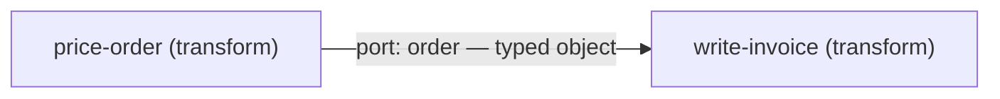

# Module 1 — Nodes and real data edges

Part of the [fourteen-step course](./README.md). Executable artifacts live in
[`examples/course/module-01/`](../../examples/course/module-01/); this page is
the teaching half. Everything here runs offline: no network, no credential, no
API key, no clock reading.

## 1. Learning objective and prerequisites (artifact 1)

After this module you can build the smallest possible graph — two nodes and
one edge — and explain what that one edge actually *is*: a **typed data
contract** between a producer and a consumer, not a prompt hand-off. You can
distinguish a **dependency** (drawn as an edge, checked by the compiler,
scheduled by the runtime) from mere **typing order** (two calls that happen
to appear one after the other in a script), and you can name, detect, and
repair the most common way the edge is implemented wrong: flattening typed
fields into a prose blob that the consumer has to parse back apart.

Prerequisites:

- A working checkout: `corepack pnpm install` plus built `dist/` for
  `@graph-engineering/core` and `@graph-engineering/runtime`, and `uv` for the
  Python lane. The [Quickstart](../QUICKSTART.md) covers both.
- [`docs/CONCEPTS.md`](../CONCEPTS.md) for the vocabulary (node, edge, port,
  entrypoint). Nothing else — this is the course's first module.

## 2. The shape (artifact 2)



Read the pair as three claims:

1. **The producer owns the fields.** `price-order` takes the graph input
   (`sku`, `quantity`, `unitPriceCents`) and returns a typed object with one
   computed addition, `totalCents`. Every field has a name and a type, and
   the producer's `outputSchema` writes that contract down in the graph
   document itself.
2. **The edge is the contract.** The one edge carries that object to
   `write-invoice` under the port name `order`. The port is the *consumer's*
   name for the value: the runtime hands the consumer an input object keyed
   `{ order: … }`, and renaming the port re-keys that view without touching
   the producer (exercise 2).
3. **The consumer reads by name.** `write-invoice` renders the invoice line
   from `order.quantity`, `order.unitPriceCents`, `order.totalCents` — field
   access, not parsing. There is no step anywhere at which the data exists
   only as a sentence.

Dependency versus typing order: in a script, `writeInvoice(priceOrder(x))`
runs in that order because the text says so, and nothing checks it. In the
graph, `write-invoice` runs after `price-order` because an edge *says so* —
delete the edge and the compiler refuses the graph before any node runs
(exercise 3), rather than running a consumer with nothing to consume.

## 3. The smallest working graph (artifacts 3, 4)

The committed graph is 2 nodes and 1 edge, `transform` kind only, and exists
byte-equivalently (after canonicalization) in both source formats:

- JSON: [`typed-edge.graph.json`](../../examples/course/module-01/typed-edge.graph.json)
- YAML: [`typed-edge.graph.yaml`](../../examples/course/module-01/typed-edge.graph.yaml)

Both canonicalize to sha256
`f8c0811a5c9fe82c47083c475f06b055099a86a524324d773129a43aacc56ffc`, and both
runners assert that before executing anything.

The TypeScript and Python sources are deliberately thin wrappers over one
shared handler module per language, so that the correct and the wrong
implementation differ only at the edge:

| Role | TypeScript | Python |
| --- | --- | --- |
| Shared deterministic handlers | [`handlers.mjs`](../../examples/course/module-01/handlers.mjs) | [`handlers.py`](../../examples/course/module-01/handlers.py) |
| Correct runner | [`run.mjs`](../../examples/course/module-01/run.mjs) | [`run.py`](../../examples/course/module-01/run.py) |

Both nodes run as plain deterministic executors — no adapter, no mock, no
scripting. Money is integer cents end to end; the only rendering to a string
happens inside the consumer, on purpose, at the last moment.

## 4. Deterministic fixture (artifact 5)

[`fixtures/expected-run.json`](../../examples/course/module-01/fixtures/expected-run.json)
commits the graph hash, the run status, `maxObservedConcurrency` (1),
`totalAttempts` (2), and the complete invoice for the one committed order
(`AB-12`, 3 units at $19.50). Both language lanes assert against this one
file.

## 5. The common mistake, and the test that exposes it (artifacts 6, 7, 8)

**The mistake: treating the edge as a prompt hand-off.** Usually phrased as
"just pass the text along" or "the next step's model will figure it out".
The producer flattens its typed fields into a sentence — `Order AB-12: 3
units at $19.50 each` — and the consumer reverse-engineers the fields back
out with pattern matching. It works on the demo input, then a value that
*looks like* another value lands in the wrong field.

- Wrong implementation:
  [`wrong.mjs`](../../examples/course/module-01/wrong.mjs) /
  [`wrong.py`](../../examples/course/module-01/wrong.py). Both flatten the
  order to prose and parse it back with "the first number is the quantity" —
  which grabs the `12` embedded in the SKU `AB-12` and invoices **12 units
  instead of 3**, for a perfectly ordinary, fully deterministic input.
  Nothing throws; the customer is silently overbilled $175.50. Executed
  directly, each prints the mis-parse and exits 1.
- Exposing test:
  [`wrong.test.mjs`](../../examples/course/module-01/wrong.test.mjs) /
  [`wrong_test.py`](../../examples/course/module-01/wrong_test.py). One
  assertion — "the invoice equals the fixture" — passes against the correct
  implementation and provably fails against the wrong one; the test asserts
  that failure, so the suite stays green while the pedagogy stays real.
- The repair (artifact 8) **is** `run.mjs` / `run.py`: keep the fields typed
  across the edge. `quantity` crosses as a named integer, so there is
  nothing to parse and nothing to parse wrongly.

Notice what the repair is *not*: it is not "write a better regex" or "add
`Quantity:` labels to the prose". Any prose format re-creates the same class
of bug one input later. The repair is that the sentence never exists between
the nodes — only at the very end, as output.

## 6. Exercises (artifact 11)

[`exercises.md`](../../examples/course/module-01/exercises.md): widen the
edge contract with a required `currency` field and update the consumer;
rename the port and predict the consumer's input key; delete the edge and
predict the compiler's refusal (`GE1006_UNREACHABLE_NODE` — dependency is a
drawn fact, not an implied one). Each has a committed solution under
[`solutions/`](../../examples/course/module-01/solutions/) verified by
[`check-exercises.mjs`](../../examples/course/module-01/check-exercises.mjs)
(exit 0 = all solutions correct).

## 7. Launch instructions (artifact 10)

### Shell

Build once (skip if `packages/*/dist` already exists), then run each lane:

```bash
corepack pnpm --filter @graph-engineering/core build \
  && corepack pnpm --filter @graph-engineering/runtime build

node examples/course/module-01/run.mjs                                  # correct, exit 0
uv run --project python python examples/course/module-01/run.py         # correct, exit 0

node examples/course/module-01/wrong.mjs                                # the mistake, exit 1
uv run --project python python examples/course/module-01/wrong.py       # the mistake, exit 1

node examples/course/module-01/wrong.test.mjs                           # exposure test, exit 0
uv run --project python pytest examples/course/module-01/wrong_test.py  # exposure test, exit 0

node examples/course/module-01/check-exercises.mjs                      # solutions check, exit 0
```

Each runner writes one JSON report to stdout and nothing else; every
assertion runs before the report prints.

### CLI

The repository CLI validates and inspects Graph IR documents directly:

```bash
uv run --project python graph validate examples/course/module-01/typed-edge.graph.json
uv run --project python graph validate examples/course/module-01/typed-edge.graph.yaml --input-format yaml
uv run --project python graph plan examples/course/module-01/typed-edge.graph.json
uv run --project python graph visualize examples/course/module-01/typed-edge.graph.json
```

`validate` prints the same sha256 for both documents
(`f8c0811a5c9fe82c47083c475f06b055099a86a524324d773129a43aacc56ffc`);
`plan` prints two layers (`price-order`, then `write-invoice`) with
`max parallel width 1`; `visualize` emits a Mermaid flowchart of the pair.
The CLI cannot *execute* the graph — `resume`, `replay`, `fork`, `retry`,
and `cancel` fail closed with exit code 6, because durable run leases and
CLI-side node executors do not exist. See [`docs/CLI.md`](../CLI.md).

### SDK — TypeScript

```js
import { canonicalHash, decodeGraphSource } from "@graph-engineering/core";
import { runGraph } from "@graph-engineering/runtime";

const graph = decodeGraphSource(jsonText, { format: "json" });
const result = await runGraph(graph, order, { nodeExecutors, concurrency: 1 });
// result.output.invoice is the typed invoice
```

`nodeExecutors` needs one entry per node id: `price-order`, `write-invoice`.
The consumer executor receives one object keyed by the incoming port
(`{ order }`) — build both from
[`handlers.mjs`](../../examples/course/module-01/handlers.mjs) as a starting
point. (There is no published npm package; the example runners import from
`packages/*/dist` in-repo.)

### SDK — Python

```python
from graph_engineering import compile_graph, parse_graph_source, run_graph

graph = compile_graph(parse_graph_source(yaml_text, format="yaml"))
result = await run_graph(graph, order, handlers, max_concurrency=1)
# result.outputs["invoice"] is the typed invoice
```

`handlers` maps the same two node ids to callables taking a `NodeContext`;
see [`handlers.py`](../../examples/course/module-01/handlers.py). (There is
no PyPI package; `uv run --project python` uses the in-repo project.)

### MCP

`@graph-engineering/mcp-server` is a read-only local stdio server with three
tools — `graph_validate`, `graph_plan`, `graph_get_schema`. An MCP client can
validate this module's graph (it returns the same canonical hash) or plan it
(two layers, width 1), but no MCP tool executes a graph. To run the module
from an agent session, invoke the shell commands above.

## 8. Performance, cost, security, durability (artifact 9)

**Performance.** Two nodes in sequence cost two scheduled attempts and no
concurrency — `maxObservedConcurrency` is 1 by construction, and the module's
`plan` shows why (two layers, width 1). The graph machinery buys nothing in
raw speed here over a two-line script; what it buys is that the contract,
the dependency, and the failure accounting are all *declared and checked*.
Module 2 shows the first operational payoff (per-node retry), module 7 the
first structural one (real width).

**Cost.** Both nodes are deterministic transforms: pricing an order and
formatting a line need no judgment, so spending a model call on either would
buy nondeterminism with money. The typed edge is also the cheaper edge in
model-shaped pipelines: passing structured fields between steps avoids
re-serializing and re-parsing prose through a model at every hop, and it is
the prose hops that multiply token cost. Note that in this release declared
budgets are documentation only — there is no cost runtime enforcing
`maxCostUsd` (it is refused pre-dispatch as the `cost-budget` capability).

**Security.** The consumer reads only declared structure — named, typed
fields — and the producer's output is data, never instructions. The
prose-blob antipattern is exactly the shape injection attacks love: a
consumer that parses free text will eventually obey free text, which is the
data-not-control stance the
[research-diamond pattern](../patterns/research-diamond.md) demonstrates
against actual injected instructions. What is *not* defended: node schemas
(`inputSchema`/`outputSchema`) are validated as part of the *document*, but
the ordinary schedulers do not yet enforce them against runtime values, and
node executors run with the ambient authority of the host process.

**Durability.** This module runs the ordinary in-memory scheduler only: stop
the process and the run is gone. Both nodes declare `sideEffects: "none"`,
so the pair is durability-friendly by construction — an interrupted run
could be resumed without in-doubt side-effect decisions. The durable
scheduler exists in both languages but requires payload protection
configured explicitly and fails closed with `PAYLOAD_PROTECTION_REQUIRED`
otherwise — see [`examples/quickstart/`](../../examples/quickstart/README.md)
for the durable lane.

## 9. Version and known limits (artifact 12)

Written and verified against **v0.2.0-alpha.2** (see
[`CHANGELOG.md`](../../CHANGELOG.md), including "What is not in this
release"). The limits that matter most before you build on this module:

- No npm or PyPI package is published; everything imports from the built
  checkout.
- Node `inputSchema`/`outputSchema` document the contract and are validated
  structurally when the document is compiled, but the ordinary schedulers do
  not enforce them against runtime values — a producer that emitted prose
  would not be stopped by the schema today. The typed edge is a discipline
  the graph lets you *declare*; enforcement is future work.
- Graph-level `inputSchema` is likewise not enforced by the ordinary
  scheduler at run time.
- No provider client exists. Both nodes are plain deterministic functions;
  swapping in a real model is new code, not configuration.
- No capability, budget, or isolation enforcement: those declarations are
  refused pre-dispatch or are documentation.
- Single-process async concurrency only; with one edge there is nothing to
  overlap anyway.
