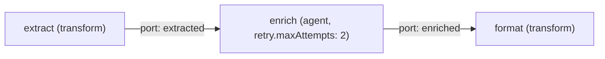

# Module 2 — Linear chain as a degenerate graph

Part of the [fourteen-step course](./README.md). Executable artifacts live in
[`examples/course/module-02/`](../../examples/course/module-02/); this page is
the teaching half. Everything here runs offline: no network, no credential, no
API key, no clock reading.

## 1. Learning objective and prerequisites (artifact 1)

After this module you can explain why a linear chain is not a rival
abstraction to a graph but a **degenerate graph** — one whose every layer has
width 1 — and what you get for free the moment you write the chain down as
nodes and edges instead of as a function calling a function: **per-node
attempt budgets**. A flaky step declares `retry.maxAttempts` on *itself*, the
scheduler retries exactly that node in place, and every other node keeps its
single attempt. You can also name, detect, and repair the most common way
this is implemented wrong: wrapping the retry around the whole chain.

Prerequisites:

- [Module 1](./module-01-typed-edges.md): nodes, typed edges, ports.
- A working checkout: `corepack pnpm install` plus built `dist/` for
  `@graph-engineering/core` and `@graph-engineering/runtime`, and `uv` for the
  Python lane. The [Quickstart](../QUICKSTART.md) covers both.

## 2. The shape (artifact 2)



Read the chain as three claims:

1. **A chain is a graph with no branching.** Three nodes, two edges, no fan
   anywhere. `graph plan` shows three layers of width 1 — the degenerate
   case of the layered schedule that gives module 7's diamond its width. The
   critical path is the whole graph: extra execution slots buy nothing
   (exercise 3 proves it with 3 slots and an unchanged
   `maxObservedConcurrency` of 1).
2. **The flake is a node property.** `enrich` is the chain's one unreliable
   step (played by a deterministic fail-once handler: first attempt throws,
   second succeeds). The graph declares `retry.maxAttempts: 2` **on that
   node** — the attempt budget lives where the failure lives.
3. **The retry is the scheduler's, not yours.** When `enrich` fails a
   retryable attempt, the scheduler re-runs `enrich` — with the same bound
   input, in place. `extract` is not re-run, because nothing about *its*
   result is in doubt. The fixture pins the per-node accounting: extract 1,
   enrich 2, format 1.

Remove the fake framing, and the comparison with a hand-written pipeline is
just this: same three functions, same order, but the graph knows *which step
failed* and the try/catch around a pipeline does not.

## 3. The smallest working graph (artifacts 3, 4)

The committed graph is 3 nodes and 2 edges, `transform` and `agent` kinds
only, and exists byte-equivalently (after canonicalization) in both source
formats:

- JSON: [`chain.graph.json`](../../examples/course/module-02/chain.graph.json)
- YAML: [`chain.graph.yaml`](../../examples/course/module-02/chain.graph.yaml)

Both canonicalize to sha256
`60f253ad55fad3083a67caf7e8353b50ac812407064482a5f2afb16b1fce8357`, and both
runners assert that before executing anything.

The TypeScript and Python sources are deliberately thin wrappers over one
shared handler module per language, so that the correct and the wrong
implementation share the very same step functions *and the very same
deterministic flake* — they disagree only about where the retry lives:

| Role | TypeScript | Python |
| --- | --- | --- |
| Shared deterministic handlers | [`handlers.mjs`](../../examples/course/module-02/handlers.mjs) | [`handlers.py`](../../examples/course/module-02/handlers.py) |
| Correct runner | [`run.mjs`](../../examples/course/module-02/run.mjs) | [`run.py`](../../examples/course/module-02/run.py) |

The `agent` node runs as a plain deterministic executor — no mock adapter,
no scripting. The fail-once gate is a counter in a closure: the flakiness is
real state, but deterministic state, so every run of this module is the same
run.

## 4. Deterministic fixture (artifact 5)

[`fixtures/expected-run.json`](../../examples/course/module-02/fixtures/expected-run.json)
commits the graph hash, the run status, `maxObservedConcurrency` (1),
`totalAttempts` (4), the **per-node attempt counts** (extract 1, enrich 2,
format 1), and the complete report. Both language lanes assert against this
one file. The per-node counts are the load-bearing part: this module's bug
is invisible in the output and visible only in the accounting.

## 5. The common mistake, and the test that exposes it (artifacts 6, 7, 8)

**The mistake: retrying the whole chain when one node is flaky.** Usually
phrased as "just retry the pipeline", or a `@retry` decorator on the
top-level function. One big try/catch restarts from the top, so `extract` —
which already succeeded — runs again. The final report is **identical** to
the correct one, which is exactly why the mistake survives smoke tests: the
waste is invisible in the output. Every re-run of a non-failing node is
duplicated cost and latency, and the moment a node has side effects it is a
duplicated side effect.

- Wrong implementation:
  [`wrong.mjs`](../../examples/course/module-02/wrong.mjs) /
  [`wrong.py`](../../examples/course/module-02/wrong.py). Both hand-orchestrate
  the three steps in a loop with one catch, using the same fail-once flake
  the correct runner gives the scheduler. Observable: attempt counts of
  extract 2, enrich 2, format 1 — against the fixture's 1, 2, 1. Executed
  directly, each prints the needlessly re-run node and exits 1.
- Exposing test:
  [`wrong.test.mjs`](../../examples/course/module-02/wrong.test.mjs) /
  [`wrong_test.py`](../../examples/course/module-02/wrong_test.py). One
  assertion — "the run shape (report *and* per-node attempts) equals the
  fixture" — passes against the correct implementation and provably fails
  against the wrong one; the test asserts that failure, and also asserts the
  wrong report *is* identical, so the point ("an output-only test cannot
  catch this") is itself machine-checked.
- The repair (artifact 8) **is** `run.mjs` / `run.py`: declare
  `retry.maxAttempts: 2` on the `enrich` node and let the scheduler retry
  the failing node in place. "Restart the whole chain" is not expressible by
  accident, because the retry is attached to a node, not wrapped around
  code.

Notice what the repair is *not*: it is not "make the catch smarter" or
"memoize extract". Those rebuild, by hand and unverified, the per-node
accounting the scheduler already does.

## 6. Exercises (artifact 11)

[`exercises.md`](../../examples/course/module-02/exercises.md): move the
flake (and the retry declaration with it) to node 3 and predict the attempt
counts; remove the retry entirely and predict the failure accounting
(`enrich` fails `NODE_EXECUTION_FAILED`, `format` is `skipped` with
`UPSTREAM_FAILED` and 0 attempts); give the chain three execution slots and
predict that `maxObservedConcurrency` stays 1. Each has a committed solution
under [`solutions/`](../../examples/course/module-02/solutions/) verified by
[`check-exercises.mjs`](../../examples/course/module-02/check-exercises.mjs)
(exit 0 = all solutions correct).

## 7. Launch instructions (artifact 10)

### Shell

Build once (skip if `packages/*/dist` already exists), then run each lane:

```bash
corepack pnpm --filter @graph-engineering/core build \
  && corepack pnpm --filter @graph-engineering/runtime build

node examples/course/module-02/run.mjs                                  # correct, exit 0
uv run --project python python examples/course/module-02/run.py         # correct, exit 0

node examples/course/module-02/wrong.mjs                                # the mistake, exit 1
uv run --project python python examples/course/module-02/wrong.py       # the mistake, exit 1

node examples/course/module-02/wrong.test.mjs                           # exposure test, exit 0
uv run --project python pytest examples/course/module-02/wrong_test.py  # exposure test, exit 0

node examples/course/module-02/check-exercises.mjs                      # solutions check, exit 0
```

Each runner writes one JSON report to stdout and nothing else; every
assertion runs before the report prints.

### CLI

The repository CLI validates and inspects Graph IR documents directly:

```bash
uv run --project python graph validate examples/course/module-02/chain.graph.json
uv run --project python graph validate examples/course/module-02/chain.graph.yaml --input-format yaml
uv run --project python graph plan examples/course/module-02/chain.graph.json
uv run --project python graph visualize examples/course/module-02/chain.graph.json
```

`validate` prints the same sha256 for both documents
(`60f253ad55fad3083a67caf7e8353b50ac812407064482a5f2afb16b1fce8357`);
`plan` prints three layers of one node each with `max parallel width 1`;
`visualize` emits a Mermaid flowchart of the chain. The CLI cannot *execute*
the graph — `resume`, `replay`, `fork`, `retry`, and `cancel` fail closed
with exit code 6, because durable run leases and CLI-side node executors do
not exist. See [`docs/CLI.md`](../CLI.md).

### SDK — TypeScript

```js
import { canonicalHash, decodeGraphSource } from "@graph-engineering/core";
import { runGraph } from "@graph-engineering/runtime";

const graph = decodeGraphSource(jsonText, { format: "json" });
const result = await runGraph(graph, { bulletin }, { nodeExecutors, concurrency: 1 });
// result.output.report is the report; result.nodes carries per-node attempts
```

`nodeExecutors` needs one entry per node id: `extract`, `enrich`, `format`.
Per-node attempt counts come back on `result.nodes` (`nodeId`, `attempts`) —
build the executors from
[`handlers.mjs`](../../examples/course/module-02/handlers.mjs) as a starting
point. (There is no published npm package; the example runners import from
`packages/*/dist` in-repo.)

### SDK — Python

```python
from graph_engineering import compile_graph, parse_graph_source, run_graph

graph = compile_graph(parse_graph_source(yaml_text, format="yaml"))
result = await run_graph(graph, {"bulletin": bulletin}, handlers, max_concurrency=1)
# result.outputs["report"] is the report; result.nodes[node_id].attempts is per node
```

`handlers` maps the same three node ids to callables taking a `NodeContext`;
see [`handlers.py`](../../examples/course/module-02/handlers.py). (There is
no PyPI package; `uv run --project python` uses the in-repo project.)

### MCP

`@graph-engineering/mcp-server` is a read-only local stdio server with three
tools — `graph_validate`, `graph_plan`, `graph_get_schema`. An MCP client can
validate this module's graph (it returns the same canonical hash) or plan it
(three layers, width 1), but no MCP tool executes a graph. To run the module
from an agent session, invoke the shell commands above.

## 8. Performance, cost, security, durability (artifact 9)

**Performance.** A chain's makespan is the sum of its nodes — there is no
*max* to exploit, and exercise 3 shows three slots observing a width of 1.
What the graph improves is the *failure* path: with per-node retry, one flake
costs one extra attempt of one node; with whole-chain retry it costs a rerun
of everything upstream. In this module that is one cheap transform; in a real
pipeline the upstream is usually the expensive part (the big model call, the
slow fetch), and the flaky node is usually the cheap one after it.
`policies.maxTotalAttempts` (6 here) caps the whole run's budget on top of
the per-node caps.

**Cost.** Re-running succeeded nodes is the silent cost multiplier of the
whole-chain retry: attempts are the unit that model calls, rate limits, and
bills scale with, and `result.nodes[*].attempts` is the meter. The
deterministic steps here cost nothing, which is exactly why the module
commits the accounting rather than a wall-clock number — the *shape* of the
waste (a 2 where a 1 belongs) is what transfers to expensive nodes. Note
that in this release declared budgets are documentation only — there is no
cost runtime enforcing `maxCostUsd` (it is refused pre-dispatch as the
`cost-budget` capability).

**Security.** Retry interacts with side effects: re-running a node that
writes, sends, or charges is not a performance bug but a correctness bug,
and the whole-chain retry re-runs nodes *indiscriminately*. Every node here
declares `sideEffects: "none"`, which is what makes its retry trivially safe;
a node that declared otherwise would need idempotence guarantees before any
attempt budget above 1 is honest (module 10's territory). Executors still
run with the ambient authority of the host process — there is no isolation
runtime in this release.

**Durability.** This module runs the ordinary in-memory scheduler only: stop
the process and the run is gone. The chain is durability-friendly by
construction (`sideEffects: "none"` everywhere), and the same per-node
attempt accounting is what a durable journal commits per attempt — the
durable scheduler replays a committed run without re-invoking executors, but
requires payload protection configured explicitly and fails closed with
`PAYLOAD_PROTECTION_REQUIRED` otherwise — see
[`examples/quickstart/`](../../examples/quickstart/README.md) for the durable
lane.

## 9. Version and known limits (artifact 12)

Written and verified against **v0.2.0-alpha.2** (see
[`CHANGELOG.md`](../../CHANGELOG.md), including "What is not in this
release"). The limits that matter most before you build on this module:

- No npm or PyPI package is published; everything imports from the built
  checkout.
- No provider client exists. The `agent` node is a plain deterministic
  function with a scripted flake; a real flaky dependency is nondeterministic
  in ways this module deliberately is not.
- Retry semantics covered here are attempt budgets and in-place re-execution
  on the ordinary schedulers. Backoff fields (`initialDelayMs`,
  `backoffMultiplier`, `maxDelayMs`) exist and default to zero delay;
  `jitter: true` is refused pre-dispatch (`retry-jitter`) because it would
  break determinism.
- A node that exhausts its budget fails the run; downstream nodes settle as
  `skipped`/`UPSTREAM_FAILED`. There is no partial-output or continue-past-
  failure mode in this shape.
- No capability, budget, or isolation enforcement: those declarations are
  refused pre-dispatch or are documentation.
- Single-process async concurrency only; `maxObservedConcurrency` measures
  scheduler overlap, not parallel CPUs — and for a chain it is 1 by
  construction.
