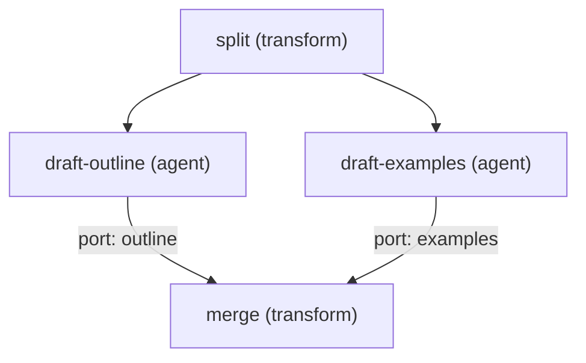

# Module 7 — Diamond topology: split, independent work, deterministic reduce

Part of the [fourteen-step course](./README.md). Executable artifacts live in
[`examples/course/module-07/`](../../examples/course/module-07/); this page is
the teaching half. Everything here runs offline: no network, no credential, no
API key, no clock reading.

## 1. Learning objective and prerequisites (artifact 1)

After this module you can build the smallest graph shape that actually earns
its concurrency: one **split** that fans a task out, two (or more) branches
that do **independent** work at the same time, and one **merge** that joins
*all* of the branches with a **deterministic reduce** — a merge whose output
is a pure function of the joined values, never of their completion order. You
can also name, detect, and repair the most common way this shape is
implemented wrong: joining by *racing* instead of *joining*.

Judgment synthesis is the second half of the objective: knowing *when* the
merge should stay deterministic code (this module: sorting keys and
concatenating findings needs no model) and when the combine is a judgment
call that deserves its own model-shaped node — that trade-off is discussed in
[performance and cost](#9-performance-cost-security-durability-artifact-9)
below and belongs to modules 4 and 9 in full.

Prerequisites:

- Modules 1–5 conceptually: nodes, data edges, fan-out. (Only module 7 is
  written today — see the [course index](./README.md) — so in practice:
  read [`docs/CONCEPTS.md`](../CONCEPTS.md) and run
  [`examples/quickstart/`](../../examples/quickstart/README.md) first.)
- A working checkout: `corepack pnpm install` plus built `dist/` for
  `@graph-engineering/core` and `@graph-engineering/runtime`, and `uv` for the
  Python lane. The [Quickstart](../QUICKSTART.md) covers both.

## 2. The shape (artifact 2)



Read the diamond as three claims, one per layer:

1. **Split** — the brief is forwarded unchanged to both branches. The fan-out
   is in the *edges*, not in the node: `split` has one output value and two
   outgoing edges.
2. **Independent work** — `draft-outline` and `draft-examples` share no edge,
   so the scheduler may (and, given 2 slots, does) run them at the same time.
   Independence is a topological fact you can verify (`graph plan` puts them
   in the same layer), not a hope.
3. **Deterministic reduce** — `merge` has two incoming edges with **ports**
   (`outline`, `examples`). The runtime hands the merge executor one object
   keyed by those port names, only after *both* branches succeeded. The merge
   sorts the keys, so its report is identical whichever branch finished
   first.

## 3. The smallest working graph (artifacts 3, 4)

The committed graph is 4 nodes and 4 edges, `transform` and `agent` kinds
only, and exists byte-equivalently (after canonicalization) in both source
formats:

- JSON: [`diamond.graph.json`](../../examples/course/module-07/diamond.graph.json)
- YAML: [`diamond.graph.yaml`](../../examples/course/module-07/diamond.graph.yaml)

Both canonicalize to sha256
`5cd653fa4ef297b8d4903b1e8bc54e0ad3552f78f3d54aac2570dfe413d4c0e9`, and both
runners assert that before executing anything.

The TypeScript and Python sources are deliberately thin wrappers over one
shared handler module per language, so that the correct and the wrong
implementation differ only at the join:

| Role | TypeScript | Python |
| --- | --- | --- |
| Shared deterministic handlers | [`handlers.mjs`](../../examples/course/module-07/handlers.mjs) | [`handlers.py`](../../examples/course/module-07/handlers.py) |
| Correct runner | [`run.mjs`](../../examples/course/module-07/run.mjs) | [`run.py`](../../examples/course/module-07/run.py) |

The two `agent` nodes run as plain deterministic executors — no mock adapter,
no scripting. That is a teaching simplification: the adapter boundary
(capabilities, usage, refusal before dispatch) is the quickstart's subject,
not this module's.

## 4. Deterministic fixture (artifact 5)

[`fixtures/expected-run.json`](../../examples/course/module-07/fixtures/expected-run.json)
commits the graph hash, the run status, `maxObservedConcurrency` (2),
`totalAttempts` (4), and the complete merged report. Both language lanes
assert against this one file; each branch also passes a 2-party rendezvous,
so "the branches overlapped" is proved without reading a clock.

## 5. The common mistake, and the test that exposes it (artifacts 6, 7, 8)

**The mistake: joining a fan-in by racing to the first completed branch.**
Usually phrased as "merge whatever is ready" or "stream results into the
reducer as they land". It looks faster, it passes a casual smoke test, and it
silently drops every branch that was not first — no error, just a report
missing half its findings.

- Wrong implementation:
  [`wrong.mjs`](../../examples/course/module-07/wrong.mjs) /
  [`wrong.py`](../../examples/course/module-07/wrong.py). Both hand-orchestrate
  the diamond and merge the first branch that lands (`Promise.race` / a
  first-result queue). Branch speeds are made deterministic so the wrong
  answer is the same wrong answer every run. Executed directly, each prints
  the dropped branch and exits 1.
- Exposing test:
  [`wrong.test.mjs`](../../examples/course/module-07/wrong.test.mjs) /
  [`wrong_test.py`](../../examples/course/module-07/wrong_test.py). One
  assertion — "the report equals the fixture" — passes against the correct
  implementation and provably fails against the wrong one; the test asserts
  that failure, so the suite stays green while the pedagogy stays real.
- The repair (artifact 8) **is** `run.mjs` / `run.py`: express the join in
  the topology (two ported edges into `merge`) and let the scheduler enforce
  it. The scheduler does not start `merge` until both branches have
  succeeded, so "first result wins" is not expressible by accident.

Notice what the repair is *not*: it is not "add a lock" or "await both
promises harder". The race was an orchestration decision made in imperative
code where nothing could check it. Moving the join into the graph makes it a
declared, validated, schedulable fact.

## 6. Exercises (artifact 11)

[`exercises.md`](../../examples/course/module-07/exercises.md): widen the
diamond to three branches and predict `maxObservedConcurrency`; rename the
merge ports and predict the join keys; serialize the diamond with one
execution slot. Each has a committed solution under
[`solutions/`](../../examples/course/module-07/solutions/) verified by
[`check-exercises.mjs`](../../examples/course/module-07/check-exercises.mjs)
(exit 0 = all solutions correct).

## 7. Launch instructions (artifact 10)

### Shell

Build once (skip if `packages/*/dist` already exists), then run each lane:

```bash
corepack pnpm --filter @graph-engineering/core build \
  && corepack pnpm --filter @graph-engineering/runtime build

node examples/course/module-07/run.mjs                                  # correct, exit 0
uv run --project python python examples/course/module-07/run.py         # correct, exit 0

node examples/course/module-07/wrong.mjs                                # the mistake, exit 1
uv run --project python python examples/course/module-07/wrong.py       # the mistake, exit 1

node examples/course/module-07/wrong.test.mjs                           # exposure test, exit 0
uv run --project python pytest examples/course/module-07/wrong_test.py  # exposure test, exit 0

node examples/course/module-07/check-exercises.mjs                      # solutions check, exit 0
```

Each runner writes one JSON report to stdout and nothing else; every
assertion runs before the report prints.

### CLI

The repository CLI validates and inspects Graph IR documents directly:

```bash
uv run --project python graph validate examples/course/module-07/diamond.graph.json
uv run --project python graph validate examples/course/module-07/diamond.graph.yaml --input-format yaml
uv run --project python graph plan examples/course/module-07/diamond.graph.json
uv run --project python graph visualize examples/course/module-07/diamond.graph.json
```

`validate` prints the same sha256 for both documents
(`5cd653fa4ef297b8d4903b1e8bc54e0ad3552f78f3d54aac2570dfe413d4c0e9`);
`plan` prints the three layers with `draft-outline | draft-examples` sharing
one layer and `max parallel width 2`; `visualize` emits a Mermaid flowchart of
the diamond. The CLI cannot *execute* the graph — `resume`, `replay`, `fork`,
`retry`, and `cancel` fail closed with exit code 6, because durable run leases
and CLI-side node executors do not exist. See [`docs/CLI.md`](../CLI.md).

### SDK — TypeScript

```js
import { canonicalHash, decodeGraphSource } from "@graph-engineering/core";
import { runGraph } from "@graph-engineering/runtime";

const graph = decodeGraphSource(jsonText, { format: "json" });
const result = await runGraph(graph, { brief }, { nodeExecutors, concurrency: 2 });
// result.output.report is the merged report; result.maxObservedConcurrency is 2
```

`nodeExecutors` needs one entry per node id: `split`, `draft-outline`,
`draft-examples`, `merge`. A merge executor receives one object keyed by the
incoming ports (`{ outline, examples }`) — build it from
[`handlers.mjs`](../../examples/course/module-07/handlers.mjs) as a starting
point. (There is no published npm package; the example runners import from
`packages/*/dist` in-repo.)

### SDK — Python

```python
from graph_engineering import compile_graph, parse_graph_source, run_graph

graph = compile_graph(parse_graph_source(yaml_text, format="yaml"))
result = await run_graph(graph, {"brief": brief}, handlers, max_concurrency=2)
# result.outputs["report"] is the merged report
```

`handlers` maps the same four node ids to callables taking a `NodeContext`;
see [`handlers.py`](../../examples/course/module-07/handlers.py). (There is
no PyPI package; `uv run --project python` uses the in-repo project.)

### MCP

`@graph-engineering/mcp-server` is a read-only local stdio server with three
tools — `graph_validate`, `graph_plan`, `graph_get_schema`. An MCP client can
validate this module's graph (it returns the same canonical hash) or plan it
(three layers, parallel width 2), but no MCP tool executes a graph. To run
the module from an agent session, invoke the shell commands above.

## 8. Performance, cost, security, durability (artifact 9)

**Performance.** The diamond's makespan is `split + max(branches) + merge`,
against `split + sum(branches) + merge` for the same work in a chain — the
whole point of the shape is replacing *sum* with *max*. That only holds if
the branches actually overlap: `policies.maxConcurrency` (2 here) and the
scheduler's slot count both cap `maxObservedConcurrency`, and exercise 3
shows the same graph degrading gracefully to serial execution with an
unchanged report. The merge is a synchronization point: the fastest branch
waits for the slowest, so the diamond only pays off when branch durations are
comparable or the branches are genuinely independent resources.

**Cost.** Two model-shaped branches means two model calls where a chain might
have made one bigger call — fan-out multiplies cost linearly with width. The
deterministic merge is deliberately *not* model-shaped: combining two
structured findings by key needs no judgment, and spending a model call on it
would buy nondeterminism with money. When the combine genuinely is a
judgment (conflicting findings, ranking, synthesis prose), make it an
explicit model-shaped node and keep the deterministic join in front of it.
Note that in this release declared budgets are documentation only — there is
no cost runtime enforcing `maxCostUsd` (it is refused pre-dispatch as the
`cost-budget` capability).

**Security.** Each branch's output crosses the merge boundary as *data*. The
merge reads only declared structure (port keys and the `branch`/`finding`
fields); no code path treats branch text as instructions — the same
data-not-control stance the
[research-diamond pattern](../patterns/research-diamond.md) demonstrates
against actual injected instructions. What is *not* defended: node executors
run with the ambient authority of the host process. There is no isolation
runtime in this release, and a compromised executor can do whatever the
process can do.

**Durability.** This module runs the ordinary in-memory scheduler only: stop
the process and the run is gone. The durable scheduler exists in both
languages and replays a committed diamond without re-invoking executors, but
it requires payload protection configured explicitly and fails closed with
`PAYLOAD_PROTECTION_REQUIRED` otherwise — see
[`examples/quickstart/`](../../examples/quickstart/README.md) for the durable
lane run on this same topology. The diamond is durability-friendly by
construction: every node declares `sideEffects: "none"`, so an interrupted
run can be resumed without in-doubt side-effect decisions.

## 9. Version and known limits (artifact 12)

Written and verified against **v0.2.0-alpha.2** (see
[`CHANGELOG.md`](../../CHANGELOG.md), including "What is not in this
release"). The limits that matter most before you build on this module:

- No npm or PyPI package is published; everything imports from the built
  checkout.
- No provider client exists. This module's agents are plain deterministic
  functions; the quickstart's are deterministic mock adapters. Swapping in a
  real model is new code, not configuration.
- No capability, budget, or isolation enforcement: those declarations are
  refused pre-dispatch or are documentation.
- The merge here is a `transform` fed by ported value edges — the all-success
  join the ordinary schedulers implement natively. Barrier *nodes* with
  quorum/deadline policies are a different feature with narrower support
  (TypeScript ordinary scheduler only), covered by module 6 when the runtime
  catches up.
- A permanently failed branch fails the run; there is no partial-merge or
  quorum fallback in this shape.
- Single-process async concurrency only; `maxObservedConcurrency` measures
  scheduler overlap, not parallel CPUs.
