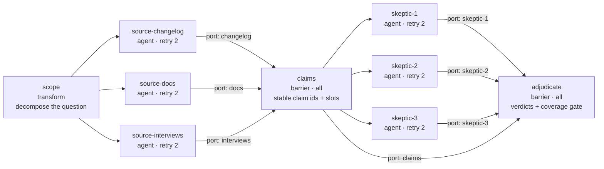
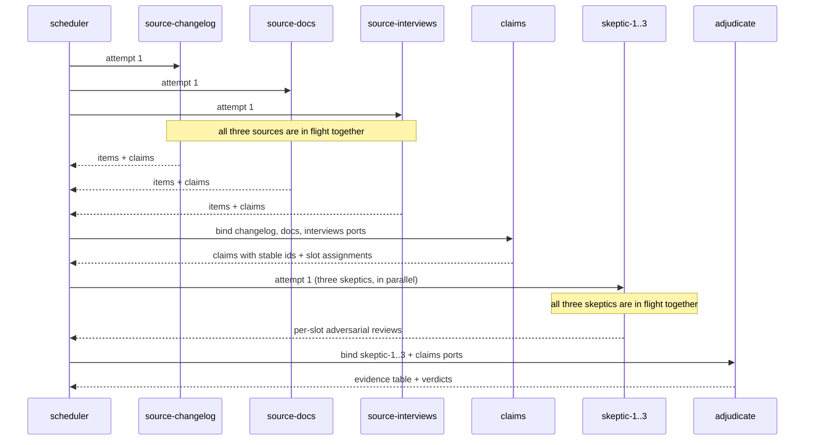
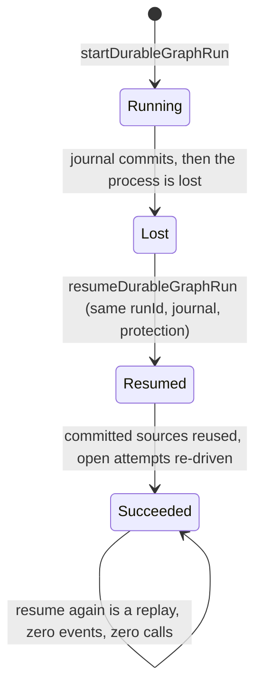
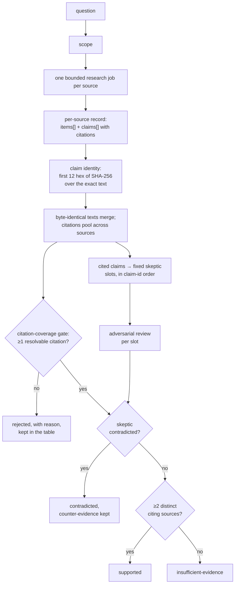
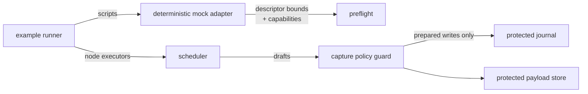

# Pattern 02 — cited deep research (reduced form)

One question is scoped into independent per-source research jobs, the sources
run in parallel with bounded retries, and exactly one fan-in barrier extracts
claims: byte-identical claim texts from different sources become one claim
with merged citations, and every claim receives a stable identity — the first
12 hex characters of SHA-256 over its exact text, computed by the same rule in
both language lanes. Each cited claim is then adversarially reviewed by one of
a **fixed** set of skeptic nodes, and a second barrier adjudicates: supported,
contradicted, or insufficient-evidence per claim, a citation-coverage gate
that rejects any claim citing no source item, and one exportable evidence
table in which every citation and every piece of counter-evidence resolves to
a committed fixture item.

Everything here runs. **Nothing here researches**, and nothing here fans out
per claim: the master-plan Pattern 02 spawns one skeptic per extracted claim,
which is runtime graph growth that every runtime in this repository refuses
pre-dispatch (`maxDynamicNodes` → the unimplemented `dynamic-graph-patch`
capability). The skeptics are `agent` nodes — the `validator` kind is refused
— and every finding they report is scripted from
[`fixtures/sources.json`](fixtures/sources.json). Both language lanes are
compared against the same expected-result and expected-event files.

| Artifact | File |
| --- | --- |
| Bundle manifest | [`manifest.json`](manifest.json) |
| Canonical graph, JSON | [`cited-research.graph.json`](cited-research.graph.json) |
| Canonical graph, YAML | [`cited-research.graph.yaml`](cited-research.graph.yaml) |
| TypeScript constructor | [`packages/patterns/src/cited-research.ts`](../../../packages/patterns/src/cited-research.ts) |
| Python constructor | [`python/src/graph_engineering/patterns/cited_research.py`](../../../python/src/graph_engineering/patterns/cited_research.py) |
| Deterministic mock descriptor | [`mock-adapter.descriptor.json`](mock-adapter.descriptor.json) |
| Source corpus fixture | [`fixtures/sources.json`](fixtures/sources.json) |
| Expected run fixture | [`fixtures/expected-run.json`](fixtures/expected-run.json) |
| Expected event fixture | [`fixtures/expected-events.json`](fixtures/expected-events.json) |
| Launch guides and runbook | [`docs/patterns/cited-research.md`](../../../docs/patterns/cited-research.md) |
| Package tests | [`packages/patterns/test/cited-research.test.ts`](../../../packages/patterns/test/cited-research.test.ts) |
| Python constructor tests | [`python/tests/test_patterns_cited_research.py`](../../../python/tests/test_patterns_cited_research.py) |

## Run it

Build the five local packages once, then run both lanes:

```bash
corepack pnpm --filter @graph-engineering/core build \
  && corepack pnpm --filter @graph-engineering/patterns build \
  && corepack pnpm --filter @graph-engineering/persistence build \
  && corepack pnpm --filter @graph-engineering/adapters build \
  && corepack pnpm --filter @graph-engineering/runtime build

node examples/patterns/cited-research/run.mjs
node examples/patterns/cited-research/resume.mjs

uv run --project python python examples/patterns/cited-research/run.py
uv run --project python python examples/patterns/cited-research/resume.py
```

No API key. No network access. No credential. No clock reading. If any
assertion in a runner fails, the runner exits non-zero — the printed JSON
report is only produced after every assertion has passed.

## Topology



`scope` is the sole entrypoint. `adjudicate` is the sole named output
(`verdicts`). Each source reaches the claims barrier on its own named port,
each skeptic reaches the adjudicator on its own named port, and the claims
barrier **also** feeds the adjudicator directly on the `claims` port — that
direct edge is what lets the citation-coverage gate see and reject an uncited
claim even though such a claim holds no skeptic slot. The skeptic stage is
three fixed slots; the claims barrier assigns cited claims to slots in
claim-id order and fails loudly if there are ever more cited claims than
slots.

## Sequence



Both fan-outs really do overlap. In the TypeScript lane two promise gates can
only be passed once all three sources (and later all three skeptics) have
arrived; in the Python lane two `asyncio.Barrier(3)` instances do the same.
Neither uses a sleep, a timestamp or a timeout, so a serial scheduler fails
the assertion rather than passing slowly.

## Recovery



What makes the resume safe is in the graph, not in the runner: every source
and every skeptic declares `sideEffects: "none"` and `retry.maxAttempts: 2`.
An interrupted attempt on a node that declares a side effect would be refused
as in-doubt instead of re-driven.

## Data flow



The corpus deliberately contains all four cases: one claim proposed
independently by two sources (`82329aad7ca5`, supported), one claim a skeptic
genuinely contradicts with counter-evidence resolving to a real corpus item
(`35833d9539b3`, contradicted — the claim stays in the table with the
contradiction), one claim citing nothing (`3af1931aeb2b`, rejected by the
coverage gate with reason `citation-coverage: cites no source item`), and one
single-source uncontradicted claim (`6e607e6cb91c`, insufficient-evidence).
All four verdicts are in the committed evidence table — adjudication is
deterministic and never silent.

## Authority



The only authority actually enforced end to end in this bundle is the write
path: the scheduler cannot reach the journal except through the guard, a
prepared write is bound to one journal instance, and a durable run without
configured protection fails closed before the first event and the first
executor call. Both runners assert that. The adjudicator adds one more real
check: every skeptic review must name its own slot, the claim id assigned to
that slot, and a claim text that hashes to that id — a skeptic reviewing the
wrong claim is a loud failure, not a silent verdict.

## Budgets, permissions, and what is not enforced

The bundle declares a budget and a least-privilege permission set in
[`manifest.json`](manifest.json). **Neither binds anything.**

- **Budgets are documentation.** No runtime component reads or enforces a
  token, money, time or rate budget. The numbers that actually bind a run are
  the Graph IR policies (`maxConcurrency`, `maxFanOut`, `maxTotalAttempts`)
  and each agent node's `retry.maxAttempts`, which the scheduler does enforce
  — the injected rate-limit scenario is stopped by `retry.maxAttempts`, not
  by a budget.
- **Permissions are documentation.** There is no isolation provider. These
  runs perform no network access because the code contains no network call and
  the mock adapter cannot make one, not because a sandbox refused one.

Read the manifest's `policy.*.enforcement` fields before quoting any of it.

## Known limitations

- **No per-claim fan-out.** The skeptic stage is three fixed slots chosen at
  construction time. Dynamic skeptic spawning needs the `dynamic-graph-patch`
  runtime capability (`maxDynamicNodes`), which every runtime here refuses
  pre-dispatch; more cited claims than slots fails loudly instead of
  truncating.
- **Skeptics are `agent` nodes, not `validator` nodes.** The `validator` kind
  is capability-gated and refused before dispatch. No verifier semantics are
  claimed; the adversarial reviews are fixture data.
- **A permanently failed source or skeptic produces no verdicts at all.**
  Both barriers are static all-success joins; quorum, deadline and
  late-arrival behaviour need integrated barrier policies, which are
  capability-gated and unimplemented.
- **Verdicts are corroboration accounting, not truth.** 'Supported' means at
  least two distinct corpus sources cite resolvable items and no scripted
  contradiction exists.
- **Claim ids are text hashes.** A paraphrased duplicate claim gets a
  different id; there is no semantic deduplication.
- **Budgets and permissions are declared but unenforced.** See the manifest.
- **Nothing is retained between runs**, and this bundle has not been
  independently reviewed.
