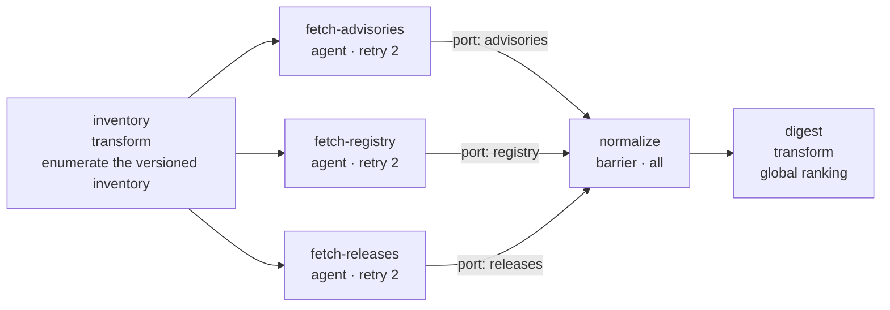
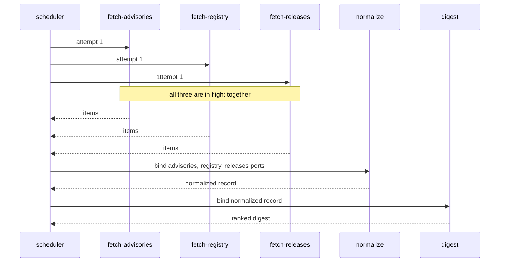
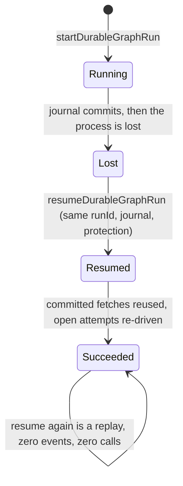
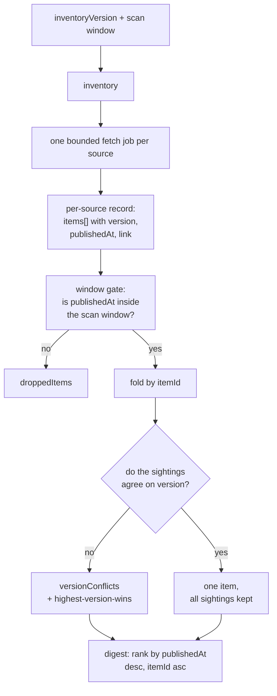
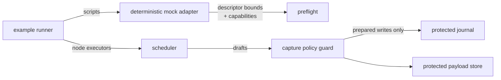

# Pattern 10 — scheduled ecosystem scan (reduced form)

A versioned source inventory is enumerated into independent per-source fetch
jobs, the fetches run in parallel with bounded retries, and exactly one fan-in
barrier compares them: it drops items published outside the scan window, folds
the same item syndicated by two sources into one entry with two sightings, and
resolves version disagreements deterministically while reporting them instead
of hiding them. A final transform performs the global ranking and renders one
digest whose every date and link came out of the committed fixtures.

Everything here runs. Nothing here fetches, and **nothing here is scheduled**:
the master-plan Pattern 10 is a *scheduled* scan with a schedule identity and
an overlap lease, and none of that exists in this repository — every run below
starts because you invoke a runner. Every feed result comes from the
deterministic mock adapter, scripted from
[`fixtures/sources.json`](fixtures/sources.json), and both language lanes are
compared against the same expected-result and expected-event files.

| Artifact | File |
| --- | --- |
| Bundle manifest | [`manifest.json`](manifest.json) |
| Canonical graph, JSON | [`ecosystem-scan.graph.json`](ecosystem-scan.graph.json) |
| Canonical graph, YAML | [`ecosystem-scan.graph.yaml`](ecosystem-scan.graph.yaml) |
| TypeScript constructor | [`packages/patterns/src/ecosystem-scan.ts`](../../../packages/patterns/src/ecosystem-scan.ts) |
| Python constructor | [`python/src/graph_engineering/patterns/ecosystem_scan.py`](../../../python/src/graph_engineering/patterns/ecosystem_scan.py) |
| Deterministic mock descriptor | [`mock-adapter.descriptor.json`](mock-adapter.descriptor.json) |
| Source corpus fixture | [`fixtures/sources.json`](fixtures/sources.json) |
| Expected run fixture | [`fixtures/expected-run.json`](fixtures/expected-run.json) |
| Expected event fixture | [`fixtures/expected-events.json`](fixtures/expected-events.json) |
| Launch guides and runbook | [`docs/patterns/ecosystem-scan.md`](../../../docs/patterns/ecosystem-scan.md) |
| Package tests | [`packages/patterns/test/ecosystem-scan.test.ts`](../../../packages/patterns/test/ecosystem-scan.test.ts) |
| Python constructor tests | [`python/tests/test_patterns_ecosystem_scan.py`](../../../python/tests/test_patterns_ecosystem_scan.py) |

## Run it

Build the five local packages once, then run both lanes:

```bash
corepack pnpm --filter @graph-engineering/core build \
  && corepack pnpm --filter @graph-engineering/patterns build \
  && corepack pnpm --filter @graph-engineering/persistence build \
  && corepack pnpm --filter @graph-engineering/adapters build \
  && corepack pnpm --filter @graph-engineering/runtime build

node examples/patterns/ecosystem-scan/run.mjs
node examples/patterns/ecosystem-scan/resume.mjs

uv run --project python python examples/patterns/ecosystem-scan/run.py
uv run --project python python examples/patterns/ecosystem-scan/resume.py
```

No API key. No network access. No credential. No clock reading. No schedule.
If any assertion in a runner fails, the runner exits non-zero — the printed
JSON report is only produced after every assertion has passed.

## Topology



`inventory` is the sole entrypoint. `digest` is the sole named output
(`digest`). Each fetch reaches the barrier on its own named port, so the
barrier body is handed a keyed record and never a positional array. The
barrier exists **only** for the global comparison — per-source work never
waits on another source — and the ranking itself happens downstream of it, in
`digest`.

## Sequence



The three lanes really do overlap. In the TypeScript lane a promise gate can
only be passed once all three fetches have arrived; in the Python lane an
`asyncio.Barrier(3)` does the same. Neither uses a sleep, a timestamp or a
timeout, so a serial scheduler fails the assertion rather than passing slowly.
That gate proves parallelism *inside one run*; it is not an overlap lease
between runs, which does not exist here.

## Recovery



What makes the resume safe is in the graph, not in the runner: each fetch
declares `sideEffects: "none"` and `retry.maxAttempts: 2`. An interrupted
attempt on a node that declares a side effect would be refused as in-doubt
instead of re-driven.

## Data flow



The corpus deliberately contains all three cases: one item syndicated by two
sources with the same version (`item-cli-release`, folded into one entry with
two sightings), one item whose version differs across sources
(`item-core-release`, resolved to the highest version with the winner's date
and link, and reported in `versionConflicts`), and one item published outside
the scan window (`item-advisory-2025-104`, dropped with reason
`published-outside-scan-window`). All three verdicts are in the committed
digest — resolution is deterministic and never silent.

## Authority



The only authority actually enforced end to end in this bundle is the write
path: the scheduler cannot reach the journal except through the guard, a
prepared write is bound to one journal instance, and a durable run without
configured protection fails closed before the first event and the first
executor call. Both runners assert that.

## Budgets, permissions, and what is not enforced

The bundle declares a budget and a least-privilege permission set in
[`manifest.json`](manifest.json). **Neither binds anything.**

- **Budgets are documentation.** No runtime component reads or enforces a
  token, money, time or *rate* budget — the master-plan "bounded rate/cost"
  fetch is not delivered. The numbers that actually bind a run are the Graph
  IR policies (`maxConcurrency`, `maxFanOut`, `maxTotalAttempts`) and each
  fetch node's `retry.maxAttempts`, which the scheduler does enforce — the
  injected rate-limit scenario is stopped by `retry.maxAttempts`, not by a
  budget.
- **Permissions are documentation.** There is no isolation provider. These
  runs perform no network access because the code contains no network call and
  the mock adapter cannot make one, not because a sandbox refused one.

Read the manifest's `policy.*.enforcement` fields before quoting any of it.

## Known limitations

- **Nothing is scheduled.** No schedule identity, no scheduled-run provenance,
  no overlap lease. Two concurrent invocations against one shared journal are
  not fenced by anything in this repository.
- **A permanently failed source produces no digest at all.** The normalize
  node is a static all-success barrier, so partial-source retention, quorum,
  deadline and late-source behaviour — all listed Pattern 10 requirements —
  are not available. They need integrated barrier policies, which are
  capability-gated and unimplemented.
- **No impact/relevance classification and no cross-source content
  verification.** Ranking is publication date plus itemId tie-break; version
  conflicts are reported, not adjudicated.
- **No retained last-success metadata.** The journal and payload store are
  in-memory; nothing survives the process, so there is no "since the last
  scan" delta.
- **Timeout, cancellation-during-ranking and replay/fork are not
  demonstrated.** Normal, retry, crash/resume, terminal replay and
  fail-closed-without-protection are.
- **No CI job runs these runners.** They are run by hand.
- **This bundle has not been independently reviewed.**
