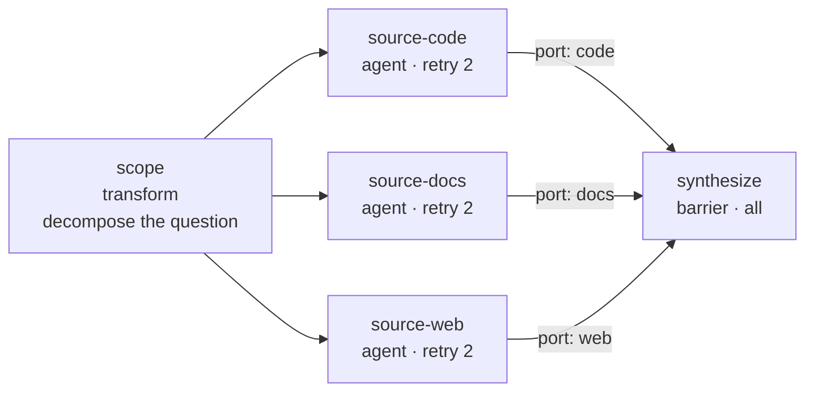
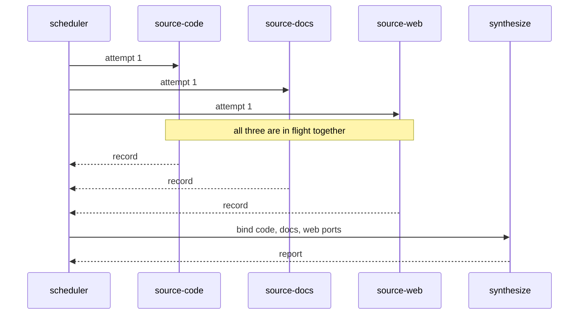
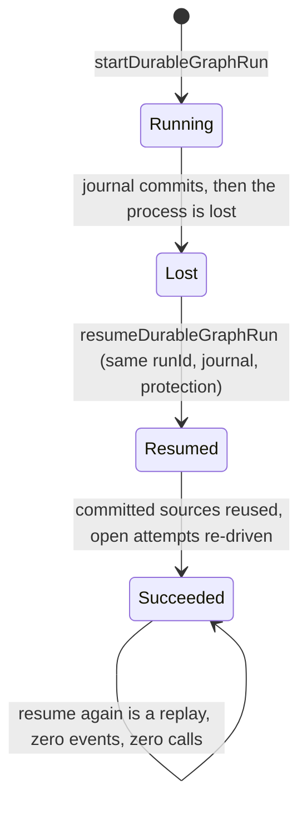
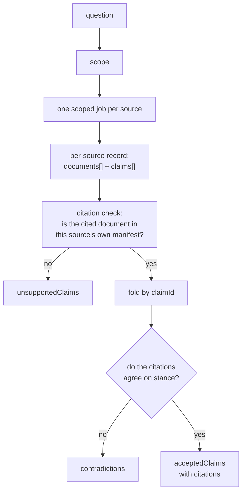
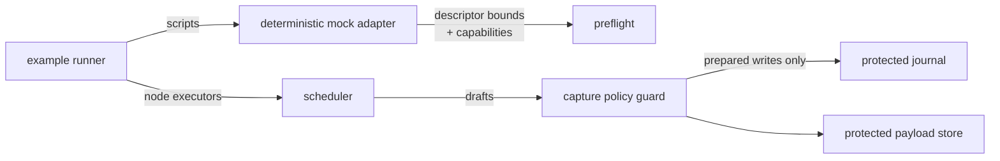

# Pattern 01 — multi-source research diamond

One question is decomposed into independent per-source jobs, the jobs run in
parallel, and exactly one fan-in barrier compares them: it verifies each claim
against the documents the same source actually returned, folds a claim found by
two sources into one claim with two citations, and reports contradictions
instead of resolving them.

Everything here runs. Nothing here fetches. Every source result comes from the
deterministic mock adapter, scripted from [`fixtures/sources.json`](fixtures/sources.json),
and both language lanes are compared against the same expected-result and
expected-event files.

| Artifact | File |
| --- | --- |
| Bundle manifest | [`manifest.json`](manifest.json) |
| Canonical graph, JSON | [`research-diamond.graph.json`](research-diamond.graph.json) |
| Canonical graph, YAML | [`research-diamond.graph.yaml`](research-diamond.graph.yaml) |
| TypeScript constructor | [`packages/patterns/src/research-diamond.ts`](../../../packages/patterns/src/research-diamond.ts) |
| Python constructor | [`python/src/graph_engineering/patterns/research_diamond.py`](../../../python/src/graph_engineering/patterns/research_diamond.py) |
| Deterministic mock descriptor | [`mock-adapter.descriptor.json`](mock-adapter.descriptor.json) |
| Source corpus fixture | [`fixtures/sources.json`](fixtures/sources.json) |
| Expected run fixture | [`fixtures/expected-run.json`](fixtures/expected-run.json) |
| Expected event fixture | [`fixtures/expected-events.json`](fixtures/expected-events.json) |
| Launch guides and runbook | [`docs/patterns/research-diamond.md`](../../../docs/patterns/research-diamond.md) |
| Package tests | [`packages/patterns/test/research-diamond.test.ts`](../../../packages/patterns/test/research-diamond.test.ts) |

## Run it

Build the four local packages once, then run both lanes:

```bash
corepack pnpm --filter @graph-engineering/core build \
  && corepack pnpm --filter @graph-engineering/patterns build \
  && corepack pnpm --filter @graph-engineering/persistence build \
  && corepack pnpm --filter @graph-engineering/adapters build \
  && corepack pnpm --filter @graph-engineering/runtime build

node examples/patterns/research-diamond/run.mjs
node examples/patterns/research-diamond/resume.mjs

uv run --project python python examples/patterns/research-diamond/run.py
uv run --project python python examples/patterns/research-diamond/resume.py
```

No API key. No network access. No credential. No clock reading. If any
assertion in a runner fails, the runner exits non-zero — the printed JSON
report is only produced after every assertion has passed.

## Topology



`scope` is the sole entrypoint. `synthesize` is the sole named output
(`report`). Each source reaches the barrier on its own named port, so the
barrier body is handed a keyed record and never a positional array.

## Sequence



The three lanes really do overlap. In the TypeScript lane a promise gate can
only be passed once all three sources have arrived; in the Python lane an
`asyncio.Barrier(3)` does the same. Neither uses a sleep, a timestamp or a
timeout, so a serial scheduler fails the assertion rather than passing slowly.

## Recovery



What makes the resume safe is in the graph, not in the runner: each source
declares `sideEffects: "none"` and `retry.maxAttempts: 2`. An interrupted
attempt on a node that declares a side effect would be refused as in-doubt
instead of re-driven.

## Data flow



The corpus deliberately contains all three cases: one claim found by two
sources (folded), one claim two sources disagree about (reported as a
contradiction, never accepted), and one claim cited to a document its own
source never returned (rejected as citation laundering).

## Authority



The only authority actually enforced end to end in this bundle is the write
path: the scheduler cannot reach the journal except through the guard, a
prepared write is bound to one journal instance, and a durable run without
configured protection fails closed before the first event and the first
executor call. Both runners assert that.

## Budgets, permissions, and what is not enforced

The bundle declares a budget and a least-privilege permission set in
[`manifest.json`](manifest.json). **Neither binds anything.**

- **Budgets are documentation.** No runtime component reads or enforces a
  token, money or time budget; that contract is `D10-*` and is contract-only.
  The numbers that actually bind a run are the Graph IR policies
  (`maxConcurrency`, `maxFanOut`, `maxTotalAttempts`) and each node's
  `retry.maxAttempts`, which the scheduler does enforce — the injected
  rate-limit scenario is stopped by `retry.maxAttempts`, not by a budget.
- **Permissions are documentation.** There is no isolation provider. These runs
  perform no network access because the code contains no network call and the
  mock adapter cannot make one, not because a sandbox refused one.

Read the manifest's `policy.*.enforcement` fields before quoting any of it.

## Known limitations

- **A permanently failed source produces no report at all.** The merge node is
  a static all-success barrier, so partial-source failure retention — a listed
  Pattern 01 requirement — is not available. It needs quorum or settled barrier
  behaviour, which is capability-gated and unimplemented.
- **Timeout, cancellation-during-synthesis and replay/fork are not
  demonstrated.** Normal, retry, crash/resume, terminal replay and
  fail-closed-without-protection are.
- **No CI job runs these runners.** They are run by hand.
- **This bundle has not been independently reviewed.**
